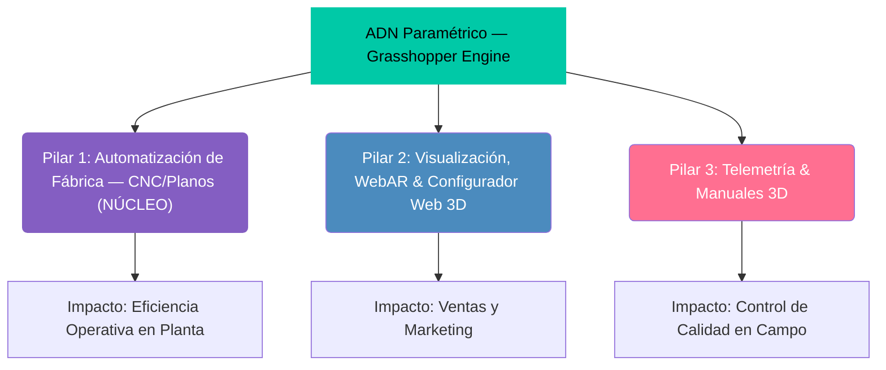
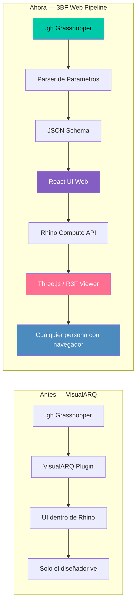
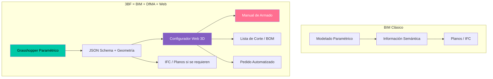

# 🏗️ 3DBimFab (3BF) — Motor de Manufactura Digital Paramétrica

> **Versión:** 1.0 — Documento Fundacional  
> **Fecha:** 30 de Julio, 2026  
> **Estado:** Definición Conceptual y Arquitectura Aprobada  
> **Proyecto padre:** [mariomojica.com](https://mariomojica.com) — Ecosistema B2B de Software para Manufactura

---

## 📌 1. Definición Oficial

**3DBimFab** es la metodología de trabajo de Mario Mojica convertida en identidad. Es el resumen de cómo transformamos la complejidad en un producto tangible:

### 3D — Geometría
Representa nuestra base. Trabajamos en un entorno tridimensional avanzado con **Rhinoceros 8**, donde definimos la geometría exacta de cada pieza y componente con precisión milimétrica.

### BIM — Información Inteligente
Aquí elevamos el estándar. Gracias a nuestros algoritmos en **Grasshopper** y un sistema de metadatos paramétricos propios, cada mueble se convierte en un **objeto inteligente** que porta su propio "ADN". Este modelo contiene toda la información de costos, materiales y procesos, conectando el diseño directamente con el ERP de la empresa.

### Fab — Manufactura Digital
Es el resultado final. Nuestra tecnología elimina el error humano y la repetición manual. Al terminar un diseño, entregamos:
- **Archivos DXF** listos para CNC (seccionadoras, taladros Biesse)
- **Listas de corte** optimizadas (Optiplaning / Nesting)
- **Manuales de armado interactivos 3D** con guía por voz
- **Activos para Realidad Aumentada** (WebAR)
- **Instrucciones de empaque** y cubicaje optimizado

Todo generado automáticamente desde un **único modelo paramétrico** y expuesto al mundo a través de **configuradores web 3D** que democratizan el acceso al diseño paramétrico sin licencias ni conocimiento técnico.

> **En pocas palabras:** 3DBimFab es el motor que convierte el diseño paramétrico en un bien tangible de forma automatizada, reduciendo radicalmente los tiempos de desarrollo y conectando la creatividad del diseño con la eficiencia de la fábrica.

---

## 🧬 2. Origen y Evolución

3DBimFab es la evolución directa de lo que internamente se conocía como *MakeLab*. El cambio de nombre refleja una maduración conceptual:

| Aspecto | MakeLab (Pasado) | 3DBimFab (Presente) |
|---------|------------------|---------------------|
| **Enfoque** | Herramienta interna de producción | Metodología y plataforma escalable |
| **Alcance** | Desktop (Rhino + VisualARQ) | Desktop → Web (Rhino → Configurador) |
| **Dependencias** | VisualARQ como UI paramétrica | Grasshopper nativo → JSON → Web UI |
| **Output** | Archivos técnicos locales | Plataforma SaaS multitenant |
| **Usuario** | Solo el diseñador/ingeniero | Diseñador + Cliente final (Web) |

---

## 🏛️ 3. Los Tres Pilares del Ecosistema

3BF opera como un ecosistema de tres pilares interconectados, donde el **Pilar 1 (Automatización)** es el núcleo y los Pilares 2 y 3 son la periferia de impacto:



### Pilar 1: Automatización de Fábrica e Industria 4.0 — NÚCLEO
- **Grasshopper como motor headless de computación**
- Planos de fabricación automatizados desde parámetros
- Integración CNC & Listas de Corte (DXF para Biesse)
- Costeo en Tiempo Real vinculado a bases de materiales
- 3D Nesting / Empaque Eficiente

### Pilar 2: Digitalización y Marketing Visual (Periferia)
- Renders Fotorrealistas 4K generados localmente
- Realidad Aumentada Web (WebAR) desde el navegador
- Configurador Web 3D interactivo para el cliente final

### Pilar 3: Optimización Postventa & Telemetría (Periferia)
- Visor 3D Interactivo (Three.js / React Three Fiber)
- Escaneo inteligente de piezas y herrajes desde el modelo
- Telemetría de campo (embudo de armado, tiempos, bloqueos)

---

## 🌐 4. La Gran Evolución: De VisualARQ a la Web

### 4.1 El Problema con VisualARQ

VisualARQ cumplió un rol fundamental como capa de presentación sobre Grasshopper: leía los parámetros del `.gh` y los convertía en una interfaz de "estilos" dentro de Rhino, permitiendo al usuario modificar dimensiones, materiales y herrajes sin tocar el código.

Sin embargo, esta dependencia presenta limitaciones críticas:

| Limitación | Impacto |
|-----------|---------|
| **Licencia adicional costosa** | +$695 USD por puesto |
| **Atado al escritorio** | Solo funciona dentro de Rhino |
| **No escalable** | Cada usuario necesita Rhino + VisualARQ |
| **Sin acceso web** | El cliente final jamás ve el configurador |
| **UI limitada** | La interfaz es la de Rhino, no personalizable |

### 4.2 La Solución: Parser Web Nativo

La visión de 3BF es **reemplazar VisualARQ** con un sistema que:

1. **Lee el `.gh`** directamente y extrae el esquema de parámetros (`RH_IN:`)
2. **Genera un JSON Schema** con tipos, rangos, valores por defecto y dependencias
3. **Renderiza una UI web nativa** (React) con sliders, selects, toggles y color pickers
4. **Envía cambios en tiempo real** al motor Grasshopper (vía Rhino Compute o Hops)
5. **Recibe la geometría actualizada** y la renderiza en Three.js/R3F



### 4.3 Mapeo de Componentes GH → UI Web

Los nodos de entrada de Grasshopper (`RH_IN:`) se traducen a componentes web nativos:

| Componente Grasshopper | Tipo GH | Componente Web |
|------------------------|---------|----------------|
| `Number Slider` | `Number` | `<Slider>` con min/max/step |
| `Value List` | `String` | `<Select>` / `<Dropdown>` |
| `Boolean Toggle` | `Boolean` | `<Toggle>` / `<Switch>` |
| `Panel` (texto) | `String` | `<Input type="text">` |
| `Colour Swatch` | `Color` | `<ColorPicker>` |
| `Point` | `Point3d` | `<CoordinateInput>` (x, y, z) |
| `Geometry Pipeline` | `Brep/Mesh` | Renderizado directo en Three.js |

---

## 🔬 5. Más Allá del BIM: El Paradigma Web-BIM

### 5.1 ¿Sigue siendo BIM?

**Sí.** BIM se sustenta en 3 pilares fundamentales, y 3BF los cumple todos:

| Pilar BIM | Definición | ¿3BF lo cumple? |
|-----------|-----------|-----------------|
| **Geometría paramétrica** | El objeto se define por parámetros, no coordenadas fijas | ✅ Grasshopper es 100% paramétrico |
| **Información semántica** | El modelo "sabe" qué es: material, costo, peso | ✅ Los metadatos viajan en el JSON Schema |
| **Interoperabilidad** | Exporta a IFC, intercambia datos con otros sistemas | ✅ Rhino exporta IFC nativo |

### 5.2 Donde 3BF trasciende el BIM

Lo que 3BF construye es un **Web-BIM Configurator** — un paradigma donde el BIM paramétrico se democratiza:

```
BIM Tradicional                    3BF (Web-BIM)
─────────────────                  ─────────────────
Arquitecto → Rhino/Revit          Cliente final → Navegador web
Licencia costosa                   Acceso gratuito (SaaS)
Diseño desde cero                  Configuración guiada
Output: planos técnicos           Output: planos + manual + pedido
Usuario: profesional              Usuario: cualquier persona
```

### 5.3 La Frontera que 3BF Cruza



| Concepto | BIM Tradicional | 3BF |
|----------|:-:|:-:|
| **DfMA** (Design for Manufacturing & Assembly) | ❌ Opcional | ✅ Nativo — el manual de armado es core |
| **Mass Customization** | ❌ No contempla | ✅ El cliente configura en la web |
| **E-commerce integration** | ❌ No existe | ✅ Del configurador al carrito |
| **Democratización** | ❌ Solo profesionales | ✅ Cualquier usuario |

> **3BF no abandona BIM, lo democratiza.** Toma el núcleo paramétrico de Grasshopper (que es BIM puro), le quita la barrera de entrada (licencias, conocimiento técnico) y lo expone al mundo a través de la web. No estamos en "la frontera final del BIM" — estamos en **la frontera inicial del Web-BIM para manufactura**, un territorio donde muy pocos han llegado y donde el mercado RTA de Brasil está hambriento de soluciones.

---

## 🏛️ 6. Análisis de Arquitecturas a Emular (Benchmark: ShapeDiver)

Para garantizar que el motor de **3DBimFab (3BF)** escale con estándares de clase mundial, tomamos como referencia técnica la arquitectura de **ShapeDiver**, el estándar global para desplegar definiciones paramétricas de Grasshopper en la web.

### 6.1 Arquitectura de 4 Capas de ShapeDiver

```mermaid
graph TD
    subgraph "1. Client Layer (Frontend & WebGL)"
        A["Navegador Web del Usuario"] --> B["ShapeDiver Viewer SDK (Three.js Engine)"]
        A --> C["UI Web (Sliders, Dropdowns, Toggles en React/Vue)"]
    end

    subgraph "2. API Gateway & Orchestration Layer"
        D["Geometry Backend API (REST / GraphQL)"]
        E["Ticket & Session Manager"]
    end

    subgraph "3. Computation & Cache Layer (Backend Cloud)"
        F["Graph-Based Caching System (Redis / DB)"]
        G["Clúster de Servidores Headless (Rhino / Grasshopper Engines)"]
    end

    subgraph "4. Asset Pipeline & Formatos"
        H["Mallas 3D: glTF 2.0 + Compresión Draco"]
        I["Archivos Técnicos Exportables (DXF, STEP, PDF, BOM JSON)"]
    end

    C -->|1. Petición POST /compute {ticket, params}| D
    D --> E
    E --> F
    F -- "Hit (Caché)" --> D
    F -- "Miss (Computar)" --> G
    G -->|Genera| H
    G -->|Genera| I
    H -->|2. Stream de Mallas glTF| B
    B -->|3. Renderizado GPU 60fps| A
```

### 6.2 Desglose Técnico de Componentes

1. **Capa de Autoría y Plugin Grasshopper**:
   - Mapeo declarativo de Entradas (`Inputs`: Sliders, Dropdowns, Swatches, File Uploads) y Salidas (`Outputs`: Mallas 3D, Planos, Despiece).
   - Generación de un **JSON Schema** que abstrae los parámetros para que la web los consuma sin abrir el archivo `.gh`.

2. **Capa de Computación & Caché (Geometry Backend API)**:
   - **Ticket System**: Asignación de fichas/tokens de sesión por modelo cargado para seguridad y aislamiento.
   - **Graph-Based Caching**: Almacenamiento en caché de estados intermedios del árbol de componentes de Grasshopper. Si un parámetro no afecta una rama del modelo, esa subgeometría se recupera instantáneamente de memoria en <50ms sin reevaluar todo el motor.

3. **Capa de Transporte (glTF 2.0 + Compresión Draco)**:
   - En lugar de enviar geometría CAD pesada (`.3dm`, `.brep`), convierte el modelo resultante a **glTF 2.0 binario (`.glb`)** comprimido con Draco. Esto reduce la transferencia por red en un **80-90%** (archivos de 50MB bajan a 2-4MB).

4. **Capa de Presentación Client-Side (ShapeDiver Viewer / Three.js)**:
   - Visor JavaScript basado en Three.js con **actualización incremental de escena** (`mesh.replace()`), permitiendo intercambiar submallas modificadas sin recargar ni parpadear la escena 3D.

### 6.3 Paralelismo e Implementación en 3BF

| Componente ShapeDiver | Equivalente en 3BF (Mario Mojica) | Estado en 3BF |
| :--- | :--- | :--- |
| **Plugin GH (Inputs/Outputs)** | Convención Nombres `RH_IN:` y `RH_OUT:` en `.gh` | ✅ Implementado |
| **Geometry Backend API** | API Gateway + Motor de Cómputo (Rhino Compute / ShapeDiver Headless API / Custom Worker) | 🔄 En Evaluación de Arquitectura |
| **Formato de Transmisión** | `.glb` cifrado (IP Shield AES-256) + Draco | ✅ Implementado |
| **3D Viewer SDK** | React Three Fiber (R3F) + Zustand State Engine | ✅ Implementado |
| **Diferenciador 3BF** | Integración nativa DfMA para Muebles RTA (planos CNC Biesse, despiece herrajes, telemetría y manuales 3D) | ✅ Ventaja Competitiva 3BF |

### 6.4 Matriz Comparativa de Soluciones (con Enlaces Oficiales)

| Solución / Enlace | Tipo / Modelo | Motor de Cálculo | Enfoque Principal | Fortalezas | Limitaciones |
| :--- | :--- | :--- | :--- | :--- | :--- |
| 🌐 **[ShapeDiver](https://www.shapediver.com/)** | Commercial SaaS | Grasshopper / Rhino | Configuradores 3D WebGL para e-commerce / productos | Listo para usar, caché optimizada, visor WebGL ultrarrápido | Costos recurrentes por créditos/uso, atado a su infraestructura |
| 🌐 **[VIKTOR.ai](https://www.viktor.ai/)** | Commercial SaaS / Enterprise | Python + Grasshopper / CAD | Aplicaciones web completas de ingeniería y cálculo | Integra código Python, dashboards, análisis estructural y CAD | Enfoque más ingenieril que de visualización e-commerce |
| 🌐 **[Packhunt](https://www.packhunt.io/)** | Commercial SaaS | Grasshopper / CAD | Flujos *Configure-to-Production* para arquitectura y manufactura | Generación directa de datos para fábrica y cumplimiento de normas | Licenciamiento empresarial especializado en sector AEC |
| 🌐 **[BeeGraphy](https://beegraphy.com/)** | Freemium SaaS | Editor de Nodos Cloud propio (Nativo Web) | Diseño paramétrico 100% en navegador y configurador web | Cero software local (funciona sin Rhino), edición colaborativa | Ecosistema de nodos menos maduro que Grasshopper |
| 🌐 **[Hypar](https://hypar.io/)** | Commercial / Freemium | C# / Python / Open BIM | Generación de edificios y automatización BIM | Enfoque Web-BIM nativo, rápido para diseño generativo de edificación | Orientado a edificación, no a manufactura de productos |
| 🌐 **[Speckle](https://speckle.systems/)** | **Open Source** (MIT) | Conectores multi-software (Rhino, GH, Revit, etc.) | Gestión y *Streaming* de datos 3D ("Git para AEC") | Código abierto, excelente API WebGL, sincronización multicanal | No evalúa lógica paramétrica por sí solo (necesita un runner) |
| 🌐 **[Rhino Compute](https://developer.rhino3d.com/guides/compute/)** | **Developer API** (Licencia Rhino) | Rhino 8 / Grasshopper Headless | Motor Backend REST para desarrollo custom *(Opción de evaluación para 3BF)* | Control 100% total, sin intermediarios, costo fijo por servidor | Requiere desarrollo total de DevOps, caché y visor WebGL |
| 🌐 **[CadQuery](https://cadquery.readthedocs.io/)** | **Open Source** (Apache 2.0) | OpenCASCADE (Python) | Modelado CAD paramétrico sólido por código | 100% libre de licencias comercial de Rhino | Basado en código Python (sin interfaz visual de nodos tipo GH) |

### 6.5 Evaluación Abierta de Infraestructura de Backend para 3BF

El núcleo de **3DBimFab (3BF)** radica en la **experiencia del usuario y la integración con la planta de manufactura** (DfMA, despiece de herrajes, planos CNC Biesse, telemetría de campo y manuales 3D). El motor de backend geométrico es un componente modular en proceso de evaluación estratégica bajo 4 posibles caminos:

1. **Camino A — ShapeDiver como Backend Headless (SaaS API)**: Consumir el Geometry Backend API de ShapeDiver como motor de cálculo en la nube, liberando el desarrollo de la gestión de servidores (DevOps) y concentrando el esfuerzo en la interfaz DfMA y la plataforma B2B.
2. **Camino B — Rhino Compute + Capa Custom de Caché (Self-Hosted)**: Implementar servidores propios con Rhino Compute agregando un middleware custom (Redis / Node.js) para orquestación de caché, seguridad (IP Shield) y exportación `glTF`.
3. **Camino C — Pipeline Abierto con Speckle + Workers Async**: Utilizar Speckle para el streaming de datos 3D y desacoplar la evaluación paramétrica con microservicios asíncronos.
4. **Camino D — Motor Nativo Open Source (CadQuery / WebAssembly)**: Evaluar engines sin licencias comerciales de Rhino para componentes seriados estándar de la industria mueblera RTA.

---

## 🔗 7. Referencia: Captura del Estilo VisualARQ (Antecedente)

La siguiente captura muestra la interfaz de VisualARQ dentro de Rhino, donde los parámetros del Grasshopper se exponen como un formulario de "Propiedades del Mueble". Este es el comportamiento que el **Parser Web** de 3BF replicará de forma nativa en el navegador:

> **Nota:** La imagen de referencia del estilo VisualARQ se encuentra en los archivos del proyecto. Los paneles laterales muestran: Geometría (Volumen, Posición, Rotación), dimensiones paramétricas (Ancho, Altura, Profundidad), opciones de estilo (Recorte bajo, Cantidad de Paneles, Tipo de Pata), y la configuración de cada panel individual (altura, unión superior, giro de perno minifix, unión inferior, giro de tuerca plástica).

---

## 📂 8. Ubicación en el Ecosistema

```
mmapp/
├── 3BF.md                          ← 📍 ESTE ARCHIVO (Documento Fundacional)
├── 3bf/                            ← 🆕 Proyecto Configurador Web 3D Paramétrico
│   ├── plan_de_implementacion.md   ← Plan por fases con gates de validación
│   ├── packages/                   ← Módulos: gh-parser, compute-bridge, ui-generator, viewer
│   ├── apps/                       ← App web integrada
│   └── docs/                       ← Documentación técnica interna
├── ESTADO_DEL_PROYECTO.md           ← Memoria RAM activa
├── HISTORICO_DEL_PROYECTO.md        ← Registro cronológico de hitos
├── Arquitectura/                    ← Topología técnica del ecosistema
├── Comercial/                       ← CRM, ventas, copywriting
├── docs/
│   └── MANIFIESTO_NEGOCIO.md        ← GTM y estrategia comercial
├── mario-mojica-plataforma/         ← CMS Next.js B2B
├── mariomojica-portfolio/           ← Portfolio público
├── mario-mojica-homepage/           ← Landing page
└── legacy-aplicativo-armado/        ← Visor 3D (React Three Fiber)
```

---

## 🗺️ 9. Próximo Paso

El **Plan de Implementación** detallado para llevar la arquitectura 3BF de la conceptualización al desarrollo se encuentra en:

📄 **[plan_de_implementacion.md](file:///c:/Desarrollo/mmapp/3bf/plan_de_implementacion.md)**

Este plan define las fases progresivas con gates de validación entre cada una.

---

*Este documento debe ser actualizado por Antigravity después de cada hito relevante del proyecto 3BF. No se debe borrar información anterior, solo agregar nueva.*

