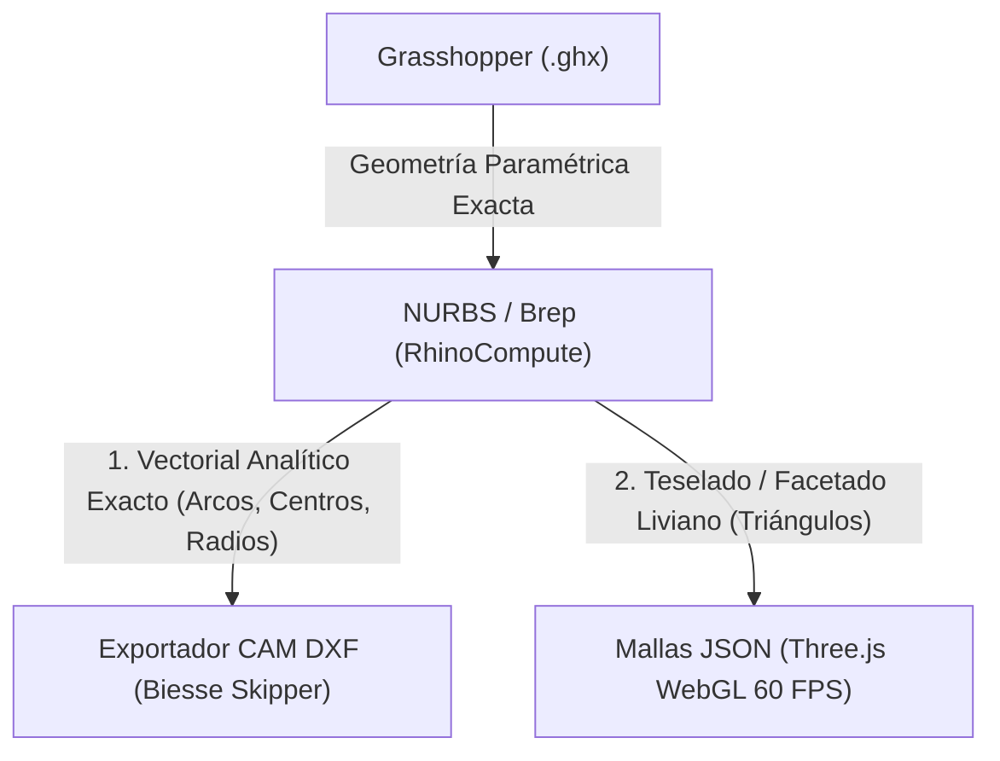
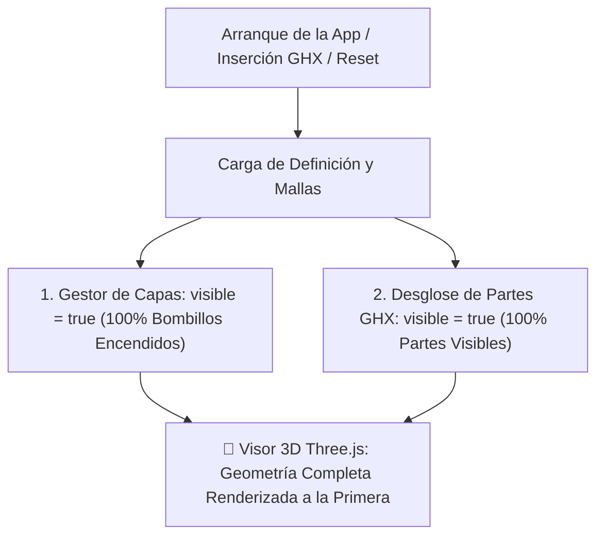

# 3BF Worker Python Engine (`3bf_worker.py`) - Memoria Técnica y Estándar de Comunicación GHX ➔ Web

Este documento constituye la **memoria técnica oficial, arquitectura y estándar de comunicación** del motor **3BF Worker Python** (`worker/3bf_worker.py`). Define los contratos de datos, algoritmos de texturizado DfMA, transformación de coordenadas CAD a WebGL y las reglas de diseño para definiciones Grasshopper (`.gh` / `.ghx`).

---

## 🏛️ 1. Arquitectura y Rol del Worker

El **3BF Worker** es un microservicio de alto rendimiento construido con **FastAPI** y **Uvicorn** que opera en `http://localhost:8005`. Actúa como el puente bidireccional inteligente entre:
1. **El Motor CAD Headless**: **RhinoCompute 8** (`http://localhost:5000/grasshopper`), resolviendo geometría OpenNURBS con aceleración nativa.
2. **El Frontend Web**: **3DBimFab Next.js / Three.js** (`http://localhost:3005`), proporcionando interfaces dinámicas auto-generadas y renderizado PBR en tiempo real.

```
 ┌────────────────────────┐         ┌────────────────────────┐         ┌────────────────────────┐
 │   Grasshopper (.ghx)   │ ──────► │ 3BF Worker (FastAPI)   │ ──────► │ 3DBimFab Web (Three.js)│
 │   - Sliders / Inputs   │         │ Puerto: 8005           │         │ Puerto: 3005           │
 │   - Grupos GH_Group    │         │ - /metadata (Esquema)  │         │ - UI Tech Ethos        │
 │   - Mallas & BoxMapping│ ◄────── │ - /compute (Solver 3D) │ ◄────── │ - Visor PBR en tiempo  │
 └────────────────────────┘         └────────────────────────┘         └────────────────────────┘
                 ▲                              │
                 │      Evaluación OpenNURBS    ▼
                 └────────────────── 🦏 RhinoCompute 8 Engine (Puerto: 5000)
```

---

## 🔌 2. Endpoints Oficiales y Contratos de Datos

### ⚡ A. `POST /metadata` (Esquema Dinámico Ultrarrápido < 50 ms)
Analiza el archivo XML `.ghx` sin necesidad de llamar al solver de RhinoCompute, extrayendo instantáneamente la configuración para construir la interfaz gráfica de usuario.

* **Extracción de Sliders (`parse_ghx_slider_limits`)**:
  * Obtiene `<Min>`, `<Max>`, `<Value>` y `<Interval>` de los chunks de Grasshopper.
  * Mapea nombres exactos `RH_IN:...` a controles deslizantes con entrada numérica editable.
* **Extracción de Menús Desplegables (`Value List`)**:
  * Extrae pares `Nombre = Expresión` (ej. `Vertical = 0`, `Horizontal = 4`).
* **Extracción de Grupos Espaciales (`parameter_groups`)**:
  * Agrupa visualmente los controles en tarjetas de UI según los `GH_Group` definidos por el diseñador en el canvas de Grasshopper.

### 📐 B. `POST /compute` (Solver Geométrico y Pipeline 3D)
Recibe los valores modificados por el usuario, empaqueta el payload Hops para RhinoCompute y procesa la respuesta:
* **Bust-Cache Hashing**: Modifica un comentario interno en el XML antes de enviarlo a RhinoCompute para garantizar que cálculos con geometrías complejas nunca se queden atascados en la caché de Rhino.
* **Deserialización OpenNURBS (`rhino3dm`)**: Decodifica cadenas `archive3dm` en objetos nativos `rhino3dm.Mesh` y `rhino3dm.Brep`.
* **Cálculo de Bounding Boxes y Centros**: Obtiene el centro de gravedad geométrico de cada pieza en milímetros para posicionamiento relativo.
* **Extracción de Mallas Poligonales y Normales**: Extrae vértices locales, índices de triángulos y corrige las normales hacia afuera (CCW).
* **Extracción de Coordenadas de Textura UV (`TextureCoordinates`)**: Lee las coordenadas UV nativas asignadas por Grasshopper para el texturizado de la madera.

---

## 🪵 3. Estándar de Texturizado DfMA y Mapeo Cúbico 3D (`BoxMapping`)

Para garantizar que la veta de la madera en las caras principales y en los cantos perimetrales respete las reglas de manufactura digital (**DfMA**) y optimización de corte (**Nesting CNC**), se utiliza un **Mapeo de Caja Cúbica 3D de 6 Caras Independientes**.

### 🧭 Tabla Oficial de Giros y Grados (Niveles 0 al 5):

| Nivel | Nombre de Veta | Tipo de Pieza Típica | Giro 1 (`Rotate 3D`) | Giro 2 (`Rotate 3D`) | Orientación de Veta Resultante |
| :---: | :--- | :--- | :--- | :--- | :--- |
| **0** | **Vertical** | Lateral / Parante vertical | `Unit Y` : **`90°`** | `Unit X` : **`0°`** | Veta vertical a lo largo de la altura (Z). |
| **1** | **Vertical Atravesada** | Lateral / Parante vertical | `Unit Y` : **`90°`** | `Unit X` : **`90°`** | Veta horizontal a lo largo de la profundidad (Y). |
| **2** | **Frontal** | Puerta / Frente de Cajón / Fondo | `Unit X` : **`90°`** | `Unit Y` : **`90°`** | Veta vertical a lo largo de la altura (Z). |
| **3** | **Frontal Atravesada** | Puerta / Frente de Cajón / Fondo | `Unit X` : **`90°`** | `Unit Y` : **`0°`** | Veta horizontal a lo largo del ancho (X). |
| **4** | **Horizontal** | Cubierta / Base / Entrepaño | `Unit X` : **`0°`** | `Unit Y` : **`0°`** | Veta longitudinal a lo largo del ancho (X). |
| **5** | **Horizontal Atravesada** | Cubierta / Base / Entrepaño | `Unit Z` : **`90°`** | `Unit Y` : **`0°`** | Veta transversal a lo largo de la profundidad (Y). |

---

### 📝 Código del Componente Python Nativo en Grasshopper (Sin Plugins Externos):

Este componente nativo en Rhino 8 reemplaza al plugin *Human* y estampa las coordenadas UV en la malla para que los cantos perimetrales **nunca tengan rayas estiradas**:

```python
import Rhino

def aplicar_mapeado_caja(mesh, box_input):
    if mesh is None:
        return None
    
    mesh_mapped = mesh.DuplicateMesh()
    
    if box_input is not None:
        box_geom = None
        if isinstance(box_input, Rhino.Geometry.Box):
            box_geom = box_input
        elif hasattr(box_input, "GetBoundingBox"):
            bbox = box_input.GetBoundingBox(True)
            box_geom = Rhino.Geometry.Box(bbox)
            
        if box_geom is not None and box_geom.IsValid:
            plane = box_geom.Plane
            size_x = max(1.0, box_geom.X.Length)
            size_y = max(1.0, box_geom.Y.Length)
            size_z = max(1.0, box_geom.Z.Length)
            center = box_geom.Center
            
            # Asegurar normales de vértices calculadas
            mesh_mapped.Normals.ComputeNormals()
            mesh_mapped.TextureCoordinates.Clear()
            
            # Mapeo Cúbico 3D de 6 Caras Independientes (BoxMapping Real)
            for idx in range(len(mesh_mapped.Vertices)):
                v = mesh_mapped.Vertices[idx]
                n = mesh_mapped.Normals[idx] if idx < len(mesh_mapped.Normals) else Rhino.Geometry.Vector3f(0, 0, 1)
                
                # Posición y normal en el espacio local de la caja
                pt = Rhino.Geometry.Point3d(v)
                vec = pt - center
                local_x = vec * plane.XAxis
                local_y = vec * plane.YAxis
                local_z = vec * plane.ZAxis
                
                norm_vec = Rhino.Geometry.Vector3d(n)
                norm_x = abs(norm_vec * plane.XAxis)
                norm_y = abs(norm_vec * plane.YAxis)
                norm_z = abs(norm_vec * plane.ZAxis)
                
                # Proyección según la cara dominante de la caja
                if norm_z >= norm_x and norm_z >= norm_y:
                    # Caras Superior / Inferior
                    u = (local_x / size_x) + 0.5
                    v_coord = (local_y / size_y) + 0.5
                elif norm_y >= norm_x and norm_y >= norm_z:
                    # Cantos Frontal / Trasero
                    u = (local_x / size_x) + 0.5
                    v_coord = (local_z / size_z) + 0.5
                else:
                    # Cantos Lateral Izquierdo / Derecho
                    u = (local_y / size_y) + 0.5
                    v_coord = (local_z / size_z) + 0.5
                    
                mesh_mapped.TextureCoordinates.Add(float(u), float(v_coord))
                
    return mesh_mapped

# Procesar entradas
if isinstance(M, list):
    resultado = [aplicar_mapeado_caja(item, B) for item in M if item is not None]
else:
    resultado = aplicar_mapeado_caja(M, B)

# Salida oficial de Grasshopper
a = resultado
```

---

## 📐 4. Transformación Dextrógira CAD ➔ WebGL (Rhino ➔ Three.js)

Para eliminar el efecto espejo y garantizar que la pieza mantenga su posición exacta 1:1 respecto al punto de origen `(0, 0, 0)` de Rhino:

### Mapeo de Coordenadas:
* $$\text{Three.js } X = +\text{Rhino } X$$
* $$\text{Three.js } Y = +\text{Rhino } Z \text{ (Altura vertical)}$$
* $$\text{Three.js } Z = -\text{Rhino } Y \text{ (Profundidad horizontal hacia el fondo)}$$

### Corrección de Normales y Devanado de Caras:
Al aplicar la reflexión en profundidad ($-\text{Rhino } Y$), el orden de los vértices de cada cara se invierte para conservar normales exteriores y evitar caras transparentes:
```python
# Inversión de índices para mantener la orientación Counter-Clockwise (CCW)
indices.extend([face[0], face[2], face[1]])
if face[2] != face[3]:
    indices.extend([face[2], face[0], face[3]])
```

---

## ⚠️ 5. Reglas de Oro para Definiciones Grasshopper (`.ghx`)

1. **Unicidad Estricta de Nombres de Salida (`RH_OUT:`):**
   * Cada grupo de salida debe tener un nombre **único e irrepetible** (ej. `RH_OUT:MDP cubierta`, `RH_OUT:MDP entrepaño`). Si dos grupos comparten el mismo nombre, Hops cancela la salida por colisión de identificadores.
2. **Nombres de Grupo y Componente Sincronizados:**
   * El nombre del grupo `GH_Group` debe coincidir con el componente de geometría interior.
3. **Formateo de `Value List` para Hops:**
   * Las constantes de los `Value List` deben estructurarse con índices enteros (`Opción = 0`, `Opción = 1`) para evitar rechazos en los componentes `Stream Filter`.
4. **Dimensiones de Caja de Mapeo (`Box`):**
   * La caja estándar de mapeo debe medir **600 x 600 x 600 mm** (escala estándar del patrón fotográfico melamínico de 60 cm).

---

## 🛠️ 6. Protocolo de Diagnóstico y Recuperación del Worker

Si se presentan fallos en el worker o en la comunicación con RhinoCompute:
1. **Comprobar Health Check**: `http://localhost:8005/health` (debe responder `{"status": "online", "rhino_compute": "online"}`).
2. **Logs del Solver**: Revisar el output en consola de `3bf_worker.py` para verificar los tiempos de cómputo y el recuento de mallas extraídas.
3. **Reinicio Rápido**: Terminar el proceso con `manage_task` o `Stop-Process` y relanzar con `/Arranque3BF`.

---

## 💰 7. Motor Económico B2B, Matriz de Proveedores y Liquidación de Costos

Para cerrar la brecha entre la geometría paramétrica 3D y la rentabilidad financiera en planta de producción, 3DBimFab integra un **Motor de Costeo B2B en Tiempo Real** (`DatabaseView.tsx`, `DespieceView.tsx`, `lib/store.ts`):

### 🏢 A. Directorio de Proveedores en Acordeón Alfabético:
* **Arauco** (Chile / Internacional): MDF & MDF RH Hidrófugo. TRM y descuentos comerciales directos.
* **Duratex** (Colombia / Brasil): HDF & Fondos delgados (2.7 mm, 3 mm).
* **Masisa** (Chile / Colombia): MDP Supercor estándar y melamínico.
* **Novopan del Ecuador S.A.**: Matriz industrial completa de importación desde Ecuador (MDPKOR y Tropical).

### 📐 B. Algoritmo Oficial de Liquidación Novopan (Ecuador ➔ Colombia):
Para cualquier tablero de Novopan con precio de lista $E$ (USD), calibre $C$ (mm) y dimensiones $L \times A$ (mm):
1. **Área y Volumen:**
   $$\text{Área } (\text{m}^2) = \frac{L \times A}{1\,000\,000}, \quad \text{Volumen } (\text{m}^3) = \text{Área} \times \frac{C}{1000}$$
2. **Descuento por Acabado de Cara (Columna I):**
   $$I = 0.05 \text{ si el acabado es D/B (Diseño/Balance Blanco)}, \quad I = 0.00 \text{ si es D/D (2 Caras Diseño), D/KN o Madera}$$
3. **Precio Neto de Catálogo:**
   $$E_{\text{neto}} = E \times (1 - I)$$
4. **Logística y Fletes:**
   $$\text{Flete } (\text{USD}) = 18.57 \times \text{Volumen}$$
5. **Apoyos y Gavelas Comerciales:**
   * $\text{Pronto Pago (3.5%)} = (E_{\text{neto}} + \text{Flete}) \times 0.035$
   * $\text{Apoyo Volumen (20.0%)} = E_{\text{neto}} \times 0.20$
   * $\text{Apoyo Tasa (15.1%)} = E_{\text{neto}} \times 0.151$
   * $\text{Gastos Nacionalización (8.7%)} = E_{\text{neto}} \times 0.087$
6. **Costo Ajustado y Financiación:**
   $$\text{Costo Base} = E_{\text{neto}} + \text{Flete} - (\text{Pronto Pago} + \text{Apoyo Volumen} + \text{Apoyo Tasa}) + \text{Nacionalización}$$
   $$\text{Costo USD Final} = \text{Costo Base} \times 1.011 \text{ (Financiación 1.1%)}$$
7. **Costo Puesto en Fábrica (COP) y Costo por $\text{m}^2$:**
   $$\text{Costo Lámina (COP)} = \text{Costo USD Final} \times \text{TRM Novopan } (\$4.000)$$
   $$\text{Costo } \text{m}^2 \text{ (COP)} = \frac{\text{Costo Lámina (COP)}}{\text{Área } (\text{m}^2)}$$

### ✂️ C. Algoritmo de Desperdicio de Corte y Nesting Industrial:
Para cada pieza del mueble en la lista de corte (BOM):
$$\text{Factor de Desperdicio} = \frac{1}{1 - \frac{\% \text{Desp}}{100}}$$
$$\mathbf{\text{Costo Total Pieza}} = \text{Área Neta } (\text{m}^2) \times \text{Costo } \text{m}^2 \times \left(\frac{1}{1 - \frac{\% \text{Desp}}{100}}\right)$$
* **Desperdicio Global por Defecto**: `10.0%` (editable en cabecera).
* **Desperdicio Individual por Fila**: Editable por pieza con auto-selección numérica completa (`DecimalInput`) para acoplarse a los reportes del software de nesting CNC.

### 📊 D. Limpieza y Compatibilidad de Archivos ERP (`Google Sheets Optimizer`):
* Detección y eliminación de cuadrículas infinitas ($1.048.576\text{ filas en BD}$, $16.383\text{ columnas en HERRAJES CANTOS}$) para reducir archivos de $4.66\text{ MB}$ a $601\text{ KB}$ sin pérdida de datos.
* Restauración de los 35 Rangos Nombrados Globales (`TRM`, `MPLAMINAS`, `MP2HERRAJES_CANTOS`, `CODIGOS`) para garantizar cero errores `#NAME?` al abrir plantillas en Google Sheets.

---

## 8. Reglas de Ingeniería DfMA: Cubiertas Fijas vs Entrepaños Deslizables en Nicho

### 📐 8.1. Regla de Medida Nominal Gobernante
* **Principio Rector:** La medida que gobierna el modelo es siempre la dimensión nominal configurada en la interfaz (`RH_IN:01 Ancho` y `RH_IN:02 Profundidad`).

* **Versión Cubierta Fija (`Minifix`, `Tornillo tarugo`, `Ya definida`):**
  * La pieza encaja de forma precisa en el nicho del armario.
  * **Nombre en BOM:** `Cubierta`.
  * **Dimensiones en Lista de Corte:** $\text{Largo} = \text{Ancho Nominal}$, $\text{Ancho} = \text{Profundidad Nominal}$.
  * **Herrajes:** Cajas Minifix, Pernos o Tornillos según selección.
  * **Cantos:** Canto frontal visto ($L=1$) + Cantos laterales según selectores 3D de Borde Derecho / Izquierdo ($A \in \{0, 1, 2\}$) en PVC Rígido 22x2.0mm.

* **Versión Entrepaño Deslizable (`Union = Entrepaño` / Soportes Activos):**
  * En el mundo físico, un entrepaño móvil debe entrar y salir fácilmente del nicho sin friccionar con los costados del armario.
  * **Holgura DfMA:** Pierde $0.5\text{ mm}$ por cada lado ($\mathbf{-1.0\text{ mm}}$ en la longitud transversal del nicho).
  * **Nombre en BOM:** `Entrepaño`.
  * **Dimensiones en Lista de Corte:** $\text{Largo} = \text{Ancho Nominal} - 1.0\text{ mm}$, $\text{Ancho} = \text{Profundidad Nominal}$.
  * **Herrajes:** Soportes de Entrepaño (4 unidades).
  * **Cantos:** Canto frontal visto exclusivamente ($A=0, L=1$) en Canto PVC Ceniza 19x0.5mm.

---

## 9. Modelo Financiero y Ficha Técnica Consolidada (100.00% del Costo)

El motor económico de 3BF implementa el estándar contable de **Costeo por Absorción Estándar (NIC 2 / RTA)**, proyectando la totalidad del costo de fabricación del producto:

$$\mathbf{\text{Costo Total (100\%)}} = \text{Materia Prima Directa (MP)} + \text{Tercerizaciones} + \text{Mano de Obra Directa + Prestaciones (MO+PRES)} + \text{Costos Indirectos de Fabricación (CIF)}$$

### 📊 9.1. Distribución Porcentual Estándar de Fábrica
1. **Materia Prima Directa ($\text{MP: } 77.78\%$):**
   * **Láminas & Tableros:** Tableros MDP/MDF liquidados con matriz de proveedor y factor de desperdicio.
   * **Fondos:** Tableros delgados de 2.7 a 3 mm.
   * **Cantos:** Metros lineales reales con fórmula oficial de despunte ($+100\text{ mm}$ por borde canteado).
   * **Material de Empaque:** Cajas de cartón corrugado y láminas de cartón panal.
   * **Herrajes:** Tornillería, Minifix, tarugos, correderas y cantoneras.
   * **Adicionales & Consumibles ($0.40\%$):** Pegantes, disolventes, estopas y etiquetas barcode.
2. **Tercerizaciones ($0.00\%$):** Procesos y servicios industriales maquilados en el exterior.
3. **Mano de Obra Directa + Prestaciones ($\text{MO+PRES: } 12.42\%$):**
   * Absorbe salarios base de operarios de planta (seccionadora, canteadora, centro de mecanizado CNC, embalaje) y la carga prestacional legal obligatoria (Cesantías, Primas, Vacaciones, Salud, Pensión, ARL Riesgo III/IV y Parafiscales).
4. **Costos Indirectos de Fabricación ($\text{CIF: } 9.80\%$):**
   * Depreciación horaria de maquinaria CNC (Morbidelli, Skipper), consumo eléctrico de corte/aspiración, adhesivos termofusibles (EVA/PUR), desgaste de fresas/sierras diamantadas y supervisión de nave industrial.

### 🧮 9.2. Ecuación de Liquidación Automática
$$\mathbf{\text{COSTO TOTAL DE FABRICACIÓN (100\%)}} = \frac{\text{Total MP Directa} + \text{Tercerizaciones}}{1 - (\% \text{MO+PRES} + \% \text{CIF})} = \frac{\text{Total MP Directa} + \text{Tercerizaciones}}{\mathbf{0.7778}}$$
$$\mathbf{\text{MO+PRES (\$)}} = \text{Costo Total} \times 12.42\%$$
$$\mathbf{\text{CIF (\$)}} = \text{Costo Total} \times 9.80\%$$

---

## 🏭 10. Módulo CAM & Generador de DXF CNC para Biesse Skipper (`/export-dxf`)

Para cerrar el ciclo de manufactura digital (**DfMA ➔ CAM ➔ CNC**), el worker incorpora un generador vectorial nativo en formato **AutoCAD 2007 (AC1021)** compatible al 100% con los postprocesadores de centros de mecanizado y seccionadoras **Biesse Skipper (BiesseWorks / bSolid / TpaCAD)**.

```
                     ┌──────────────────────────────┐
                     │ Canto Superior / Frontal(W4) │
                     └──────────────────────────────┘
                                  ▲ (gap 20mm)
 ┌───────────────┐   ┌──────────────────────────────┐   ┌───────────────┐
 │Canto Izq (W1) │◄──│   VISTA SUPERIOR (Cara W0)   │──►│Canto Der (W3) │
 │ 2x Taladros Ø8│   │      4x Cajas Minifix Ø15    │   │ 2x Taladros Ø8│
 └───────────────┘   └──────────────────────────────┘   └───────────────┘
                                  ▼ (gap 20mm)
                     ┌──────────────────────────────┐
                     │Canto Inferior / Trasero (W2) │
                     └──────────────────────────────┘
```

### 🏷️ 10.1. Estándar de Nomenclatura Paramétrica de Capas Biesse (`TCHW...`)
La Biesse Skipper lee automáticamente las herramientas, caras y profundidades sin reprogramación manual mediante la sintaxis:
$$\mathbf{TCH + W[\text{Cara}] + B[\text{Herramienta}] + D[\text{Profundidad}]}$$

| Capa DXF | Operación / Herramienta | Cara de Trabajo | Profundidad | Entidad Geométrica |
| :--- | :--- | :---: | :---: | :--- |
| **`TCHW0B8D[Prof]`** | Contorno de Corte / Desbaste ($\varnothing 8\text{ mm}$) | $W_0$ (Cara Superior) | Pasante (ej. $15.0\text{ mm} \rightarrow D1500$) | `LWPOLYLINE` cerrada rectangular ($L \times A$) |
| **`TCHW1B8`** | Vista Canto Lateral Izquierdo | $W_1$ (Side 1 / Left) | N/A | `LWPOLYLINE` cerrada ($Espesor \times Ancho$) |
| **`TCHW2B8`** | Vista Canto Inferior / Trasero | $W_2$ (Side 2 / Bottom) | N/A | `LWPOLYLINE` cerrada ($Largo \times Espesor$) |
| **`TCHW3B8`** | Vista Canto Lateral Derecho | $W_3$ (Side 3 / Right) | N/A | `LWPOLYLINE` cerrada ($Espesor \times Ancho$) |
| **`TCHW4B8`** | Vista Canto Superior / Frontal | $W_4$ (Side 4 / Top) | N/A | `LWPOLYLINE` cerrada ($Largo \times Espesor$) |
| **`TCHW0B15D1350`** | Cajas Minifix ($\varnothing 15\text{ mm}$) | $W_0$ (Cara Superior) | **$13.50\text{ mm}$** | `CIRCLE` ($r=7.5\text{ mm}$) en coordenadas $X,Y$ 3D |
| **`TCHW1B8D2500`** | Taladro espiga Minifix / Tarugo en Canto Izquierdo | $W_1$ (Canto Izquierdo) | **$25.00\text{ mm}$** | `CIRCLE` ($r=4.0\text{ mm}$) en vista de canto $W_1$ |
| **`TCHW3B8D2500`** | Taladro espiga Minifix / Tarugo en Canto Derecho | $W_3$ (Canto Derecho) | **$25.00\text{ mm}$** | `CIRCLE` ($r=4.0\text{ mm}$) en vista de canto $W_3$ |
| **`TCHW0B2D1200`** | Taladros verticales de ensamble / soporte entrepaño ($\varnothing 5\text{ mm}$) | $W_0$ (Cara Superior) | **$12.00\text{ mm}$** | `CIRCLE` ($r=2.5\text{ mm}$) en coordenadas $X,Y$ 3D |

### 📐 10.2. Relaciones Matemáticas del Despliegue Ortogonal en 5 Vistas
Para un panel de dimensiones $Largo = L$, $Ancho = A$, $Espesor = E$, centrado en el origen con $hx = L/2$, $hy = A/2$ y separación estándar de vistas $\text{Gap} = 20.0\text{ mm}$:
1. **Pieza Central (Cara $W_0$):** Rectángulo cerrado de $(-hx, -hy)$ a $(hx, hy)$.
2. **Canto Izquierdo ($W_1$):** Rectángulo cerrado de $X \in [-hx-\text{Gap}-E, -hx-\text{Gap}]$ y $Y \in [-hy, hy]$.
3. **Canto Derecho ($W_3$):** Rectángulo cerrado de $X \in [hx+\text{Gap}, hx+\text{Gap}+E]$ y $Y \in [-hy, hy]$.
4. **Canto Superior ($W_4$):** Rectángulo cerrado de $X \in [-hx, hx]$ y $Y \in [hy+\text{Gap}, hy+\text{Gap}+E]$.
5. **Canto Inferior ($W_2$):** Rectángulo cerrado de $X \in [-hx, hx]$ y $Y \in [-hy-\text{Gap}-E, -hy-\text{Gap}]$.
6. **Centros de Perforación de Cantos ($W_1 / W_3$):**
   $$X_{W1} = -hx - \text{Gap} - \frac{E}{2}, \quad X_{W3} = hx + \text{Gap} + \frac{E}{2}$$
   $$Y_1 = hy - 37.0\text{ mm}, \quad Y_2 = -hy + 37.0\text{ mm}$$

### 📁 10.3. Nombrado Inteligente Dinámico
El archivo exportado se nombra automáticamente según las propiedades reales del modelo y versión:
$$\mathbf{[NombrePieza]\_[Largo]x[Ancho]\_[Espesor]mm\_BD[Version].dxf} \quad \text{(ej: } \texttt{Cubierta\_498x480\_15mm\_BD1.0.dxf}\text{)}$$

---

## 🎯 11. Fundamentos de Geometría Digital: NURBS vs Mallas (Meshes)

En la arquitectura 3BF, los sólidos **NURBS (Breps)** y las **Mallas Poligonales (Meshes)** tienen roles complementarios y estrictamente diferenciados:



1. **NURBS / Brep (Fuente de la Verdad Geométrica - CRÍTICO):**
   * **Propósito:** Fabricación digital CNC, tolerancias milimétricas y corte.
   * **Razón:** Un taladro en NURBS es un cilindro matemático perfecto ($r = 7.500\text{ mm}$). El generador CAM extrae los vectores analíticos directamente del Brep/NURBS para que la broca de la Skipper realice un mecanizado suave y preciso.
   * **Regla de Oro:** **Nunca eliminar los componentes NURBS de Grasshopper**, ya que son indispensables para el despiece real y la generación de código máquina.

2. **Mallas Poligonales / Meshes (Vehículo de Visualización Web - CRÍTICO):**
   * **Propósito:** Renderizado 3D interactivo en el navegador a 60 FPS vía WebGL / Three.js.
   * **Razón:** Las GPUs no procesan ecuaciones polinómicas NURBS en tiempo real. RhinoCompute tesela los sólidos a mallas livianas con mapeo UV (`BoxMapping`) para permitir rotación, explosión y personalización visual instantánea en la web.

---

## ⚡ 12. Arquitectura de Persistencia e Hidratación Inmediata

Para eliminar discrepancias de precios al abrir archivos GHX:
* **Función Global `hidratarDesdeLocalStorage()`:** Se ejecuta en el primer ciclo de montaje de `app/page.tsx` y `DespieceView.tsx`.
* **Catálogo Oficial por Defecto (`lib/store.ts`):**
  * **Caja Minifix 15mm:** `$100 COP` ($0.025 USD).
  * **Perno Minifix 34mm:** `$87 COP` ($0.022 USD).
  * **Tarugo 8x30mm:** `$17 COP` ($0.004 USD).
  * **Tornillo 4x50mm:** `$27 COP` ($0.007 USD).
  * **Soporte Entrepaño Ø5mm:** `$150 COP` ($0.038 USD).
* **Control de Versiones de Ficha:** Opciones limpias: **`BD 1.0`**, **`BD 1.1`**, **`BD 2.0`**.
* **Acción de Guardado:** Botón minimalista unificado en cabecera: **`Guardar`** con estado de confirmación `¡Guardado!`.

---

## 💡 13. Estándar de Inicialización y Visibilidad por Defecto (Capas y Partes 100% Activas)

Para garantizar una experiencia CAD limpia, fluida y sin bloqueos visuales:



1. **Regla de Oro de Visibilidad Inicial (`visible: true`):**
   * Al iniciar la plataforma, abrir un nuevo archivo `.ghx`, o presionar el botón de restablecer (`resetCapasYMateriales`), **todas las 19 capas estándar del modelo (`PRESET_CAPAS`) y todas las partes del árbol de Grasshopper inician siempre con `visible: true`**.
   * Los bombillos del Gestor de Capas y del Desglose de Partes aparecen encendidos de forma predeterminada, evitando que modelos recién arrastrados queden invisibles debido a estados de sesión residuales.

2. **Aislamiento Semántico de Capas:**
   * **`RH_OUT:Perforados`** $\rightarrow$ Capa **`Perforados`** (Color Rojo / Material Perforados).
   * **`RH_OUT:Perno` / `RH_OUT:Caja`** $\rightarrow$ Capa **`Zincado`** / **`Acero`** (Materiales Metálicos).
   * **`RH_OUT:Tarugo`** $\rightarrow$ Capa **`Madera`** (Material Madera).
   * **`RH_OUT:MDP` / `RH_OUT:Color` / `RH_OUT:Balance`** $\rightarrow$ Capas **`MDP`**, **`Tono`** y **`Back`** (Tableros).


