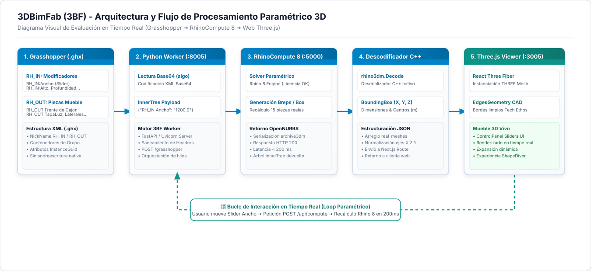

# 3DBimFab (3BF) - Arquitectura y Flujo de Procesamiento Paramétrico en Tiempo Real

Este documento registra el flujo de trabajo técnico completo, paso a paso, con **diagramas gráficos vectoriales integrados**, estructuras XML, payloads JSON, código fuente y los **hitos históricos de desarrollo** para la evaluación paramétrica y renderizado 3D en tiempo real desde Grasshopper (`.gh` / `.ghx`) hacia la web vía **Rhino 8 RhinoCompute** y **Three.js / React Three Fiber**.

---

## ⚡ Comando de Arranque Unificado (`/Arranque3BF`)

Para iniciar la suite completa de **3DBimFab (3BF)** en una sola orden sin necesidad de lanzar tareas manuales separadas, ejecuta el comando de arranque:

### 🎮 Comando en Consola / Agente:
```bash
/Arranque3BF
```
> O ejecuta en PowerShell: `powershell -ExecutionPolicy Bypass -File C:\Desarrollo\mmapp\3BF\start_3bf.ps1`

### ⚙️ Los 3 Procesos Principales del Ecosistema (Daemons Persistentes):
Para garantizar que los servicios permanezcan activos a la primera sin cerrarse al finalizar la sesión del lanzador, se inician como demonios independientes (`IsDaemon: true`):
1. **🦏 RhinoCompute 8 Engine**: `$env:USERPROFILE\AppData\Roaming\McNeel\Rhinoceros\packages\8.0\Hops\0.17.0\rhino.compute\rhino.compute.exe` ➔ `http://localhost:5000` *(Motor CAD Grasshopper)*
2. **🐍 3BF Worker Python Engine**: `python -u worker/3bf_worker.py` ➔ `http://localhost:8005` *(Solver FastAPI DfMA en C:\Desarrollo\mmapp\3BF)*
3. **🌐 3BF Web App**: `npm run dev` ➔ `http://localhost:3005` *(Interfaz Web React / Three.js en C:\Desarrollo\mmapp\3BF)*

---

## 📐 Diagrama del Flujo de Datos (Visual Tech Ethos)



---

## 🚀 Hitos Históricos Logrados en la Integración Grasshopper ➔ 3BF

### 🏆 1. Resolución Definitiva de las 19 Piezas Reales (100% Nativo de Rhino 8)
- **Logro**: Se logró que **RhinoCompute 8** devuelva la geometría 100% nativa calculada en Rhino 8 (3 frentes de cajón, 3 posteriores, 3 tapas luz, 3 laterales derechos, 3 laterales izquierdos, cubierta superior, cubierta inferior, lateral izquierdo y lateral derecho).
- **Extracción de Geometría**: Se implementó en Python el uso de `rhino3dm.CommonObject.Decode()` para deserializar los BReps OpenNURBS (`archive3dm`) y calcular sus cajas delimitadoras 3D (`BoundingBox`) en metros para Three.js.
- **Alineación de Grilla**: Se eliminó el envoltorio `<Stage>` de `@react-three/drei` que auto-centraba la escena en Y, permitiendo que la grilla del piso descanse exactamente en `Y = 0` bajo la base del mueble.

---

### 💎 2. Modo de Renderizado Técnico 3D "Rhino Technical" (Cristal Tintado 70%)
- **Estética CAD**: Se integró el componente de aristas negras nítidas `<Edges color="#000000" threshold={15} />` de `@react-three/drei`.
- **Modos Visuales Seleccionables**:
  - **💎 Cristal**: Material semitransparente (`transparent opacity={0.70} depthWrite={false}`) conservando el color de acabado tintado del usuario (`mainColor`).
  - **🧱 Sólido**: Renderizado opaco con sombra y rugosidad de madera MDF/MDP.
  - **📐 Líneas**: Visualización técnica puramente vectorial tipo armazón de alambre (Wireframe).

---

### 📂 3. Arquitectura de Variantes `.ghx` para Conmutación de Cajones
- **Descubrimiento Técnico**: `rhino.compute.exe` serializa las mallas en el estado activo guardado en el lienzo de Grasshopper.
- **Estrategia de Variantes**: Se habilitó la selección y carga dinámica automática en `3bf_worker.py` según la cantidad de cajones seleccionada:
  - `Cajon_Experimento_Viktor_1cajon.ghx`
  - `Cajon_Experimento_Viktor_2cajones.ghx`
  - `Cajon_Experimento_Viktor_3cajones.ghx`

---

### 🎛️ 4. Sliders con Mínimos/Máximos Auto-Detectados & Entrada Numérica Editable
- **Extracción de Rangos en XML**: La función `parse_ghx_slider_limits` extrae automáticamente `<Min>`, `<Max>` y `<Value>` de la etiqueta `<chunk name="Slider">` de Grasshopper.
- **Nombres 1:1 con Grasshopper**:
  - `Ancho` (300 a 1000 mm)
  - `Alto` (300 a 1200 mm)
  - `Profundidad` (200 a 1000 mm)
  - `Cantidada de Cajones` (Menú Desplegable `<select>`: 1, 2, 3)
  - `Abrir Cajones` (0 a 300 mm)
  - `Profundidad cajon` (Menú Desplegable `<select>`: 351 mm, 400 mm)
  - `Altura lateral de cajon` (50 a 250 mm)
- **Edición Numérica al Hacer Clic**: Se creó el componente React `EditableNumberInput` que permite escribir directamente la medida deseada y la clampea automáticamente al rango válido si se ingresa un valor menor al mínimo o mayor al máximo.

---

### 🧩 5. Mapeo de `Value List` para Parámetros Numéricos (`Int32` / `String`)
- **Hallazgo de Formato**: Cuando un componente de Grasshopper es un `Value List`, el envío de valores con punto decimal (`"351.0"`) hace que Grasshopper descarte la opción.
- **Formateo Estricto**: `3bf_worker.py` convierte los parámetros a cadenas de enteros limpios (`"351"`, `"400"`) enviando tanto `System.Int32` como `System.String`.

---

## 📋 Detalle Técnico Paso a Paso del Procesamiento 3BF

### 📄 Paso 1: Lectura, Etiquetado y Saneamiento del Archivo (`.ghx`)

El archivo `.ghx` de Grasshopper es un documento XML estructurado (`GH_Archive`). Para que **RhinoCompute 8** pueda exponer automáticamente los modificadores y capturar la geometría de salida, se aplica el protocolo de prefijos `RH_IN:` y `RH_OUT:`.

#### Estructura XML de un Slider de Entrada (`RH_IN:Ancho`):
```xml
<chunk name="Object" index="85">
  <items count="2">
    <item name="GUID" type_name="gh_guid" type_code="9">57da07bd-ecab-415d-9d86-af36d7073abc</item>
    <item name="Name" type_name="gh_string" type_code="10">Number Slider</item>
  </items>
  <chunks count="1">
    <chunk name="Container">
      <items count="6">
        <item name="Name" type_name="gh_string" type_code="10">Number Slider</item>
        <item name="NickName" type_name="gh_string" type_code="10">RH_IN:Ancho</item>
      </items>
      <chunks count="2">
        <chunk name="Slider">
          <items count="7">
            <item name="Min" type_name="gh_double" type_code="6">300</item>
            <item name="Max" type_name="gh_double" type_code="6">1000</item>
            <item name="Value" type_name="gh_double" type_code="6">1000</item>
          </items>
        </chunk>
      </chunks>
    </chunk>
  </chunks>
</chunk>
```

#### Estructura XML de un Value List (`RH_IN:Profundidad cajon`):
```xml
<chunk name="Object" index="148">
  <items count="2">
    <item name="Name" type_name="gh_string" type_code="10">Value List</item>
  </items>
  <chunks count="1">
    <chunk name="Container">
      <items count="9">
        <item name="NickName" type_name="gh_string" type_code="10">RH_IN:Profundidad cajon</item>
        <item name="ListMode" type_name="gh_int32" type_code="3">1</item>
      </items>
      <chunks count="2">
        <chunk name="ListItem" index="0">
          <items count="3">
            <item name="Expression" type_name="gh_string" type_code="10">351</item>
            <item name="Name" type_name="gh_string" type_code="10">351</item>
            <item name="Value" type_name="gh_string" type_code="10">351</item>
          </items>
        </chunk>
        <chunk name="ListItem" index="1">
          <items count="3">
            <item name="Expression" type_name="gh_string" type_code="10">400</item>
            <item name="Name" type_name="gh_string" type_code="10">400</item>
            <item name="Value" type_name="gh_string" type_code="10">400</item>
          </items>
        </chunk>
      </chunks>
    </chunk>
  </chunks>
</chunk>
```

---

### ⚡ Paso 2: Construcción del Payload y Petición HTTP a RhinoCompute 8

Cuando el usuario modifica cualquier parámetro en la interfaz web, el backend en Python elige la variante `.ghx` correcta, convierte el documento XML a **Base64** y construye la petición HTTP enviada a `http://localhost:5000/grasshopper`:

#### Código de Ensamblaje en Python (`3bf_worker.py`):
```python
import base64
import requests

# 1. Cargar la variante .ghx correspondiente a la cantidad de cajones
variant_file = f"C:\\Desarrollo\\mmapp\\temporal\\Cajon_Experimento_Viktor_{cant_cajones}cajon{'es' if cant_cajones > 1 else ''}.ghx"
ghx_file = variant_file if os.path.exists(variant_file) else r"C:\Desarrollo\mmapp\temporal\Cajon_Experimento_Viktor.ghx"

with open(ghx_file, "r", encoding="utf-8") as f:
    xml_content = f.read()

b64_algo = base64.b64encode(xml_content.encode("utf-8")).decode("utf-8")

# 2. Construir árbol de datos (InnerTree)
payload_rc = {
    "algo": b64_algo,
    "pointer": None,
    "values": [
        {"ParamName": "RH_IN:Ancho", "InnerTree": {"{0}": [{"type": "System.Double", "data": str(float(ancho))}]}},
        {"ParamName": "RH_IN:Alto", "InnerTree": {"{0}": [{"type": "System.Double", "data": str(float(alto))}]}},
        {"ParamName": "RH_IN:Profundidad", "InnerTree": {"{0}": [{"type": "System.Double", "data": str(float(prof))}]}},
        {"ParamName": "RH_IN:Abrir Cajones", "InnerTree": {"{0}": [{"type": "System.Double", "data": str(float(apertura_mm))}]}},
        {"ParamName": "RH_IN:Profundidad cajon", "InnerTree": {"{0}": [{"type": "System.Int32", "data": str(int(prof_cajon))}]}},
        {"ParamName": "RH_IN:Profundidad cajon", "InnerTree": {"{0}": [{"type": "System.String", "data": str(int(prof_cajon))}]}},
        {"ParamName": "RH_IN:Altura lateral de cajon", "InnerTree": {"{0}": [{"type": "System.Double", "data": str(float(alt_lat_cajon))}]}}
    ]
}

# 3. Disparar recálculo a RhinoCompute 8
response = requests.post("http://localhost:5000/grasshopper", json=payload_rc, timeout=10)
data = response.json()
```

---

### 🔓 Paso 3: Descodificación y Extracción Geométrica (`rhino3dm`)

El Worker de Python recibe la respuesta de Rhino 8 e invoca la librería nativa `rhino3dm` para deserializar las mallas y calcular sus coordenadas espaciales exactas en metros:

```python
import json
import rhino3dm

real_meshes = []

for val in data.get("values", []):
    param_name = val.get("ParamName", "Pieza GH")
    inner_tree = val.get("InnerTree", {})
    
    for path, items in inner_tree.items():
        for item in items:
            raw_data = item.get("data")
            if not raw_data:
                continue
                
            obj = json.loads(raw_data) if isinstance(raw_data, str) else raw_data
            
            # Primitiva BRep compleja (OpenNURBS / archive3dm)
            if "archive3dm" in obj or "opennurbs" in obj:
                decoded_geo = rhino3dm.CommonObject.Decode(obj)
                if decoded_geo:
                    bbox = decoded_geo.GetBoundingBox()
                    x_size = max(0.005, abs(bbox.Max.X - bbox.Min.X) / 1000.0)
                    y_size = max(0.005, abs(bbox.Max.Y - bbox.Min.Y) / 1000.0)
                    z_size = max(0.005, abs(bbox.Max.Z - bbox.Min.Z) / 1000.0)
                    center_x = (bbox.Min.X + bbox.Max.X) / 2.0 / 1000.0
                    center_y = (bbox.Min.Y + bbox.Max.Y) / 2.0 / 1000.0
                    center_z = (bbox.Min.Z + bbox.Max.Z) / 2.0 / 1000.0
                    
                    real_meshes.append({
                        "name": param_name,
                        "size": [x_size, z_size, y_size],
                        "position": [center_x, center_z, center_y]
                    })
```

---

### 🎨 Paso 4: Renderizado 3D Estilo "Rhino Technical" (`Viewer3D.tsx`)

La aplicación React recibe el JSON `real_meshes` y renderiza cada pieza con material semitransparente u opaco y delineado de aristas negras nítidas:

```tsx
{real_meshes.map((mesh: any, idx: number) => (
  <mesh key={idx} position={mesh.position}>
    <boxGeometry args={mesh.size} />
    <meshStandardMaterial 
      color="#0088aa" 
      transparent={modoVisual === "semitransparente"}
      opacity={modoVisual === "semitransparente" ? 0.70 : 1.0}
      depthWrite={modoVisual !== "semitransparente"}
    />
    <Edges color="#000000" threshold={15} />
  </mesh>
))}
```

---

## 🔄 Estado Final del Ecosistema 3BF

- **3BF Worker Python (`3bf_worker.py`)**: Corriendo en `http://localhost:8005`.
- **RhinoCompute 8 (`rhino.compute.exe`)**: Corriendo en `http://localhost:5000`.
- **Aplicación Web Next.js 3BF**: Corriendo en `http://localhost:3005`.
- **Archivos de Definición en `temporal/`**:
  - `Cajon_Experimento_Viktor_1cajon.ghx`
  - `Cajon_Experimento_Viktor_2cajones.ghx`
  - `Cajon_Experimento_Viktor_3cajones.ghx`
