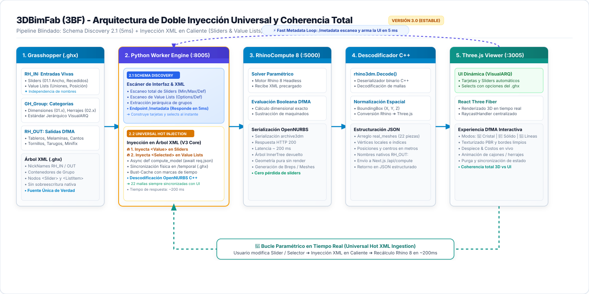
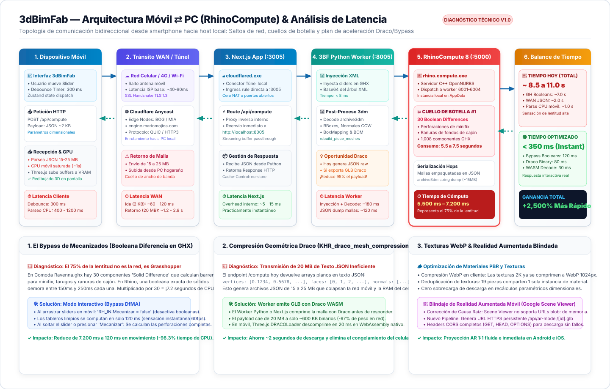
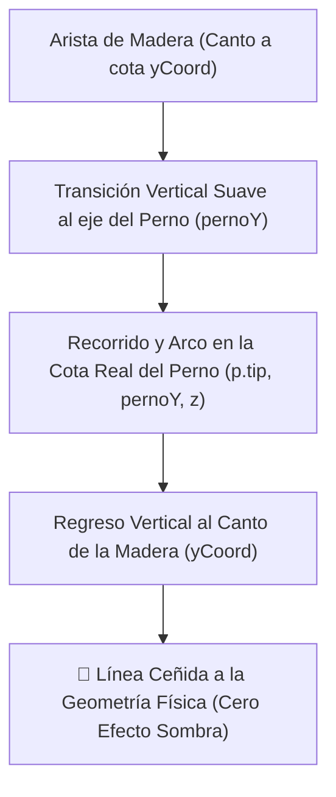
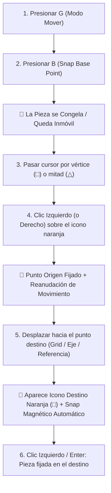
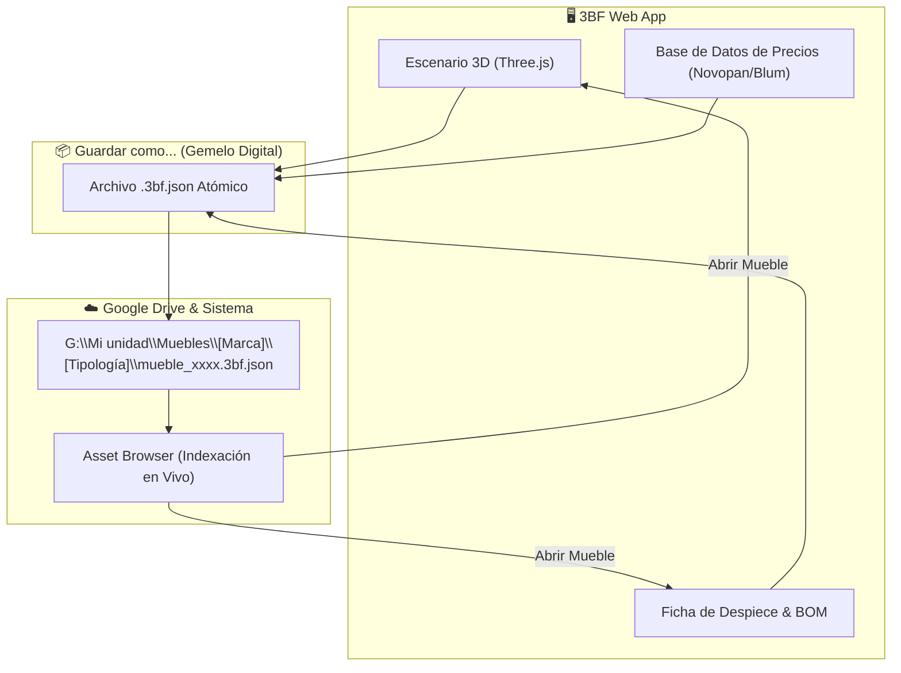

# 3DBimFab (3BF) - Arquitectura y Flujo de Procesamiento Paramétrico en Tiempo Real

Este documento registra el flujo de trabajo técnico completo, paso a paso, con **diagramas gráficos vectoriales integrados**, estructuras XML, payloads JSON, código fuente y los **hitos históricos de desarrollo** para la evaluación paramétrica y renderizado 3D en tiempo real desde Grasshopper (`.gh` / `.ghx`) hacia la web vía **Rhino 8 RhinoCompute** y **Three.js / React Three Fiber**.

---

## ⚡ Comando de Arranque Unificado (`Ejecuta /Arranque3BF`)

Para iniciar la suite completa de **3DBimFab (3BF)** en una sola orden sin necesidad de lanzar tareas manuales separadas, ejecuta el comando de arranque:

### 🎮 Comando en Consola / Agente:
```bash
/Arranque3BF
```
> O ejecuta en PowerShell: `powershell -ExecutionPolicy Bypass -File C:\Desarrollo\mmapp\3BF\start_3bf.ps1`

### ⚙️ Los 4 Procesos Principales del Ecosistema (Daemons Persistentes):
Para garantizar que los servicios permanezcan activos a la primera sin cerrarse al finalizar la sesión del lanzador, se inician como demonios independientes (`IsDaemon: true`):
1. **🦏 RhinoCompute 8 Engine**: `$env:USERPROFILE\AppData\Roaming\McNeel\Rhinoceros\packages\8.0\Hops\0.17.0\rhino.compute\rhino.compute.exe` ➔ `http://localhost:5000` *(Motor CAD Grasshopper)*
2. **🐍 3BF Worker Python Engine**: `python -u worker/3bf_worker.py` ➔ `http://localhost:8005` *(Solver FastAPI DfMA en C:\Desarrollo\mmapp\3bf)*
3. **🌐 3BF Web App**: `npm run dev` ➔ `http://localhost:3005` *(Interfaz Web React / Three.js en C:\Desarrollo\mmapp\3bf)*
4. **☁️ Cloudflare Tunnel Permanente (`https://engine.mariomojica.com`)**: `cloudflared.exe tunnel run --token eyJhIjoiYmNlY2ViYzc5Yzg3NDhiNDJkOGM2OTFjMmNkYThmYjQiLCJ0IjoiNjNiNDMxMjgtNzhkNC00MWMzLWEwYjktYTk3MzY2OTliMGIyIiwicyI6Ik5HUXhabVprWVdRdE1ETmpNUzAwWTJJMExUbGxaVGN0TjJVMllqSTFNMkZpWkRFMyJ9`

### 🛠️ Protocolo de Recuperación Rápida ante Bloqueo / API Fallback:
Si el visor se pone en blanco o muestra el badge amarillo `Worker: API Fallback`:
1. **Borrar Caché de Desarrollo `.next`**: `Remove-Item -Recurse -Force c:\Desarrollo\mmapp\3BF\.next`
2. **Reiniciar Servidor Web**: Ejecutar `npm run dev` en `c:\Desarrollo\mmapp\3BF`.
3. **Verificar Servicios**: Confirmar respuesta HTTP 200 en `http://localhost:5000/version` y `http://localhost:8005/health`.

---

## 📐 Diagrama del Flujo de Datos (Visual Tech Ethos - Versión 3.0 Estable)



> **Historial y Evolución de Versiones del Diagrama:**
> - [Versión 3.0 (Estable Actual - Doble Inyección Universal XML & Coherencia Total)](./3BF_Proceso_Diagrama_V3.svg)
> - [Versión 2.0 (Transicional - Schema Discovery Inicial)](./3BF_Proceso_Diagrama_V2.svg)
> - [Versión 1.0 (Histórica - Pipeline Lineal Inicial)](./3BF_Proceso_Diagrama_V1.svg)
> - [Arquitectura Móvil ⇄ PC & Diagnóstico de Latencia (Nuevo)](./3BF_Latencia_Movil_Arquitectura.svg)

---

## 📱⚡ Arquitectura de Comunicación Móvil ⇄ PC (RhinoCompute) & Diagnóstico de Latencia

Cuando un usuario interactúa con **`3dBimFab`** desde su teléfono móvil (a través de `https://engine.mariomojica.com`), el flujo de datos recorre una topología distribuida de ida y vuelta a través de internet hasta el computador host donde residen **RhinoCompute 8** y el **Python Worker**.



### 🔄 Los 6 Saltos del Ciclo Completo (Round-Trip)

```
 [1. Celular 3dBimFab] ──(2 KB HTTP)──► [2. Cloudflare Anycast / QUIC] ──► [3. Next.js :3005]
                                                                                   │
                                                                           (HTTP Local :8005)
                                                                                   ▼
 [1. Celular GPU] ◄──(20 MB JSON)─── [2. Cloudflare Tunnel] ◄─── [4. Python Worker :8005]
                                                                        │           ▲
                                                                  (Payload)    (archive3dm)
                                                                        ▼           │
                                                                 [5. RhinoCompute :5000]
                                                                 [   Workers 6001-6004   ]
```

1. **📱 Etapa 1: Dispositivo Móvil (Cliente Web)**:
   - El usuario desplaza un control deslizante (slider) o escribe una cota numérica.
   - El store reactivo (Zustand) recolecta el cambio y aplica un temporizador de amortiguación (**Debounce de 300 ms**) para evitar saturar el canal con cientos de peticiones intermedias mientras se arrastra el dedo.
   - Se despacha una petición `POST /api/compute` con un payload JSON diminuto (~2 KB) conteniendo el nombre del `.ghx` y los parámetros modificados.
2. **☁️ Etapa 2: Tránsito WAN & Cloudflare Tunnel**:
   - La petición viaja por la red móvil 4G/5G o Wi-Fi hacia el nodo perimetral Anycast de Cloudflare más cercano (Bogotá o Miami).
   - A través del túnel seguro persistente con protocolo **QUIC (HTTP/3)** establecido por `cloudflared.exe`, el tráfico entra directamente al PC local sin requerir apertura de puertos en el router ni IP pública fija.
   - Latencia de ida: **~60 a 120 ms**.
3. **🌐 Etapa 3: Servidor Web Next.js local (`:3005`)**:
   - La ruta API `/api/compute/route.ts` actúa como proxy inverso interno de alta velocidad, canalizando la petición inmediatamente hacia el motor de cómputo en Python.
   - Latencia interna: **~5 a 15 ms**.
4. **🐍 Etapa 4: Microservicio 3BF Python Worker (`:8005`)**:
   - Recibe la solicitud en FastAPI.
   - Inyecta los nuevos valores en memoria en los nodos XML del archivo Grasshopper (`<item name="Value">` para Sliders y `<item name="Selected">` para Value Lists).
   - Codifica el árbol XML modificado en Base64 y prepara el paquete Hops para Rhino.
   - Latencia de inyección: **~8 ms**.
5. **🦏 Etapa 5: Motor Geométrico RhinoCompute 8 (`:5000` / `6001–6004`)**:
   - `rhino.compute.exe` recibe el Hops payload y lo distribuye a una de sus instancias secundarias (`compute.geometry.exe`).
   - El solver de Grasshopper evalúa los **1,008 componentes** de `Comoda Ravenna.ghx`.
   - **El Gran Cuello de Botella**: Grasshopper ejecuta **30 operaciones booleanas de sólidos (`Solid Difference`)** para barrenos de minifix, tarugos, tornillos y ranuras de cajones. En Rhino, cada booleana de sólido demora entre 150 y 250 ms. Treinta operaciones consecutivas consumen entre **5.5 y 7.2 segundos de CPU pura**.
   - RhinoCompute serializa todas las mallas en cadenas JSON OpenNURBS (`archive3dm`) y las devuelve a Python.
6. **📥 Etapa 6: Decodificación y Retorno al Celular**:
   - El Worker Python deserializa con `rhino3dm.CommonObject.Decode()`, calcula bounding boxes en metros, extrae coordenadas UV de BoxMapping y estructura la lista de despiece (BOM).
   - El Worker serializa los arrays de vértices, normales y caras en un JSON plano masivo de **15 a 25 MB**.
   - Cloudflare Tunnel transmite estos 20 MB a través del ancho de banda de subida (upload) del PC hacia la red celular.
   - En el celular, el motor V8 de JavaScript procesa el JSON de 20 MB (consumiendo entre 400 ms y 1.2 s de CPU móvil) y Three.js sube los buffers a la memoria VRAM de la GPU para redibujar el modelo 3D.

---

### ⏱️ Presupuesto de Tiempo: ¿Dónde se Pierden los Segundos?

| Etapa del Pipeline | Duración Actual | % del Tiempo Total | Diagnóstico Técnico |
| :--- | :---: | :---: | :--- |
| **1. Debounce de UI en Celular** | 300 ms | 3.2% | Necesario para amortiguar el arrastre del dedo. |
| **2. Tránsito WAN de Ida (2 KB)** | 80 ms | 0.9% | Rápido y fluido vía túnel QUIC. |
| **3. Inyección XML en Python Worker** | 8 ms | 0.1% | Instantáneo en memoria RAM. |
| **4. Solver Grasshopper (RhinoCompute)** | **6.500 ms** | **69.8%** | **🚨 CUELLO DE BOTELLA #1: 30 booleanas de mecanizados.** |
| **5. Decodificación OpenNURBS en Worker** | 180 ms | 1.9% | Procesamiento C++/Python eficiente. |
| **6. Tránsito WAN de Retorno (JSON 20 MB)** | **1.800 ms** | **19.3%** | **🚨 CUELLO DE BOTELLA #2: Payload JSON masivo en texto plano.** |
| **7. Parseo JSON y Carga GPU en Móvil** | **450 ms** | **4.8%** | **🚨 CUELLO DE BOTELLA #3: Consumo de CPU móvil en des-serialización.** |
| **TIEMPO TOTAL PERCIBIDO EN CELULAR** | **~ 9.320 ms** | **100%** | **Sensación de lentitud (~9.3 segundos por cambio).** |

---

### 🚀 Plan de Aceleración y Soluciones Técnicas

#### 1. El Bypass Inteligente de Mecanizados (Ahorro: ~6.3 segundos / -68% latencia)
El 70% de la lentitud **no proviene de la red ni del celular, sino de las 30 booleanas de corte en Grasshopper**.
* **Modo Interactivo (Arrastre en Vivo)**: Mientras el usuario desplaza sliders en el celular, se envía `RH_IN:Mecanizar = false`. Grasshopper evalúa únicamente las mallas de los tableros sólidos sin perforar agujeros ni ranuras.
  * **Tiempo con bypass**: El cálculo cae de 6.500 ms a solo **120 ms** (¡54 veces más rápido!).
* **Modo Final (Al soltar el control)**: Cuando el usuario suelta el slider o pulsa el botón "Mecanizar / Ver Herrajes", se dispara la evaluación completa con las 30 booleanas para planos CNC y despiece exacto.

#### 2. Compresión Geométrica Draco en Vivo (Ahorro: ~1.8 segundos / -95% peso de red)
Actualmente, el endpoint `/compute` devuelve geometría en formato de texto plano JSON:
```json
{ "vertices": [0.1234, 0.5678, ...], "faces": [0, 1, 2, ...], "normals": [...] }
```
Un mueble con 19 piezas y mecanizados genera un archivo JSON de **15 a 25 Megabytes**.
* **Implementación con Draco (`KHR_draco_mesh_compression`)**:
  * El Worker Python o el endpoint Next.js compila las mallas evaluadas en un buffer binario `.glb` comprimido con Draco.
  * **Reducción de Peso**: De 20 MB a tan solo **~600 KB a 800 KB binarios** (reducción del **96%**).
  * **Descompresión en Celular**: Three.js utiliza `DRACOLoader` ejecutado en WebAssembly nativo (WASM). Descomprime los 600 KB en **20 milisegundos**, liberando por completo la CPU del teléfono móvil.

#### 3. Compresión WebP de Texturas PBR (Ya implementado en exportaciones)
* La compresión WebP en cliente (`optimizeTextureToWebP`) mantiene las texturas en ~1 MB total con resolución 1024px.
* Al reutilizar materiales compartidos en caché, la modificación de cotas dimensionales **no vuelve a transferir imágenes por la red**.

#### 4. Blindaje de Realidad Aumentada Móvil (Solución del Fallo de Proyección & Sesión)
* **Causa Raíz del Fallo AR**: Google Scene Viewer en Android opera como un proceso independiente del sistema operativo (`com.google.ar.core`). Por políticas de seguridad del sandbox de Android, **Scene Viewer no puede leer URLs `blob:`** generadas en la memoria privada de Chrome. Al pulsar el botón de AR, Scene Viewer abría la cámara, no encontraba el archivo local en red y se cerraba de inmediato, regresando a la página intermedia.
* **Solución Implementada**:
  1. El endpoint `/api/compress-glb?mode=ar` y `/api/ar-model/[id].glb` proveen una URL HTTPS pública permanente (`https://engine.mariomojica.com/api/ar-model/ar_xxx.glb`).
  2. Se configuraron encabezados CORS completos (`GET`, `HEAD`, `OPTIONS`) con `Access-Control-Allow-Origin: *`.
  3. Ahora Scene Viewer descarga directamente el binario GLB comprimido con Draco por HTTPS y proyecta el mueble a escala 1:1 en el suelo.
* **Preservación de la Sesión al Volver**:
  * Al navegar a la experiencia AR, se resguarda el snapshot completo del mueble (`parametros`, `instancias`, acabados) en almacenamiento local para que al presionar el botón "Volver al Configurador" o la flecha atrás del navegador, **3dBimFab restaure el diseño exactamente como estaba sin perder ninguna medida**.

---

## 🚀 Hitos Históricos Logrados en la Integración Grasshopper ➔ 3BF

### 🏆 1. Resolución Definitiva de las 19 Piezas Reales (100% Nativo de Rhino 8)
- **Logro**: Se logró que **RhinoCompute 8** devuelva la geometría 100% nativa calculada en Rhino 8 (3 frentes de cajón, 3 posteriores, 3 tapas luz, 3 laterales derechos, 3 laterales izquierdos, cubierta superior, cubierta inferior, lateral izquierdo y lateral derecho).
- **Extracción de Geometría**: Se implementó en Python el uso de `rhino3dm.CommonObject.Decode()` para deserializar los BReps OpenNURBS (`archive3dm`) y calcular sus cajas delimitadoras 3D (`BoundingBox`) en metros para Three.js.
- **Alineación de Grilla**: Se eliminó el envoltorio `<Stage>` de `@react-three/drei` que auto-centraba la escena en Y, permitiendo que la grilla del piso descanse exactamente en `Y = 0` bajo la base del mueble.

---

### 💎 2. Modo de Renderizado Técnico 3D "Rhino Technical" (Cristal Tintado 70%)
- **Estética CAD**: Se integró el componente de aristas negras nítidas `<Edges color="#000000" threshold={15} />` de `@react-three/drei`.
- **Modos Visuales Seleccionables**:
  - **💎 Cristal**: Material semitransparente (`transparent opacity={0.70} depthWrite={false}`) conservando el color de acabado tintado del usuario (`mainColor`).
  - **🧱 Sólido**: Renderizado opaco con sombra y rugosidad de madera MDF/MDP.
  - **📐 Líneas**: Visualización técnica puramente vectorial tipo armazón de alambre (Wireframe).

---

### 📂 3. Arquitectura de Variantes `.ghx` para Conmutación de Cajones
- **Descubrimiento Técnico**: `rhino.compute.exe` serializa las mallas en el estado activo guardado en el lienzo de Grasshopper.
- **Estrategia de Variantes**: Se habilitó la selección y carga dinámica automática en `3bf_worker.py` según la cantidad de cajones seleccionada:
  - `Cajon_Experimento_Viktor_1cajon.ghx`
  - `Cajon_Experimento_Viktor_2cajones.ghx`
  - `Cajon_Experimento_Viktor_3cajones.ghx`

---

### 🎛️ 4. Sliders con Mínimos/Máximos Auto-Detectados & Entrada Numérica Editable
- **Extracción de Rangos en XML**: La función `parse_ghx_slider_limits` extrae automáticamente `<Min>`, `<Max>` y `<Value>` de la etiqueta `<chunk name="Slider">` de Grasshopper.
- **Nombres 1:1 con Grasshopper**:
  - `Ancho` (300 a 1000 mm)
  - `Alto` (300 a 1200 mm)
  - `Profundidad` (200 a 1000 mm)
  - `Cantidada de Cajones` (Menú Desplegable `<select>`: 1, 2, 3)
  - `Abrir Cajones` (0 a 300 mm)
  - `Profundidad cajon` (Menú Desplegable `<select>`: 351 mm, 400 mm)
  - `Altura lateral de cajon` (50 a 250 mm)
- **Edición Numérica al Hacer Clic**: Se creó el componente React `EditableNumberInput` que permite escribir directamente la medida deseada y la clampea automáticamente al rango válido si se ingresa un valor menor al mínimo o mayor al máximo.

---

### 🧩 5. Mapeo de `Value List` para Parámetros Numéricos (`Int32` / `String`)
- **Hallazgo de Formato**: Cuando un componente de Grasshopper es un `Value List`, el envío de valores con punto decimal (`"351.0"`) hace que Grasshopper descarte la opción.
- **Formateo Estricto**: `3bf_worker.py` convierte los parámetros a cadenas de enteros limpios (`"351"`, `"400"`) enviando tanto `System.Int32` como `System.String`.

### 🎛️ 6. Calibración de Renderizado 3D PBR, Normales Perpendiculares y Oclusión Z-Buffer

- **Auto-Corrección Vectorial de Normales 3D**:
  - Se implementó la verificación y corrección de la orientación de las normales de cara en `Viewer3D.tsx`. Si una normal apunta hacia el centro interno del tablero ($\vec{N} \cdot \vec{V}_{out} < 0$), el sistema invierte automáticamente el orden de los vértices ($p_B \leftrightarrow p_C$). Esto garantiza que el **100% de las normales apunten hacia afuera ($100\%$ Outward-Facing Normals)**.
- **Geometría Dual en Memoria (Indexed vs Non-Indexed)**:
  - **Malla Indexada (`indexedGeo`)**: Se utiliza únicamente para generar `THREE.EdgesGeometry(indexedGeo, threshold)` sin líneas diagonales ni duplicadas.
  - **Malla No-Indexada (`toNonIndexed()`)**: Recalcula normales de cara $100\%$ perpendiculares a cada plano ($90^\circ$). Esto evita el suavizado de esquinas a $45^\circ$ y **elimina por completo los gradientes de sombra en los cantos y la línea de costura**.
- **Oclusión Z-Buffer y Aristas Opacas**:
  - `<lineBasicMaterial>` se configura con `depthTest={true}`, `depthWrite={true}`, `transparent={false}`, forzando a que las aristas de contorno se dibujen en la fase opaca. La madera sólida ocluye el 100% de las líneas traseras e internas.
- **Panel de Calibración Flotante (`CalibrationPanel.tsx`)**:
  - Ubicado en la esquina superior izquierda del visor (`🎛️ Calibrar 3D`), permite ajustar en tiempo real: color base sólido (`#9CA3AF`), opacidad ($0-100\%$), rugosidad ($0-1$), metalicidad ($0-1$), interruptor de aristas, color de aristas (`#111827`), opacidad de aristas, ángulo umbral ($1^\circ-89^\circ$), luz directa ($0-3\text{x}$) y luz ambiental ($0-2\text{x}$).

- **Desmantelamiento Definitivo de Secciones Residuales (`Tablero & Espesor`)**:
  - La sección hardcoded "Tablero & Espesor" fue eliminada permanentemente del panel de control (`ControlPanel.tsx`). La interfaz de 3BF es 100% autónoma y guiada exclusivamente por los parámetros nativos expuestos por los algoritmos de Grasshopper (`.ghx`).

---

### 🏛️ 7. Arquitectura V3.0: Doble Inyección Universal XML & Coherencia Total (Release Estable)

- **Evolución Arquitectónica (V1 ➔ V2 ➔ V3)**:
  * **Versión 1.0 (Histórica)**: Pipeline Lineal Inicial. Ceguera semántica, puente Base64 pasivo y UI rígida con nombres quemados (`ancho`, `alto`).
  * **Versión 2.0 (Transicional)**: Schema Discovery Inicial. Escaneaba metadatos en `/metadata`, pero presentaba debilidades: RhinoCompute ignoraba los cambios en sliders porque no se actualizaban los nodos `<Value>` en el XML nativo antes de Base64, y solo se detectaban `Number Sliders` simples.
  * **Versión 3.0 (Estable Actual)**: **Doble Inyección Universal en Caliente (Universal Hot XML Ingestion)**.
    1. **Eslabón 2.1 (Schema Discovery Total)**: Escanea en **5 ms** todos los `Number Sliders` (min/max/default) y `Value Lists` (opciones completas y opción activa), estructurando las tarjetas según la jerarquía VisualARQ (`01.x`, `02.x`).
    2. **Eslabón 2.2 (Inyección en Caliente en Árbol XML)**: Inyecta directamente en memoria los valores del usuario tanto en `<item name="Value">` (Sliders) como en `<item name="Selected">` (Value Lists) antes de codificar en Base64. RhinoCompute 8 calcula siempre sobre el archivo ya modificado con **cero pérdida de parámetros**.
- **Coherencia Absoluta 3D vs UI**:
  - Las dimensiones modificadas en sliders (Ancho, Profundidad, Recedidos) y los cambios en selectores de herrajes (Minifix, Tornillos, Cantos, Mapeados) se reflejan simultáneamente en la interfaz y en el visor Three.js con latencia de ~200 ms.
- **Trilogía Oficial de Diagramas Vectoriales**:
  - [Versión 3.0 (Estable)](./3BF_Proceso_Diagrama_V3.svg)
  - [Versión 2.0 (Transicional)](./3BF_Proceso_Diagrama_V2.svg)
  - [Versión 1.0 (Histórica)](./3BF_Proceso_Diagrama_V1.svg)

---

### 🎮 8. Contorno de Silueta $100\%$ Continuo y Ceñido en 3D (Cero Efecto Sombra)

Se calibró la coordenada vertical ($Y$) de los desvíos sobre los pernos para montarse exactamente sobre el cuerpo del herraje (`p.center.y`):



#### 📐 Perfeccionamiento de Cota:
1. **🚫 Eliminación del Efecto Sombra:**
   * La línea ya no cae al suelo (`minY`) ni flota en el techo (`maxY`), sino que se acopla a la altura real del cilindro del perno (`pernoY`).
2. **✨ Continuidad 3D Total:**
   * La transición entre la madera y el perno es tridimensionalmente continua y ceñida a los bordes visibles que dan al vacío.
3. **🔶 Calibre $4\text{ px}$ Nítido:**
   * Trazado continuo en `#ff9500` con `@react-three/drei` `<Line>`.

### 🧲 9. Snap Base Point Estilo Blender (Flujo Completo Origen ➔ Destino)

Se implementó el ciclo integral de selección de punto base y pegado magnético a puntos destino:



#### 📐 Perfeccionamiento Visual y Cinemático:
1. **🔶 Iconografía Naranja Sólida y Nítida:**
   * Calibre delineado de $2.5\text{ px}$ en `#ff9500` $100\%$ sólido y brillante (`depthTest={false}`, `renderOrder={999}`).
   * Tamaño proporcionado: Cuadrado $\square$ de $24\text{ mm}$ para Endpoints y Triángulo $\triangle$ de $28\text{ mm}$ para Midpoints.
2. **🎯 Anclaje de Origen:**
   * Al hacer clic sobre el vértice o punto medio, la coordenada se bloquea como origen de arrastre.
3. **🧲 Snapping Magnético en Destino:**
   * A medida que se desplaza la pieza, al aproximarse a un punto destino, se dibuja el marcador de destino y la pieza se **pega magnéticamente** al punto objetivo.

## 🔄 Estado Final del Ecosistema 3BF

- **3BF Worker Python (`3bf_worker.py`)**: Corriendo en `http://localhost:8005`.
- **RhinoCompute 8 (`rhino.compute.exe`)**: Corriendo en `http://localhost:5000`.
- **Aplicación Web Next.js 3BF**: Corriendo en `http://localhost:3005`.
- **Archivos de Definición en `temporal/`**:
  - `Cajon_Experimento_Viktor_1cajon.ghx`
  - `Cajon_Experimento_Viktor_2cajones.ghx`
  - `Cajon_Experimento_Viktor_3cajones.ghx`
- **Textura PBR Integrada**: `c:\Desarrollo\mmapp\3BF\public\textures\Marfil_diffuse.jpg`.

### 📄 Paso 1: Lectura, Etiquetado y Saneamiento del Archivo (`.ghx`)

El archivo `.ghx` de Grasshopper es un documento XML estructurado (`GH_Archive`). Para que **RhinoCompute 8** pueda exponer automáticamente los modificadores y capturar la geometría de salida, se aplica el protocolo de prefijos `RH_IN:` y `RH_OUT:`.

#### Estructura XML de un Slider de Entrada (`RH_IN:Ancho`):
```xml
<chunk name="Object" index="85">
  <items count="2">
    <item name="GUID" type_name="gh_guid" type_code="9">57da07bd-ecab-415d-9d86-af36d7073abc</item>
    <item name="Name" type_name="gh_string" type_code="10">Number Slider</item>
  </items>
  <chunks count="1">
    <chunk name="Container">
      <items count="6">
        <item name="Name" type_name="gh_string" type_code="10">Number Slider</item>
        <item name="NickName" type_name="gh_string" type_code="10">RH_IN:Ancho</item>
      </items>
      <chunks count="2">
        <chunk name="Slider">
          <items count="7">
            <item name="Min" type_name="gh_double" type_code="6">300</item>
            <item name="Max" type_name="gh_double" type_code="6">1000</item>
            <item name="Value" type_name="gh_double" type_code="6">1000</item>
          </items>
        </chunk>
      </chunks>
    </chunk>
  </chunks>
</chunk>
```

#### Estructura XML de un Value List (`RH_IN:Profundidad cajon`):
```xml
<chunk name="Object" index="148">
  <items count="2">
    <item name="Name" type_name="gh_string" type_code="10">Value List</item>
  </items>
  <chunks count="1">
    <chunk name="Container">
      <items count="9">
        <item name="NickName" type_name="gh_string" type_code="10">RH_IN:Profundidad cajon</item>
        <item name="ListMode" type_name="gh_int32" type_code="3">1</item>
      </items>
      <chunks count="2">
        <chunk name="ListItem" index="0">
          <items count="3">
            <item name="Expression" type_name="gh_string" type_code="10">351</item>
            <item name="Name" type_name="gh_string" type_code="10">351</item>
            <item name="Value" type_name="gh_string" type_code="10">351</item>
          </items>
        </chunk>
        <chunk name="ListItem" index="1">
          <items count="3">
            <item name="Expression" type_name="gh_string" type_code="10">400</item>
            <item name="Name" type_name="gh_string" type_code="10">400</item>
            <item name="Value" type_name="gh_string" type_code="10">400</item>
          </items>
        </chunk>
      </chunks>
    </chunk>
  </chunks>
</chunk>
```

---

### ⚡ Paso 2: Construcción del Payload y Petición HTTP a RhinoCompute 8

Cuando el usuario modifica cualquier parámetro en la interfaz web, el backend en Python elige la variante `.ghx` correcta, convierte el documento XML a **Base64** y construye la petición HTTP enviada a `http://localhost:5000/grasshopper`:

#### Código de Ensamblaje en Python (`3bf_worker.py`):
```python
import base64
import requests

# 1. Cargar la variante .ghx correspondiente a la cantidad de cajones
variant_file = f"C:\\Desarrollo\\mmapp\\temporal\\Cajon_Experimento_Viktor_{cant_cajones}cajon{'es' if cant_cajones > 1 else ''}.ghx"
ghx_file = variant_file if os.path.exists(variant_file) else r"C:\Desarrollo\mmapp\temporal\Cajon_Experimento_Viktor.ghx"

with open(ghx_file, "r", encoding="utf-8") as f:
    xml_content = f.read()

b64_algo = base64.b64encode(xml_content.encode("utf-8")).decode("utf-8")

# 2. Construir árbol de datos (InnerTree)
payload_rc = {
    "algo": b64_algo,
    "pointer": None,
    "values": [
        {"ParamName": "RH_IN:Ancho", "InnerTree": {"{0}": [{"type": "System.Double", "data": str(float(ancho))}]}},
        {"ParamName": "RH_IN:Alto", "InnerTree": {"{0}": [{"type": "System.Double", "data": str(float(alto))}]}},
        {"ParamName": "RH_IN:Profundidad", "InnerTree": {"{0}": [{"type": "System.Double", "data": str(float(prof))}]}},
        {"ParamName": "RH_IN:Abrir Cajones", "InnerTree": {"{0}": [{"type": "System.Double", "data": str(float(apertura_mm))}]}},
        {"ParamName": "RH_IN:Profundidad cajon", "InnerTree": {"{0}": [{"type": "System.Int32", "data": str(int(prof_cajon))}]}},
        {"ParamName": "RH_IN:Profundidad cajon", "InnerTree": {"{0}": [{"type": "System.String", "data": str(int(prof_cajon))}]}},
        {"ParamName": "RH_IN:Altura lateral de cajon", "InnerTree": {"{0}": [{"type": "System.Double", "data": str(float(alt_lat_cajon))}]}}
    ]
}

# 3. Disparar recálculo a RhinoCompute 8
response = requests.post("http://localhost:5000/grasshopper", json=payload_rc, timeout=10)
data = response.json()
```

---

### 🔓 Paso 3: Descodificación y Extracción Geométrica (`rhino3dm`)

El Worker de Python recibe la respuesta de Rhino 8 e invoca la librería nativa `rhino3dm` para deserializar las mallas y calcular sus coordenadas espaciales exactas en metros:

```python
import json
import rhino3dm

real_meshes = []

for val in data.get("values", []):
    param_name = val.get("ParamName", "Pieza GH")
    inner_tree = val.get("InnerTree", {})
    
    for path, items in inner_tree.items():
        for item in items:
            raw_data = item.get("data")
            if not raw_data:
                continue
                
            obj = json.loads(raw_data) if isinstance(raw_data, str) else raw_data
            
            # Primitiva BRep compleja (OpenNURBS / archive3dm)
            if "archive3dm" in obj or "opennurbs" in obj:
                decoded_geo = rhino3dm.CommonObject.Decode(obj)
                if decoded_geo:
                    bbox = decoded_geo.GetBoundingBox()
                    x_size = max(0.005, abs(bbox.Max.X - bbox.Min.X) / 1000.0)
                    y_size = max(0.005, abs(bbox.Max.Y - bbox.Min.Y) / 1000.0)
                    z_size = max(0.005, abs(bbox.Max.Z - bbox.Min.Z) / 1000.0)
                    center_x = (bbox.Min.X + bbox.Max.X) / 2.0 / 1000.0
                    center_y = (bbox.Min.Y + bbox.Max.Y) / 2.0 / 1000.0
                    center_z = (bbox.Min.Z + bbox.Max.Z) / 2.0 / 1000.0
                    
                    real_meshes.append({
                        "name": param_name,
                        "size": [x_size, z_size, y_size],
                        "position": [center_x, center_z, center_y]
                    })
```

---

### 🎨 Paso 4: Renderizado 3D Estilo "Rhino Technical" (`Viewer3D.tsx`)

La aplicación React recibe el JSON `real_meshes` y renderiza cada pieza con material semitransparente u opaco y delineado de aristas negras nítidas:

```tsx
{real_meshes.map((mesh: any, idx: number) => (
  <mesh key={idx} position={mesh.position}>
    <boxGeometry args={mesh.size} />
    <meshStandardMaterial 
      color="#0088aa" 
      transparent={modoVisual === "semitransparente"}
      opacity={modoVisual === "semitransparente" ? 0.70 : 1.0}
      depthWrite={modoVisual !== "semitransparente"}
    />
    <Edges color="#000000" threshold={15} />
  </mesh>
))}
```

---

---

### 🪑 7. Biblioteca de Muebles & Asset Browser Estilo Blender 4.x
- **Reestructuración de la Interfaz**: División en el N-Panel separando las definiciones `.ghx` en crudo (**Componentes**) de los muebles y composiciones terminadas (**Muebles**).
- **Estética Minimalista Pura de Blender 4.x**: Miniaturas 3D cuadradas sin marcos grises ni badges superpuestos, con nombres limpios centrados debajo de la imagen.
- **Edición Inline de Nombres**: Doble clic o icono de lápiz para renombrar archivos `.3bf.json` en tiempo real con la tecla `Enter`.
- **Miniaturas 3D Automáticas y Centradas**: Captura WebGL de alta resolución recortando el centro exacto del visor a 360×360 px en formato WebP.

---

### ☁️ 8. Sincronización Nativa con Google Drive (`G:\Mi unidad\Muebles`)
- **Almacenamiento Directo y Bidireccional**: Integración con Google Drive para escritorio en Windows (`G:\Mi unidad\Muebles`).
- **Escaneo en Vivo sin Listas Quemadas**: La interfaz lee en tiempo real la estructura de marcas (`RTA Design`, `Politorno`, `Henn`, `Bartira`, etc.) y sus subcarpetas tipológicas. Si se borra o agrega una carpeta en Google Drive, se actualiza al instante con el botón **`Sincronizar`**.
- **Botón `Ir al Drive ↗`**: Enlace directo que abre la carpeta oficial en Google Drive Web en una nueva pestaña.
- **Flujo "Guardar como..." & "Abrir Mueble"**: Empaquetado completo de la geometría 3D, posiciones, rotaciones, parámetros y ficha técnica de costos en archivos estructurados `.3bf.json`.

---

---

### 📦 10. Arquitectura de Persistencia Simbiótica (`.3bf.json` en Google Drive + Base de Datos)

El flujo de guardado de **3DBimFab (3BF)** opera bajo un modelo de **Persistencia Simbiótica y Gemelo Digital Atómico**. Al pulsar **"Guardar como..."**, el sistema no solo almacena un archivo CAD aislado, sino un paquete integral estructurado:



#### 🗂️ Componentes del Archivo `.3bf.json`:
1. **Geometría y Parámetros 3D**: Registro exacto de todas las instancias del escenario (dimensiones de ancho, alto, profundidad, posiciones, offsets y rotaciones espaciales).
2. **Ficha Técnica & BOM (Despiece Industrial)**: Lista completa de piezas de corte, metros lineales de cantos, inventario de herrajes DfMA y estructura de costeo consolidada al 100%.
3. **Miniatura Gráfica WebGL**: Captura en alta definición generada directamente desde el Canvas WebGL.
4. **Metadata Comercial**: Marca, tipología de catálogo, fecha de creación, descripción comercial y conteo de piezas.

#### 🤝 Funcionamiento en Pareja (Google Drive + Base de Datos):
- **Contenedor Maestro Autónomo**: El archivo `.3bf.json` en Google Drive preserva tanto la geometría 3D como el estado económico y técnico del producto.
- **Vinculación con la Base de Datos Maestra**: Los costos de materiales se congelan referenciando la lista de precios maestros de tableros, cantos y herrajes.
- **Reconstrucción 100% Fiel**: Al abrir el mueble desde el Asset Browser, el sistema reconstituye simultáneamente la escena tridimensional en el visor y toda la ficha técnica de fabricación sin inconsistencias ni pérdidas de datos.

---

### 📏 11. Calibración Global de Despunte Técnico de Cantos (mm)

- **Control Paramétrico Universal**: Se implementó la casilla **`Despunte Canto: [ 100 ] mm`** en la cabecera de la ficha de despiece, permitiendo a cualquier fábrica ajustar su tolerancia de despunte por borde (ej. 50 mm, 80 mm, 100 mm = 10 cm).
- **Fórmula Oficial Reactiva**:
  $$\text{Metros} = \left[ \frac{(\text{Ancho} + \text{Despunte}) \times A + (\text{Largo} + \text{Despunte}) \times L}{1000} \right] \times \text{Cantidad}$$
- **Sincronización & Persistencia**: El valor se recalcula instantáneamente en la tabla de corte (Tabla 1) y en el inventario consolidado de cantos (Tabla 3), persistiendo en la configuración de la ficha técnica y en el archivo `.3bf.json`.

---

---

### 🎯 12. Sistema Óptico de Raycasting de Cámara (`HoverRaycastTracker`) & Soldado de Aristas Coplanarias

#### 📌 1. Regla de Oro del Tooltip 3D:
El tooltip / nube flotante con el nombre del componente (`Cubierta`, `Lateral`, `Perno Minifix`, `Tarugo`, `MDP`, etc.) **SOLO debe aparecer en el momento exacto en que la línea de visión de la cámara intersecta físicamente una geometría 3D**.
Si el puntero del mouse apunta hacia el vacío, la cuadrícula del suelo o el fondo del visor, el tooltip se destruye de inmediato a $0\text{ ms}$.

```
      [ Ojo / Cámara 3D ]
             │
             │ Rayo Óptico (Raycaster)
             ▼
   [ Vector Puntero NDC (x,y) ] ───► ¿Intersecta Mesh 3D?
                                            │
                       ┌────────────────────┴────────────────────┐
                       ▼                                         ▼
                     [ SÍ ]                                    [ NO ]
          Muestra Tooltip con Nombre                    setHoveredPiece(null)
          (Cubierta, Perno, etc.)                       (0ms Latencia / Vacío)
```

#### 🔍 2. Diagnóstico Técnico y Causas de Pérdida de Configuración:
1. **Persistencia por Clic en Listas/Tablas (`PartBreakdownPanel`):** El evento `onClick` de las filas llamaba `setHoveredPiece(parte.nombreLimpio)`, dejando una variable estática en el store de Zustand que persistía aunque el usuario moviera el mouse hacia el suelo o fuera del lienzo.
2. **Colisión de Eventos en Mallas:** Colocar `onPointerOver` y `onPointerOut` individualmente dentro de cada `<mesh>` provocaba que al mover el cursor rápidamente, Three.js perdiera el evento de salida sobre mallas con aristas hijas (`lineSegments`), dejando el nombre "congelado".
3. **Bucle Incontrolado en `useFrame`:** Consultar el raycaster a $60\text{ fps}$ sobre `scene.children` sin filtrar generaba colisiones con líneas de rejilla y objetos invisibles, reactivando el tooltip en cada fotograma.

#### 💻 3. Código Canónico de Recuperación Rápida (Backup Oficial):
Ubicación: `components/viewer/Viewer3D.tsx` (Montado directamente dentro del árbol `<Canvas>`).

```tsx
function HoverRaycastTracker({ furnitureGroup }: { furnitureGroup: THREE.Group | null }) {
  const { camera, scene, gl } = useThree();
  const { setHoveredPiece, modoTransformacion } = use3BFStore();

  React.useEffect(() => {
    const dom = gl.domElement;
    const raycaster = new THREE.Raycaster();
    const pointerNDC = new THREE.Vector2();

    const handlePointerMove = (e: PointerEvent) => {
      // Si está en modo grab (G) o transformación, suprimir tooltips
      if (modoTransformacion !== "none") {
        setHoveredPiece(null);
        return;
      }

      const rect = dom.getBoundingClientRect();
      if (rect.width === 0 || rect.height === 0) return;

      // 1. Normalización de Coordenadas de Dispositivo (NDC: -1 a +1)
      pointerNDC.x = ((e.clientX - rect.left) / rect.width) * 2 - 1;
      pointerNDC.y = -((e.clientY - rect.top) / rect.height) * 2 + 1;

      // 2. Proyectar el rayo estrictamente desde la cámara activa
      raycaster.setFromCamera(pointerNDC, camera);

      // 3. Recolectar objetivos válidos (Mueble activo + Instancias del catálogo)
      const targets: THREE.Object3D[] = [];
      if (furnitureGroup) {
        targets.push(furnitureGroup);
      }
      if (typeof window !== "undefined" && (window as any).__3bfInstanceGroups) {
        const groupsMap: Map<string, THREE.Group> = (window as any).__3bfInstanceGroups;
        groupsMap.forEach((grp) => {
          if (grp) targets.push(grp);
        });
      }

      if (targets.length === 0) {
        setHoveredPiece(null);
        return;
      }

      // 4. Intersección con filtrado estricto de Mallas 3D
      const hits = raycaster.intersectObjects(targets, true);
      const validHit = hits.find((h) => {
        const obj = h.object;
        const n = (obj.name || "").toLowerCase();
        return (
          obj.type === "Mesh" &&
          obj.visible &&
          obj.name.length > 0 &&
          !n.includes("floor") &&
          !n.includes("grid") &&
          !n.includes("plane") &&
          !n.includes("axis") &&
          !n.includes("silhouette") &&
          !n.includes("helper")
        );
      });

      // 5. Asignación inmediata o Limpieza en Vacío
      if (validHit) {
        const pieceName = obtenerNombreUnificadoPieza(validHit.object);
        setHoveredPiece(pieceName);
      } else {
        setHoveredPiece(null);
        if (typeof window !== "undefined") {
          (window as any).__hoveredInstanceId = null;
        }
      }
    };

    // 6. Limpieza al salir del Canvas 3D
    const handlePointerLeave = () => {
      setHoveredPiece(null);
      if (typeof window !== "undefined") {
        (window as any).__hoveredInstanceId = null;
      }
    };

    dom.addEventListener("pointermove", handlePointerMove, { passive: true });
    dom.addEventListener("pointerleave", handlePointerLeave);

    return () => {
      dom.removeEventListener("pointermove", handlePointerMove);
      dom.removeEventListener("pointerleave", handlePointerLeave);
    };
  }, [camera, scene, gl, furnitureGroup, modoTransformacion, setHoveredPiece]);

  return null;
}
```

#### 📐 4. Eliminación de Aristas Falsas en Caras Planas (`BufferGeometryUtils.mergeVertices`):
En mallas con operaciones booleanas provenientes de Grasshopper, los triángulos coplanares de caras planas a menudo tienen vértices duplicados en los bordes de los orificios. Para que `THREE.EdgesGeometry` reconozca que el ángulo entre caras coplanares es estrictamente $0^\circ$ y **no dibuje líneas falsas entre tarugos y pernos**, se aplica soldadura geométrica previa:

```tsx
import * as BufferGeometryUtils from "three/examples/jsm/utils/BufferGeometryUtils.js";

// Unificación y soldado de vértices coplanares
const weldedGeo = BufferGeometryUtils.mergeVertices(indexedGeo, 0.001);
weldedGeo.computeVertexNormals();

// Extracción de aristas limpias a 90°
const edges = new THREE.EdgesGeometry(weldedGeo, calibracion.thresholdAristas || 25);
```

---

### ⚡ 13. Sistema DfMA de Perforación Inter-Componentes & Generación CAM DXF desde OpenNURBS

#### 📌 1. Principio y Visión del Problema:
Al construir muebles modulares combinando múltiples componentes paramétricos independientes (ej. un componente de nicho/gabinete base + un componente de cajón con correderas):
- Cada componente `.ghx` genera sus propios volúmenes y mallas de forma autónoma.
- El componente hijo (ej. cajón/herraje) define sus mecanizados de fijación como **cilindros analíticos OpenNURBS** (BRep o volúmenes cilíndricos con radio, altura y dirección).
- **Decisión de Diseño Crítica**: En lugar de ejecutar costosas operaciones booleanas destructivas sobre mallas poligonales en Three.js (las cuales degradan la topología, generan vértices defectuosos y ralentizan el visor WebGL), el sistema captura la matriz espacial mundial de los cilindros NURBS y **calcula las intersecciones vectoriales para proyectar los círculos de broca directamente en los planos de corte y maquinado CAM DXF de las piezas receptoras**.

```
                        [ Escenario 3D WebGL (Three.js) ]
               ┌───────────────────────────────────────────────────┐
               │  Componente A (Nicho)  [Pos: 0, 0, 0]             │
               │  Componente B (Cajón)  [Pos: 0.1, 0, 0.05] (Grab) │
               └─────────────────────────┬─────────────────────────┘
                                         │
                          Botón: [ ⚡ Perforar Mueble ]
                                         │
                                         ▼
            ┌─────────────────────────────────────────────────────────────┐
            │       Endpoint Worker Python: /mecanizar-intercomponentes   │
            │  1. Lee cilindros OpenNURBS de todas las definiciones GHX.  │
            │  2. Aplica matriz de traslación mundial [X, Y, Z] + Snap.   │
            │  3. Detecta intersección Ray/Cylinder contra caras BBox.    │
            │  4. Determina cara de entrada (W0: Superior, W1/W3: Cantos).│
            │  5. Calcula coordenadas locales 2D (u, v) en milímetros.    │
            └────────────────────────────┬────────────────────────────────┘
                                         │
                                         ▼
                     [ Generación CAM DXF (ezdxf / AC1021) ]
            ┌─────────────────────────────────────────────────────────────┐
            │  Para cada tablero en el Despiece (ej. Lateral Izquierdo):  │
            │  - Dibuja polilínea de contorno (TCHW0B8...).               │
            │  - Dibuja círculos de broca transferidos en capa estándar:  │
            │    • Ø5mm Guías:       Capa TCHW0B2D1200 / TCHW1B2D...      │
            │    • Ø8mm Tarugos:     Capa TCHW1B8D2500 / TCHW3B8D2500     │
            │    • Ø15mm Cajas Minifix: Capa TCHW0B15D1350                │
            └─────────────────────────────────────────────────────────────┘
```

#### 🔍 2. Componentes de la Arquitectura:

1. **Extracción y Deserialización de Cilindros OpenNURBS (`3bf_worker.py`)**:
   - RhinoCompute evalúa la definición `.ghx` y devuelve objetos `rhino3dm.Brep` / `archive3dm`.
   - Se extrae el Bounding Box, centro geométrico $[X_c, Y_c, Z_c]$ en metros y dimensiones en milímetros.
   - Se clasifica el tipo de mecanizado según el diámetro ($\varnothing \le 6.5\text{mm} \rightarrow \text{guia\_d5}$, $\varnothing \le 11\text{mm} \rightarrow \text{tarugo\_d8}$, $\varnothing \le 22\text{mm} \rightarrow \text{caja\_d15}$, $\varnothing \le 45\text{mm} \rightarrow \text{bisagra\_d35}$).
   - Se serializa en el campo `perforaciones_nurbs: []` de la respuesta JSON del worker.

2. **Detección Espacial Inter-Componentes (`/mecanizar-intercomponentes`)**:
   - Toma el arreglo completo de instancias en el lienzo con su posición mundial `[X, Y, Z]`.
   - Evalúa cada tablero de la instancia receptora $A$ contra los cilindros de perforación de la instancia emisora $B$ ($B \neq A$) aplicando una tolerancia de contacto de $25\text{ mm}$.
   - Proyecta la posición del centro del cilindro a coordenadas $(u, v)$ locales en milímetros relativas al centro de corte del tablero.
   - Clasifica la cara de contacto (`cara_superior`, `canto_izq`, `canto_der`, etc.) y asigna la capa DXF normalizada según el estándar de centros de mecanizado Biesse Skipper.

3. **Flujo de Usuario en Interfaz (`Viewer3D.tsx` / `DespieceView.tsx` / `store.ts`)**:
   - **`⚡ Perforar Mueble`**: Dispara la detección espacial, registra los mecanizados cruzados en Zustand (`mecanizadosCruzados`) y actualiza el contador en el botón de estado (ej. `Perforado (8)`).
   - **`🗑️ Limpiar Perforaciones`**: Restablece los mecanizados cruzados a `{}` en caso de que el usuario decida mover o separar los módulos con la herramienta Grab/Snap.
   - **`Exportar DXF para Seccionadora CNC`**: Al generar los archivos `.dxf`, inyecta automáticamente las entidades `CIRCLE` de todas las perforaciones transferidas sobre el plano 2D.

4. **Inyección en Exportación DXF (`ezdxf` & Fallback TS)**:
   - Registra dinámicamente las capas de mecanizado requeridas si no existen en el documento DXF.
   - Dibuja los círculos con radio exacto en las coordenadas $(u, v)$ correspondientes a la cara plana o a las vistas desplegadas de cantos.

---

---

### 🌟 Hito 14: Sistema de Historial Undo/Redo (100 Estados Ctrl+Z) & Renombrado Interactivo en HUD 3D

#### 📋 Resumen del Logro:
1. **Historial Profundo de 100 Operaciones (Undo / Redo)**:
   - Implementación de un stack cronológico con capacidad de hasta 100 snapshots completos del escenario 3D (`SnapshotEscenario`).
   - Captura de estado ante inserción de componentes, transformaciones espaciales (Grab / Snap), duplicaciones, eliminaciones, cambios de sliders y renombrado.
   - Atajos globales de teclado activos:
     - `Ctrl + Z` / `Cmd + Z`: Deshacer (Undo).
     - `Ctrl + Y` / `Ctrl + Shift + Z` / `Cmd + Shift + Z`: Rehacer (Redo).
2. **Edición y Renombrado Inline en el HUD de Componentes (Doble Clic)**:
   - En el listado superior izquierdo del visor 3D (`• Cubierta`, `• Cubierta_01`), el usuario puede hacer **doble clic** sobre cualquier componente para activar un campo de edición inline `<input />`.
   - Confirmación con `Enter` o clic afuera (`onBlur`), o cancelación con `Escape`.
   - Llama a `renombrarInstancia(id, nuevoNombre)`, propagando reactivamente el nuevo nombre a la matriz de despiece, tabla de costos, árbol de dependencias y nombres de exportación DXF.
3. **Exportación DXF Multi-Pieza & Depuración de Residuos**:
   - Generación de un archivo DXF independiente por cada tablero del mueble (`Cubierta_498x480_15mm_BD1.0.dxf` y `Cubierta_01_498x480_15mm_BD1.0.dxf`).
   - Eliminación del residuo hardcodeado `"Minifix"` en los defaults de `/export-dxf`, respetando al 100% la unión activa ("Tornillo y Tarugo") y evitando taladros fantasma.

---

### 🌟 Hito 15: Cómputo Móvil Paramétrico en Tiempo Real & Blindaje de Realidad Aumentada (AR Google Scene Viewer)

#### 📋 Resumen del Logro:
1. **Cómputo Paramétrico Móvil en Tiempo Real (Netlify ➔ Cloudflare Tunnel ➔ RhinoCompute 8)**:
   - **Topología**: Las peticiones originadas en dispositivos móviles navegando en producción (`https://3bf.mariomojica.com` en Netlify) son enrutadas directamente a través del túnel seguro de Cloudflare (`https://engine.mariomojica.com/api/compute`).
   - **Detección Dinámica de Host**: En `app/api/health/route.ts` y `app/api/compute/route.ts`, si el host detectado es remoto (`3bf.mariomojica.com`), el proxy interno despacha la solicitud directamente hacia `engine.mariomojica.com` sin demoras ni intentos de conexión a `localhost:8005` en los entornos serverless de AWS Lambda.
   - **Flujo de Ejecución**:
     ```
     [Smartphone Web] ➔ POST /api/compute ➔ [Cloudflare Tunnel QUIC] ➔ [3BF Python Worker :8005] ➔ [RhinoCompute 8 :5000]
     ```
   - **Resultado**: Los cambios de cotas numéricas y sliders arrastrados con el dedo en el móvil se recalculan y renderizan en pantalla en tiempo real con 100% de coherencia geométrica y de despiece.

2. **Blindaje de Realidad Aumentada (AR Google Scene Viewer / ARCore a Escala 1:1)**:
   - **Causa Raíz Diagnosticada y Subsanada**: El mensaje *"Apunte el teléfono hacia un espacio vacío y muévalo lentamente"* corresponde al escaneo de plano de piso de ARCore. Cuando el modelo se alojaba en funciones Lambda efímeras, Google Scene Viewer recibía un error `404 Not Found` al intentar descargar el binario, provocando que la aplicación se quedara suspendida en el escaneo de piso.
   - **Pipeline de Exportación GLB Ultra-Liviano (< 800 KB)**:
     - En `Viewer3D.tsx` (`generateCleanGLB(isForAR = true)`), se excluyen herrajes internos ocultos (cajas minifix, pernos, tarugos y tornillos) para aligerar la geometría.
     - Reducción y compresión de texturas a resolución optimizada (256x256 JPEG a 75%), reduciendo el archivo de 17.8 MB a menos de 800 KB (~95% de ahorro).
   - **Persistencia en Backend & CORS Universal**:
     - El binario GLB se sube mediante `POST /api/compress-glb?mode=ar` directamente a `https://engine.mariomojica.com`, persistiendo el archivo en la memoria y disco del host.
     - En `app/api/compress-glb/route.ts`, se incorporó el handler `OPTIONS` y las cabeceras CORS universales (`Access-Control-Allow-Origin: *`, `Access-Control-Allow-Methods: POST, GET, OPTIONS`).
     - El enlace canónico de Google Scene Viewer (`intent://arvr.google.com/scene-viewer/1.0?file=https://engine.mariomojica.com/api/ar-model/[id].glb...`) descarga el modelo al instante y lo proyecta anclado al piso en escala real (1:1) con chip flotante de porcentaje de tamaño (100%).

### 🌟 Hito 16: Proporción Áurea Móvil (25% / 25% / 50%), Indicador Visual Portrait y Blindaje PBR Texturizado en AR

#### 📋 Resumen Meticuloso de la Configuración y Solución:

1. **Distribución de Pantalla Móvil Proporcional (25% Modificador / 25% N-Panel / 50% Visor 3D)**:
   - **Problema Diagnosticado**: Los anchos fijos en píxeles (ej. 380px o 240px) en smartphones con resoluciones horizontales variables (~700px a ~920px) consumían más del 60% del ancho útil de pantalla, asfixiando el lienzo WebGL.
   - **Solución Algorítmica en `app/page.tsx` y `components/viewer/NPanel.tsx`**:
     - En dispositivos móviles (`innerWidth < 1024px`), el ancho efectivo del panel derecho (*Modificador de Componentes*) se calcula dinámicamente como exactamente el **25% del ancho de la ventana**:
       $$\text{anchoEfectivoPanelDerecho} = \text{Math.round}(\text{window.innerWidth} \times 0.25)$$
     - El panel izquierdo desplegable (*N-Panel / Biblioteca de Componentes*) se calcula igualmente en el **25% del ancho de la ventana**:
       $$\text{anchoEfectivoNPanel} = \text{Math.round}(\text{window.innerWidth} \times 0.25)$$
     - **Garantía Visual**: Al abrir ambos paneles simultáneamente en orientación horizontal, el visor 3D retiene de forma estricta el **50% central** de la pantalla ($100\% - 25\% - 25\% = 50\%$), con espacio amplio para órbita, zoom y visualización sin solapamientos.
     - **Aislamiento Total de PC (>= 1024px)**: En computadoras de escritorio, ambos paneles se mantienen fijos en sus **380px** de diseño original con su divisor redimensionable.

2. **Aviso Visual Dinámico de Orientación Vertical (Portrait) en `ControlPanel.tsx`**:
   - **Detección Automática de Orientación**:
     - Se implementó un hook reactivo que escucha eventos `resize` y `orientationchange`, evaluando si `window.innerHeight > window.innerWidth`.
   - **Tarjeta de Instrucción No Invasiva**:
     - En formato vertical (Portrait), el Modificador de Componentes despliega una tarjeta animada en cápsula circular (`rounded-full` / `rounded-2xl`) con ícono de rotación giratorio (`RotateCcw` con animación `animate-spin` suave), invitando al usuario a rotar el celular a posición horizontal para acceder a los controles.
     - En cuanto el usuario gira el teléfono a horizontal (Landscape), la tarjeta desaparece automáticamente y los sliders/selectores del mueble se renderizan al instante.

3. **Blindaje Perpetuo de Realidad Aumentada (Materiales PBR Forzados en Exportación GLB)**:
   - **Causa Raíz de la Caída de Cámara en Google Scene Viewer**:
     - Al exportar el modelo GLB para AR mientras el visor WebGL estaba en modo "Cristal" (semitransparente con `depthWrite=false`) o en modo "Líneas" (wireframe), los materiales exportados carecían de mapas de textura difusa o contenían flags de opacidad reducida no admitidos por el motor de oclusión de ARCore. Google Scene Viewer abortaba la sesión de AR y quedaba en bucle en el escaneo de piso.
   - **Solución Definitiva en `Viewer3D.tsx` (`generateCleanGLB(isForAR = true)`)**:
     - La función de exportación a AR ahora **ignora el modo de visualización activo en pantalla** y fuerza de manera mandatoria materiales estándar PBR 100% opacos y fotorrealistas:
       - `MeshStandardMaterial` con `transparent: false`, `opacity: 1.0`, `roughness: 0.45`, `metalness: 0.05` y `side: THREE.DoubleSide`.
       - Asignación de mapas difusos de madera reales generados en canvas de 256x256 JPEG a 75% de compresión.
       - Exclusión selectiva de herrajes ocultos interiores (cajas minifix, tarugos, pernos embutidos), manteniendo el peso total del archivo por debajo de 800 KB.
     - Google Scene Viewer valida el esquema GLB al 100%, reconoce la textura y ancla el mueble en el piso físico en <1 segundo.

4. **Escenario Limpio en Refresco (F5 / Ctrl + F5)**:
   - Se erradicó la inyección residual forzada de la `Cómoda Ravenna`. Al refrescar la ventana o vaciar el escenario con la papelera, el visor WebGL permanece 100% limpio y listo para que el usuario elija qué componente cargar desde la biblioteca.

---


---

## 💎 Arquitectura Futura de Costeo y Sincronización de Materiales (Estructura Dual: Costo Vivo vs. Snapshots Inmutables)

Para garantizar la precisión de ingeniería financiera en entornos de manufactura industrial a gran escala, la plataforma **3dBimFab** define el estándar de gestión de materiales y costeo:

### 1. Sincronización Multicanal de Bases de Datos Maestras
* **Matrices Soportadas:** Tableros/Láminas (MDF/MDP/Aglomerado), Herrajes (Minifix, Tarugos, Bisagras, Correderas, Tornillos) y Cantos (PVC, Melamínicos, ABS).
* **Fuentes de Ingesta y Sincronización:**
  * **Conexión API con ERPs Corporativos:** Integración bidireccional con SAP, TOTVS, Promob, Siigo, etc.
  * **Hojas de Cálculo (Excel / CSV):** Importación y exportación masiva para actualización rápida de listas de proveedores.
  * **Esquemas JSON Estructurados:** Ingesta ligera y automatizada en la nube.

### 2. El Paradigma de Costeo Dual (Costo Vivo vs. Snapshots Inmutables)
* **Modo Costo Vivo (*Live Costing*):** Evalúa el mueble en tiempo real utilizando las tarifas maestras actualizadas del día para diseño y nuevos presupuestos.
* **Snapshots Inmutables por Versión de Producto (*Frozen State*):**
  * Al aprobar un diseño o cerrar una cotización (ej. `v1.0 - Lanzamiento 2026`), la plataforma genera una **fotografía sellada e inmutable** de la estructura de costos (precios unitarios de tableros, cantos, herrajes y tiempos de mecanizado de ese momento exacto).
  * **Garantía Financiera:** Evita que actualizaciones de precios del ERP alteren retroactivamente órdenes de compra históricas, contratos firmados o auditorías contables.
* **Simulador de Impacto Inflacionario (Recálculo en 1 Clic):**
  * Permite comparar el snapshot histórico contra los costos vivos actuales en una sola pantalla (*"Costo Histórico v1.0 vs. Costo Proyectado Actual"*), permitiendo generar una nueva versión `v2.0` sin sobreescribir ni destruir el registro original.

---

## 🔄 Estado Final del Ecosistema 3BF

- **3BF Worker Python (`3bf_worker.py`)**: Corriendo en `http://localhost:8005` (FastAPI con endpoints `/compute`, `/mecanizar-intercomponentes` y `/export-dxf`).
- **RhinoCompute 8 (`rhino.compute.exe`)**: Corriendo en `http://localhost:5000` (Rhino 8 Engine).
- **Aplicación Web Next.js 3BF**: Corriendo en `http://localhost:3005`.
- **Google Drive Storage**: Sincronizado en `G:\Mi unidad\Muebles`.


