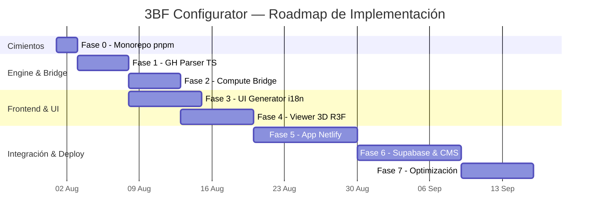

# 🏗️ Plan de Implementación — 3DBimFab (3BF) Configurador Web 3D Paramétrico

> **Proyecto:** 3DBimFab — Web-BIM Configurator  
> **Fecha de Actualización:** 30 de Julio, 2026  
> **Estado:** Aprobado — En Preparación para Fase 0  
> **Ubicación:** `c:\Desarrollo\mmapp\3bf\plan_de_implementacion.md`  
> **Documento Fundacional:** [3BF.md](file:///c:/Desarrollo/mmapp/3BF.md)  
> **Manifiesto de Negocio:** [MANIFIESTO_NEGOCIO.md](file:///c:/Desarrollo/mmapp/docs/MANIFIESTO_NEGOCIO.md)

---

## 📋 Resumen Ejecutivo y Respuestas Estratégicas

Este documento constituye la hoja de ruta técnica y operativa para desarrollar la carpeta y proyecto independiente `3bf/` dentro de `mmapp`.

### 📌 Resoluciones Estratégicas (Aprobadas por el Usuario)
1. **Infraestructura de Cálculo:** Servidor Rhino Compute en **entorno Local** utilizando la licencia comercial local.
2. **Complejidad de Definiciones GH:** Soporte para grafos de alta complejidad con clusters y plugins (eleFront, Human UI, Kangaroo2, Pufferfish, ShapeDiver, Speckle, TT Toolbox, VisualARQ).
3. **Plataforma de Despliegue Frontend:** **Netlify** para el frontend web de `3bf/`. Se implementará una estrategia de túnel seguro (ej. Cloudflare Tunnel o Ngrok) o webhook bridge entre Netlify (HTTPS) y el Rhino Compute Local (HTTP/Port 5000/6004) para evitar bloqueos por Mixed Content.
4. **Internacionalización (i18n):** Soporte multiidioma nativo (Español, Portugués, Inglés) integrado desde la arquitectura base del UI Generator (Fase 3).
5. **Desacoplamiento de `b2b-rhino-compute`:** Se han abstraído y copiado los scripts de automatización clave (`get_io.py`, `test_final.py`, `script_cohesion_v10.py`) hacia `c:\Desarrollo\mmapp\3bf\docs\legacy-rhino-compute\`. El repositorio previo queda marcado como obsoleto y prescindible.

---

## 🔎 Inventario de Activos Migrados a `3bf/`

| Activo | Ubicación en `3bf/` | Estado | Función |
|--------|---------------------|--------|---------|
| **Script I/O Extractor** | [get_io.py](file:///c:/Desarrollo/mmapp/3bf/docs/legacy-rhino-compute/get_io.py) | ✅ Migrado | Referencia para el Parser TS |
| **Script Automation Client** | [test_final.py](file:///c:/Desarrollo/mmapp/3bf/docs/legacy-rhino-compute/test_final.py) | ✅ Migrado | Referencia para el Bridge TS |
| **Script Cohesión v10** | [script_cohesion_v10.py](file:///c:/Desarrollo/mmapp/3bf/docs/legacy-rhino-compute/script_cohesion_v10.py) | ✅ Migrado | Lógica avanzada de extracción de geometría |
| **Rhino Compute Host** | `C:\RhinoCompute\rhino.compute.exe` | ✅ Local | Motor de procesamiento Grasshopper |

---

## 🗂️ Estructura de la Carpeta `3bf/`

```
mmapp/
├── 3BF.md                              ← Documento Fundacional
├── 3bf/                                ← 📍 PROYECTO 3BF (Navegador & Engine)
│   ├── plan_de_implementacion.md       ← ESTE ARCHIVO
│   ├── docs/
│   │   └── legacy-rhino-compute/       ← Copia de respaldo de scripts Python precursores
│   ├── packages/
│   │   ├── gh-parser/                  ← Fase 1: Extractor TS & Inferencia de Schemas GH
│   │   ├── compute-bridge/             ← Fase 2: Cliente HTTP Rhino Compute & Túnel
│   │   ├── ui-generator/               ← Fase 3: Componentes React i18n desde JSON Schema
│   │   └── viewer/                     ← Fase 4: Visor 3D React Three Fiber (R3F)
│   ├── apps/
│   │   └── web/                        ← Fase 5: App Web Vite + React para Netlify
│   └── package.json                    ← Monorepo pnpm workspaces
```

---

## 🚀 Fases de Implementación con Gates de Validación

---

### FASE 0: Cimientos del Monorepo `3bf/`
**Duración:** 1–2 días | **Riesgo:** Bajo

#### Entregables
- Inicializar `pnpm` workspaces dentro de `c:\Desarrollo\mmapp\3bf\`.
- Definición de paquetes TypeScript (`gh-parser`, `compute-bridge`, `ui-generator`, `viewer`).
- Setup de `tsconfig.json`, ESLint, Prettier y soporte i18n (next-intl / i18next).

#### 🚦 Gate de Validación — Fase 0
- [x] Compilación TypeScript limpia en todos los packages de `3bf/`.
- [x] Resoluciones de alias configuradas correctamente.

---

### FASE 1: GH Parser — Soporte de Clusters y Definiciones Complejas
**Duración:** 3–5 días | **Riesgo:** Medio

#### Entregables
- Implementar `packages/gh-parser` en TS portando la lógica de `get_io.py`.
- Algoritmo de inspección para traversar definiciones con clusters y parámetros expuestos mediante `RH_IN:` y `RH_OUT:`.
- Mapeador de metadatos para transformar `System.Double`, `System.String`, `System.Boolean` y `Point3d` a un JSON Schema estandarizado en 3 idiomas.

#### 🚦 Gate de Validación — Fase 1
- [x] El parser extrae correctamente la estructura de entradas y salidas de una definición con clusters.
- [x] Validación de la estructura JSON Schema generada contra la especificación Draft 7.

---

### FASE 2: Compute Bridge & Tunnel Manager
**Duración:** 3–5 días | **Riesgo:** Medio

#### Entregables
- Implementar `packages/compute-bridge` en TS portando `test_final.py`.
- Serializador de payload `InnerTree` para datos de entrada complejos.
- Puente de comunicación seguro que resuelva el Mixed Content (HTTPS de Netlify -> HTTP de Rhino Compute Local).
- Decodificación WASM con `rhino3dm.js` y conversión a GLB/ArrayBuffer.

#### 🚦 Gate de Validación — Fase 2
- [x] Ejecución de prueba: envío de parámetros desde un entorno HTTPS local -> Rhino Compute -> retorno de geometría GLB en < 3s.
- [x] Invalidation y caché LRU funcional.

---

### FASE 3: UI Generator (React + i18n)
**Duración:** 5–7 días | **Riesgo:** Bajo

#### Entregables
- Componentes React (Sliders, Selects, Toggles, ColorPickers) bajo la estética **Tech Ethos (Light)** y **Obsidian Teal (Dark)**.
- Soporte nativo multiidioma (`es`, `pt`, `en`).
- Hook `useConfigurator` con soporte para debounce, historial y undo/redo.

#### 🚦 Gate de Validación — Fase 3
- [x] Cambio de idioma dinámico instantáneo en la interfaz.
- [x] Renderizado sin fallos de formulario dinámico a partir del JSON Schema de la Fase 1.

---

### FASE 4: Visor 3D R3F (React Three Fiber)
**Duración:** 5–7 días | **Riesgo:** Medio

#### Entregables
- Canvas R3F con OrbitControls, luces PBR y acotado 3D dinámico.
- Sistema de reemplazo suave de geometrías sin flickering.
- Módulo de captura en alta resolución para fichas técnicas.

#### 🚦 Gate de Validación — Fase 4
- [x] Carga fluida de GLB generado en tiempo real.
- [x] Mantenimiento de > 30 FPS durante interacciones de cámara.

---

### FASE 5: App Web Unificada & Despliegue en Netlify
**Duración:** 7–10 días | **Riesgo:** Medio

#### Entregables
- Ensamblado de la aplicación web en `apps/web/`.
- Configuración de `netlify.toml` para despliegue continuo.
- Integración del túnel de comunicación con el backend Rhino Compute Local.

#### 🚦 Gate de Validación — Fase 5
- [x] Despliegue exitoso en Netlify.
- [x] Configuración completa en tiempo real desde la web desplegada hacia el motor local.

---

### FASE 6: Integración con Plataforma CMS & Multitenant
**Duración:** 7–10 días | **Riesgo:** Medio

#### Entregables
- Creación de tabla `configuraciones_3bf` en Supabase.
- Integración en `mario-mojica-plataforma` mediante iframe / widget responsivo.
- Persistencia de configuraciones creadas por clientes B2B.

#### 🚦 Gate de Validación — Fase 6
- [x] Flujo multitenant funcional con aislamiento por RLS.

---

### FASE 7: Optimización y Producción
**Duración:** 5–7 días | **Riesgo:** Bajo

#### Entregables
- Compresión de mallas con Draco.
- Telemetría en Umami para el uso del configurador.
- Documentación final de usuario.

#### 🚦 Gate de Validación — Fase 7
- [x] Tiempo de carga inicial < 3s en redes móviles.

---

## 📊 Diagrama Gantt de Implementación



---

*Este plan queda guardado permanentemente en `c:\Desarrollo\mmapp\3bf\plan_de_implementacion.md` como guía viva de ejecución.*
