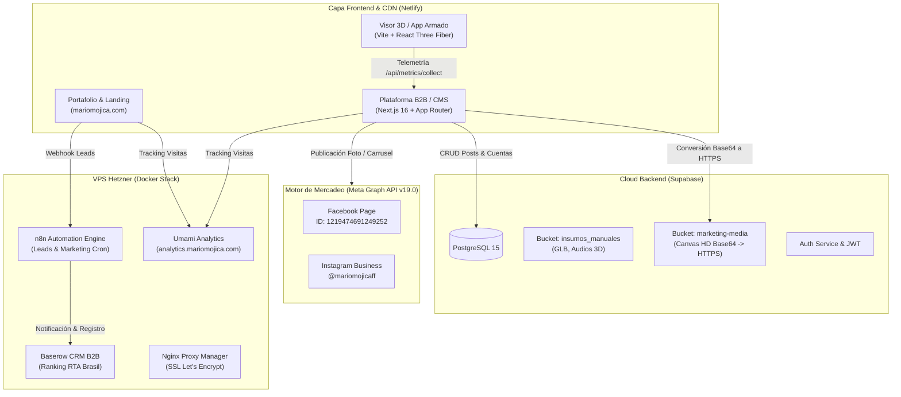

# Arquitectura del Ecosistema B2B Mario Mojica - Versión 8 (V8)

> **Versión:** V8 (Julio 2026)  
> **Estado:** Producción Activa & Validada  
> **Diagrama Vectorial:** [arquitectura_V8.svg](file:///c:/Desarrollo/mmapp/Arquitectura/arquitectura_V8.svg)  
> **Guía de Replicación:** [guia_replicacion_V8.md](file:///c:/Desarrollo/mmapp/Arquitectura/guia_replicacion_V8.md)

---

## 1. Visión General del Sistema

El ecosistema B2B de Mario Mojica integra una arquitectura multicanal de alto rendimiento compuesta por:
1. **Plataforma B2B / CMS (`mario-mojica-plataforma`):** Aplicación Next.js 16 (App Router) con panel de control, gestión de proyectos, telemetría de fricción y **Módulo de Mercadeo Multicanal (Meta Facebook & Instagram)**.
2. **Motor de Publicación de Mercadeo (Meta Graph API v19.0):** Publicación directa single photo y carrusel HD a Facebook Page (`1219474691249252`) e Instagram Business (`@mariomojicaff`), con intercambio automático a Token Perenne de Página y convertidor HTTPS Base64 a través del bucket `marketing-media`.
3. **Planificador Semanal B2B (24 Horas & Mapa de Calor):** Visualizador estilo Metricool con mapa de calor de engagement CTR B2B (tonos coral/rosa), cabecera sticky de días y selector de zonas horarias (`Bento Gonçalves / Brasil UTC-3` vs `Colombia UTC-5`).
4. **Visor 3D / App de Armado (`legacy-aplicativo-armado`):** Motor WebGL (React Three Fiber / Three.js) optimizado para modelos GLB interactivos, con blindaje 3D (IP Shield) y telemetría de uso.
5. **Supabase Cloud Backend:** PostgreSQL 15, Auth JWT, Row Level Security (RLS) y almacenamiento dual (`insumos_manuales` privado y `marketing-media` público).
6. **VPS Hetzner (Dockerized Infrastructure):** n8n (Worker de publicación programada y webhooks de leads), Baserow (CRM B2B Directorio RTA Brasil), Umami Analytics y Nginx Proxy Manager.
7. **Portafolio & Landing Page (`mario-mojica-homepage`):** Sitio público en Netlify (`mariomojica.com`) sincronizado con alertas de leads en WhatsApp Cloud API.

---

## 2. Mapa Tecnológico por Componentes

---

## 3. Flujo del Módulo de Mercadeo (Facebook & Instagram)

### A. Preparación y Generación HD de Imagen (Canvas 2K)
1. El usuario crea o edita una publicación en `EditorPostModal`.
2. Si el post incluye carruseles o plantillas creadas en Inkscape/SVG, el motor cliente renderiza un **Canvas HTML5 a resolución 2K (2048px @ 98% JPEG)** para garantizar tipografía cristalina.
3. El frontend despacha la imagen Base64 DataURL al endpoint de publicación `/api/marketing/publish`.

### B. Conversión HTTPS de Medios (`ensurePublicImageUrl`)
1. El servidor API en `app/api/marketing/publish/route.ts` recibe la imagen Base64.
2. Si la imagen viene en formato DataURL, se convierte a `Buffer` y se sube automáticamente al bucket público de Supabase Storage `marketing-media`.
3. Supabase retorna la **URL pública HTTPS permanente** (`https://...supabase.co/storage/v1/object/public/marketing-media/...`).
4. Esta URL es requerida obligatoriamente por la CDN de Meta para descargar las imágenes.

### C. Intercambio de Tokens a Nunca-Expirar (Never-Expiring Page Token)
1. En `saveMarketingCuenta` (`app/actions/marketing.ts`), al ingresar un User Access Token de Explorer, el servidor consulta automáticamente:
   `GET /oauth/access_token?grant_type=fb_exchange_token`
2. Esto convierte el token efímero de 1 hora en un **Long-Lived User Token (60 días)**.
3. A continuación, consulta `/v19.0/1219474691249252?fields=access_token,instagram_business_account`.
4. Retorna el **Never-Expiring Page Access Token** de la página `Mario Mojica - Smart Assembly 3D - Inteligência Moveleira` y extrae el ID de Instagram `@mariomojicaff`.

### D. Publicación en Facebook Page
- **Foto Única:** `POST /v19.0/{page_id}/photos` enviando `{ url: publicUrl, caption, access_token }`.
- **Carrusel (Multi-Foto):**
  1. Para cada foto: `POST /v19.0/{page_id}/photos` enviando `{ url, published: false, access_token }` -> Retorna `photo_id`.
  2. Publicar álbum: `POST /v19.0/{page_id}/feed` enviando `{ message: caption, attached_media: [{ media_fbid: photo_id }, ...] }`.

### E. Publicación en Instagram Business (`@mariomojicaff`)
- **Foto Única:**
  1. Crear contenedor: `POST /v19.0/{ig_id}/media` con `{ image_url: publicUrl, caption, access_token }` -> Retorna `creation_id`.
  2. **Espera técnica obligatoria:** `await setTimeout(3500)` para dar tiempo a la CDN de Meta de procesar la imagen.
  3. Publicar contenedor: `POST /v19.0/{ig_id}/media_publish` con `{ creation_id, access_token }`.
- **Carrusel (Multi-Foto):**
  1. Para cada foto: `POST /v19.0/{ig_id}/media` con `{ image_url, is_carousel_item: true }` -> Retorna `item_id`.
  2. Crear contenedor carrusel: `POST /v19.0/{ig_id}/media` con `{ media_type: "CAROUSEL", children: [item_id_1, item_id_2], caption }` -> Retorna `carousel_container_id`.
  3. `await setTimeout(3500)` -> Publicar con `POST /v19.0/{ig_id}/media_publish`.

---

## 4. Planificador Semanal B2B (24 Horas & Mapa de Calor Metricool)

- **Grilla de 24 Horas:** Visualización continua de `00:00` a `23:00`.
- **Cabecera Sticky:** Los encabezados de los días (`Lunes` a `Domingo`) se mantienen congelados arriba (`sticky top-0 z-20 backdrop-blur-md`) mientras se desplaza la franja horaria.
- **Mapa de Calor de CTR B2B:** Degradados rosa/coral en horarios pico de prospección a ejecutivos de empresas RTA Brasil (Martes a Jueves `09:00`, `11:00`, `14:00`, `15:00`, `18:00`, `19:00`).
- **Selector de Zonas Horarias:**
  - 🇧🇷 `Bento Gonçalves / Brasil (UTC-3)`
  - 🇨🇴 `Colombia / Ecuador (UTC-5)`
  - Calculadora de equivalencia de hora local (Muestra por ejemplo `08:00 (06:00 Col)`).

---

## 5. Blindaje de Seguridad y Control de Datos

- **IP Shield 3D:** Firma dinámica HMAC y protección de modelos `.glb` en el bucket privado `insumos_manuales`.
- **Persistencia de Credenciales:** La tabla `marketing_cuentas` almacena de forma aislada tokens por proveedor con `plataforma` única.
- **Control de Borrado en UI:** Confirmación interactiva con botón destructivo de alto contraste en el modal de edición y borrado rápido en 1 clic en la tarjeta de próximas publicaciones.

---

## 6. Inventario de Archivos Clave de la Arquitectura

| Archivo / Ruta | Descripción |
| :--- | :--- |
| [`Arquitectura/arquitectura_V8.svg`](file:///c:/Desarrollo/mmapp/Arquitectura/arquitectura_V8.svg) | Diagrama SVG oficial de la Arquitectura V8. |
| [`Arquitectura/guia_replicacion_V8.md`](file:///c:/Desarrollo/mmapp/Arquitectura/guia_replicacion_V8.md) | Guía técnica para replicar la infraestructura desde cero. |
| [`app/actions/marketing.ts`](file:///c:/Desarrollo/mmapp/mario-mojica-plataforma/app/actions/marketing.ts) | Server Actions para CRUD de publicaciones y auto-exchange de tokens. |
| [`app/api/marketing/publish/route.ts`](file:///c:/Desarrollo/mmapp/mario-mojica-plataforma/app/api/marketing/publish/route.ts) | Motor de publicación a Facebook Page e Instagram Business Graph API. |
| [`components/marketing/calendario-semanal.tsx`](file:///c:/Desarrollo/mmapp/mario-mojica-plataforma/components/marketing/calendario-semanal.tsx) | Componente del Planificador 24H con mapa de calor y zonas horarias. |
| [`components/marketing/editor-post-modal.tsx`](file:///c:/Desarrollo/mmapp/mario-mojica-plataforma/components/marketing/editor-post-modal.tsx) | Modal editor multi-canal con renderizador Canvas 2K HD y borrado. |
