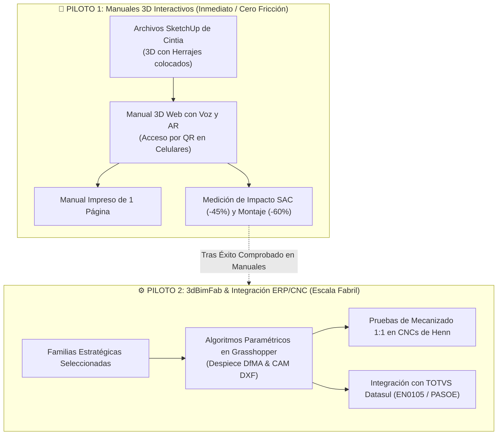

# 🏢 MÓVEIS HENN: MEMORIA TÉCNICA, MANUAL 3D, CALCULADORA DE COSTOS E INTEGRACIÓN TOTVS DATASUL

> **Documento Backend de Inteligencia de Negocios, Costos y Arquitectura Técnica**  
> **Cliente:** Móveis Henn (Mondaí, Santa Catarina, Brasil)  
> **Área:** Engenharia de Produto & P&D / Manufatura Digital  
> **Autor:** Mario Mojica (Manuales 3D Interactivos & 3dBimFab)  
> **Fecha:** 26 de Agosto de 2026 (Actualizado con Calculadora de Costos para Reunión del 27/08)  
> **Estado:** Documento Vivo / Backend Estratégico  

---

## 🧭 1. Perfil del Cliente y Mapa de Poder

* **Empresa:** Móveis Henn (Mondaí, Santa Catarina, Brasil).
* **Escala:** Uno de los mayores fabricantes y exportadores de muebles **RTA (Ready-To-Assemble)** de América Latina, con más de 70.000 m² de planta industrial automatizada.
* **Contactos Clave:**
  * **Marcos Unnass (Coordenador P&D):** Tomador de decisión técnico. Evalúa costos de ingeniería, tiempos de desarrollo y defiende la propuesta ante la junta directiva.
  * **Jonas Borck (Analista de Engenharia de Produtos):** Padrino B2B e interlocutor técnico directo.
  * **Cintia (Diseñadora / P&D):** Modela en **SketchUp**, inserta herrajes y diseña los manuales impresos actuales en InDesign/Illustrator.
  * **Rudgeri Henkel (Gerente de Planejamento e Materiais):** Controla compras, abastecimiento y logística de planta.

---

## 📊 2. Métricas Clave y Beneficios Validados en Muebles RTA

Basado en métricas de adopción de manuales interactivos en la industria mueblera:
* 📉 **-60% Reducción de Reclamos por Montaje:** Menor tasa de devoluciones por piezas mal ensambladas o tablas invertidas.
* 📵 **-45% Llamadas de Soporte Evitadas (SAC):** Drástica caída de solicitudes por herrajes supuestamente "faltantes".
* 🎯 **82% Tasa de Conclusión de Montaje Exitosa:** Mayor porcentaje de clientes que finalizan el armado sin requerir ayuda externa.
* ⭐ **71.9% Experiencia y Evaluaciones Positivas:** Elevación del Net Promoter Score (NPS) y valoraciones en marketplaces (Mercado Livre, Magalu, Amazon).

---

## 📄 3. Estrategia de Adopción: El Manual Impreso de 1 Sola Página + QR

### El Dilema del Código QR:
Si se entrega el mueble con un manual impreso tradicional de múltiples hojas, el comprador o montador se cerrará a la costumbre del papel y no escaneará el código QR, perdiéndose la novedad y la asistencia 3D con voz.

### La Solución Estratégica de Mario Mojica:
1. **Manual Impreso Ultra Sintetizado en 1 Sola Página:** Contiene únicamente el despiece de piezas esenciales, precauciones de seguridad y un llamado visual grande: *"Escanea aquí para ver la animación 3D interactiva paso a paso con voz"*.
2. **Resultado:** Al tener solo 1 página, la persona siente la **necesidad y curiosidad natural** de escanear el QR en su smartphone.
3. **Multilenguaje Nativo (3 Idiomas):** Locución y subtítulos en **Português do Brasil, Español e Inglés** incluidos en el piloto, con capacidad de agregar cualquier idioma de exportación adicional.

---

## 🎯 4. Claridad de Flujos: Dos Pilotos Diferenciados

1. **Piloto de Manuales (Inmediato):** Del SketchUp de Cintia al Manual 3D. **CERO algoritmos en Grasshopper.** Entrega en días.
2. **Piloto 3dBimFab (Escalado):** Modelado paramétrico para generación de BOM automática para Datasul y CAM DXF para CNCs.

---

## 💰 5. Calculadora de Costos de P&D y Garantía de Ahorro del 30% (Reunión del 27/08)

Datos extraídos y formulados desde `Calculadora_Costos_Henn.xlsx` para calibrar con Marcos en la llamada de mañana:

| Variable / Pregunta | Valor Base Estimado | Unidad | Notas / Fórmulas |
| :--- | :--- | :--- | :--- |
| **Personal en P&D dedicado a manuales** | 2 | Personas | Diseñadores dedicados a modelado, isométricos y despiece manual. |
| **Software y Licencias en uso** | SketchUp, InDesign, Illustrator | Software / Año | Costo anual en licencias por puesto de trabajo. |
| **Salario mensual promedio + cargas (CLT)** | R$ 6.000,00 | R$ / mes | Estimación Santa Catarina (Costo hora: R$ 34,09/h sobre 176h/mes). |
| **Manuales Pequeños (&lt; 10 piezas)** | 8 h (1 día) | Horas / Manual | Volumen estimado: 5 manuales/mes (40 horas). |
| **Manuales Medianos (11 a 25 piezas)** | 12 h (1.5 días) | Horas / Manual | Volumen estimado: 8 manuales/mes (96 horas). |
| **Manuales Grandes (26 a 40 piezas)** | 16 h (2 días) | Horas / Manual | Volumen estimado: 3 manuales/mes (48 horas). |
| **Total Horas Invertidas en Manuales** | 184 | Horas / Mes | Equivale a más de 1 diseñador a tiempo completo. |
| **Costo Interno Mensual Actual de Henn** | R$ 6.272,72 | R$ / Mes | 184 horas x R$ 34,09/h (Costo base en tiempo de P&D). |
| **Costo Interno Promedio por Manual** | R$ 392,05 | R$ / Manual | R$ 6.272,72 / 16 manuales. |
| **Propuesta Mario Mojica (30% Ahorro)** | **R$ 4.390,91** | R$ / Mes | Tarifa mensual de servicio con ahorro garantizado. |
| **Ahorro Neto Mensual para Henn** | **R$ 1.881,82** | R$ / Mes | Dinero directo ahorrado cada mes en P&D. |
| **Ahorro Anual Garantizado para Henn** | **R$ 22.581,82** | R$ / Año | Ahorro anual acumulado directo (sin contar reducción de SAC). |

---

## 📊 6. Mapeo de Entidades: Manual 3D & 3dBimFab ➔ TOTVS Datasul

| Entidad 3dBimFab | Campo Datasul (`EN0105`/`EN0102`) | Tipo de Dato | Función en Planta y Manual Henn |
| :--- | :--- | :--- | :--- |
| `model_id` (ej: `D737`) | `it-codigo` (Item Padre) | Alfanumérico (16) | Código del mueble que enlaza el catálogo, Datasul y el Manual 3D. |
| `pieza.nombre` (ej: `LAT-DIR`) | `es-codigo` (Item Hijo) | Alfanumérico (16) | Nombre y código de pieza identificada por voz en el Manual 3D. |
| `ancho` x `largo` x `espesor` | `largura`, `comprimento`, `espessura` | Decimal (mm) | Medidas netas para corte y cotas visibles en el visor 3D. |
| `veta_madera` (Horiz / Vert) | `sentido-veio` | Carácter (H/V) | Orientación de veta para nesting y renderizado fotorrealista. |
| `cantos` (Bordes 1..4) | `fita-borda-comp` | Decimal (Metros) | Metros lineales de cinta de PVC para enchapado y despiece. |
| `herrajes` (Minifix, Tarugos) | `item-componente` | Alfanumérico / Cant | Dosificación de kits de herrajes y animación de montaje en 3D. |
| `cubicaje_empaque` (Cajas 1/2) | `peso-bruto`, `peso-liquido`, `cubagem` | Decimal (kg / m³) | Cálculo de cubicaje para logística y asignación de bultos del manual. |

---

## 🎯 7. Hoja de Ruta Escalonada de 3 Meses

| Mes | Enfoque de Trabajo | Entregables Concretos |
| :--- | :--- | :--- |
| **Mes 1: Piloto Manuales 3D** | Recepción de SketchUp de Cintia. | * **Manual 3D Cômoda Ravenna D737** con voz en 3 idiomas y AR. * Manual impreso de 1 sola página con código QR. * Medición de aceptación directa con montadores, SAC y P&D. |
| **Mes 2: Piloto 3dBimFab & CNC** | Modelado paramétrico y pruebas de planta. | * Modelado paramétrico de productos seleccionados con Jonas. * Prueba de perforación 1:1 en máquinas CNC de Henn. * Validación de estructura BOM para Datasul (`EN0105`). |
| **Mes 3: Integración y Escala** | Medición de ahorro y plan de expansión. | * Informe consolidado de ahorro en P&D (+30%). * Reducción comprobada de llamadas SAC (-45%). * Propuesta de adopción corporativa para toda la línea Henn. |

---

> 📌 **Ubicación de Archivos:**  
> - **Backend MD:** `Clientes/Henn/ERP_Datasul_Integracion.md` y `Clientes/Henn/Henn.md`  
> - **Frontend PDF:** `Clientes/Henn/Integracion_TOTVS_Datasul_Moveis_Henn_ES.pdf` (2 páginas exactas).
