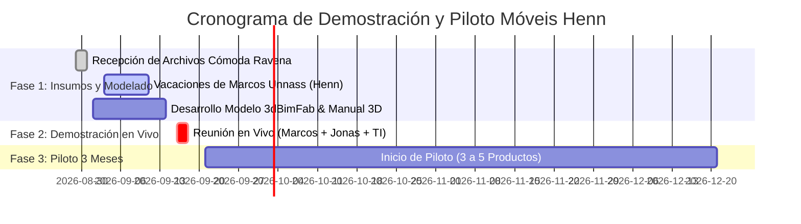

# 🎙️ Reunión 02: Levantamento de Custos de P&D, Manuais 3D & Validação 3dBimFab | Mario Mojica & Móveis Henn

> **Registro Oficial de Reunión / Notas de Inteligencia B2B & Acta Proactiva**  
> **Fecha:** 28 de Agosto de 2026  
> **Hora de Inicio:** 08:00 BRT / 06:00 COL | **Duración Total:** 53 minutos  
> **Participantes:**  
> * **Mario Mojica** — Fundador & Desarrollador Principal / Diseñador Industrial ([mariomojica.style@gmail.com](mailto:mariomojica.style@gmail.com))  
> * **Marcos Unnass** — Coordenador de Engenharia e P&D, Móveis Henn ([engenharia1@henn.com.br](mailto:engenharia1@henn.com.br))  
> * *(Referenciados en la sesión)*: **Jonas Borck** (Analista de Engenharia de Produtos / Padrino B2B), **Cyntia** (Diseñadora P&D / Modelado SketchUp e InDesign), **Rudgeri Henkel** (Gerente de Planejamento e Materiais)  
> **Documento Financiero de Soporte:** `Cotizador_Costos_Moveis_Henn_Mario_Mojica.xlsx`  

---

## 📌 1. Resumen Ejecutivo de la Sesión

La segunda reunión entre Mario Mojica y Marcos Unnass tuvo como objetivo primordial auditar y validar la estructura de costos reales de la operación de P&D de Móveis Henn para la creación de manuales de montaje, contrastando los costos actuales con la propuesta de automatización paramétrica e instructivos 3D interactivos.

1. **Validación Financiera del Ahorro del 30%:** Se validaron los insumos del libro financiero maestro. Móveis Henn produce un promedio de **80 manuales reales de producto al año** con un costo interno absorbido de **R$ 1.926,14 BRL por manual**. Con la propuesta de Mario Mojica a **R$ 1.348,30 BRL por manual**, se garantiza un **ahorro neto directo de +R$ 46.227,27 BRL anuales** para la junta directiva de Henn.
2. **Descubrimiento del Dolor Operativo Oculto:** Se identificó una brecha crítica en el flujo actual entre **Promob, SketchUp e InDesign**, donde la saturación de software obliga a omitir herrajes y realizar conteos manuales con alto riesgo de error humano.
3. **Aprobación de Demostración de Concepto (Cómoda Ravena):** Se acordó realizar una prueba de concepto en vivo con el producto real **"Cómoda Ravena"** para presentar después del 15 de septiembre ante Marcos, Jonas Borck y el equipo de Sistemas/TI.

---

## 📊 2. Matriz Financiera y Costos Validados (Libro Financiero BRL)

Los datos revisados en pantalla durante la sesión correspondieron a las cifras auditadas en `Cotizador_Costos_Moveis_Henn_Mario_Mojica.xlsx`:

| Parámetro Operativo | Dato Real Henn (BRL) | Justificación y Fuente en Fábrica |
| :--- | :---: | :--- |
| **Volumen Anual de Manuales:** | **80 manuales/año** | ~150-200 lanzamientos anuales considerando variantes de color; 80 manuales únicos de ingeniería. |
| **Escala de Producción en Planta:** | **330 productos/mes** | Volumen mensual de fabricación en planta industrial de Mondaí, SC. |
| **Equipo Dedicado en P&D:** | **2 proyectistas CLT** | R$ 6.000,00/mes por persona (Salario CLT + Cargas Sociales) = **R$ 144.000,00/año**. |
| **Licencias SketchUp Pro:** | **R$ 2.400,00/año** | R$ 1.200/año por estación de trabajo (2 estaciones). |
| **Licencias Adobe CC / InDesign:** | **R$ 3.600,00/año** | R$ 1.800/año por estación de trabajo (2 estaciones). |
| **Horas Soporte / Retrabajo SAC:** | **10 h/mes (120 h/año)** | Horas técnicas invertidas en corregir errores de manuales anteriores y atender dudas. |
| **Costo Total Operación Henn:** | **R$ 154.090,91 BRL/año** | Costo actual total que absorbe Móveis Henn. |
| **Costo Actual por Manual:** | **R$ 1.926,14 BRL** | Promedio ponderado actual por producto (~R$ 1.900 redondeado). |
| **Propuesta Mario Mojica (-30%):** | **R$ 1.348,30 BRL** | Tarifa por manual entregado con visor 3D interactivo y manual 1 página QR. |
| **Costo Anual con Mario Mojica:** | **R$ 107.863,64 BRL** | Presupuesto anual de tercerización y plataforma. |
| **Ahorro Neto Anual para Henn:** | **+R$ 46.227,27 BRL** | **+R$ 577,84 BRL de ahorro neto garantizado por cada manual.** |

### 🧩 Desglose por Complejidad y Rango de Piezas:
* **Pequeño (Hasta 10 piezas - Factor 0.65x):** Costo Henn R$ 1.251,99 ➔ **Propuesta Mario: R$ 876,39 BRL** ($170,50 USD). *(Ej: Mesas de noche, nichos, repisas).*
* **Mediano (11 a 24 piezas - Factor 1.00x - Promedio Henn ~20 piezas):** Costo Henn R$ 1.926,14 ➔ **Propuesta Mario: R$ 1.348,30 BRL** ($262,31 USD). *(Ej: Cómoda Ravena, Racks, Buffets).*
* **Grande / Complejo (25 a 40 piezas - Factor 1.35x):** Costo Henn R$ 2.600,28 ➔ **Propuesta Mario: R$ 1.820,20 BRL** ($354,12 USD). *(Ej: Roperos 6 puertas, cocinas moduladas).*

---

## 🔍 3. Zoom Técnico Estratégico: Problemática Promob vs. SketchUp (Línea de Enfoque Prioritaria)

> [!IMPORTANT]
> **HALLAZGO CRÍTICO A PROFUNDIZAR EN EL FUTURO INMEDIATO:**  
> Durante la sesión, Marcos Unnass reveló el mayor dolor de cabeza técnico del flujo de ingeniería en Henn: la **lentitud y saturación de Promob** y la necesidad obligatoria de "salvar" y terminar el diseño en **SketchUp e InDesign**. Se debe hacer zoom exhaustivo en esta problemática para estructurar la propuesta de valor definitiva de `3dBimFab`.

### 🚨 La Anatomía del Problema en Móveis Henn:
1. **Saturación y Caída de Rendimiento en Promob:**
   * Promob se vuelve extremadamente pesado (*"carrega muito o desenho, demora muito no Promob"*) cuando se introducen herrajes pequeños y geometrías repetitivas.
   * Para evitar que el software colapse o se vuelva inmanejable, los ingenieros de Henn **omiten deliberadamente hasta un 15% de los herrajes en Promob** (especialmente esquineras/cantoneras, clavos/puntillas del fondo y tornillos menores de fijación).
2. **La Desconexión del Flujo (Promob ➔ SketchUp ➔ InDesign):**
   * Debido a que el archivo original de Promob no tiene los herrajes completos, el archivo 3D pasa a SketchUp (a cargo de Cyntia), donde se deben insertar a mano las cantoneras y generar las vistas explosionadas.
   * Luego, en InDesign, el equipo debe **contar e inventariar manualmente las cantidades de cada herraje** para colocarlas en la tabla de materiales del manual impreso.
3. **Las Consecuencias Operativas:**
   * **Errores Humanos en el Conteo:** El conteo manual genera discrepancias frecuentes entre los herrajes reales en caja y lo impreso en el manual, disparando reclamos a Asistencia Técnica (SAC).
   * **Duplicidad de Trabajo y Pérdida de Tiempo:** Modificar un producto exige volver a editar en Promob, re-exportar a SketchUp, re-dibujar en InDesign y re-contar piezas manualmente.
   * **Riesgo de Dependencia y Bloqueo de Software:** En plataformas tradicionales de suscripción cerrada, si se cancela la licencia se pierde la operatividad de los archivos, obligando a las fábricas a pagar membresías permanentes para no perder sus desarrollos.

### 💡 La Solución con `3dBimFab`:
* **Instanciación Geométrica Inteligente:** `3dBimFab` no carga mallas pesadas repetidas. Un tornillo o cantonera es una única instancia multiplicada por algoritmo.
* **Cálculo Matemático Automatizado:** El algoritmo calcula parámetros según reglas de ingeniería (ej. *"puntillas cada 10 cm"* o *"cantoneras por división"*). El conteo de herrajes repetitivos se realiza automáticamente en tiempo real con 0% de error humano, sin importar la cantidad de elementos en el producto.
* **Gemelo Digital 100% Real:** El 3D exportado a la Web y al manual contiene la totalidad de herrajes exactos sin ralentizar los navegadores ni los dispositivos móviles de los clientes.

---

## 🤝 4. Acuerdos y Decisiones Clave

1. **Aprobación de la Demostración Cómoda Ravena:** Marcos enviará a Mario Mojica los archivos nativos de la **`Cómoda Ravena`** (DWG de Promob, SketchUp con explosiones de Cyntia, e InDesign/Illustrator) para que Mario construya el modelo paramétrico en `3dBimFab` y el Manual 3D interactivo.
2. **Modelo Comercial Flexible:** Cobro unitario por manual completado; versiones derivadas o cambios menores de medidas se cotizan con cobro proporcional/fraccionado.
3. **Soberanía y Propiedad Perpetua de los Datos:** Móveis Henn mantendrá el control, posesión y propiedad perpetua de sus modelos 3D y manuales interactivos desarrollados. A diferencia de las plataformas tradicionales de suscripción cerrada, donde la cancelación de licencias bloquea el acceso a los archivos, la solución de Mario Mojica garantiza que los activos digitales pertenezcan siempre a la fábrica con total independencia operativa.
4. **Articulación con el Equipo de Marketing (Videos de Montaje):** Marcos dialogará internamente con el departamento de Marketing (quienes actualmente filman los videos de montaje en el showroom de la fábrica) para evaluar cómo integrar y potenciar los videos junto a los manuales 3D interactivos, alineándolo con el gerente de planificación **Rudgeri Henkel**.
5. **Convocatoria del Equipo de Sistemas / TI para la Demo:** Marcos acordó invitar a **Jonas Borck** y a un integrante del **área de Sistemas/TI de Henn** (*"alguém do sistema"*) a la presentación en vivo de la Cómoda Ravena para evaluar la arquitectura técnica de la plataforma.

---

## 📅 5. Plan de Acción y Cronograma de Trabajo

* **3 al 11 de Septiembre:** Periodo de vacaciones de Marcos Unnass.
* **1 al 14 de Septiembre:** Mario Mojica desarrolla el Gemelo Digital de la Cómoda Ravena en `3dBimFab`, configurando el conteo automatizado de herrajes y el Manual 3D interactivo con asistencia de voz.
* **Post 15 de Septiembre:** Presentación técnica en vivo ante Marcos Unnass, Jonas Borck y el especialista del área de Sistemas/TI de Henn para dar apertura formal al **Piloto de 3 meses**.

---

> 📂 **Ubicación de Archivo:** `c:\Desarrollo\mmapp\Clientes\Henn\reuniones\2026-08-28_Reunion_02_Levantamiento_Costos_Moveis_Henn.md`  
> 📄 **Documentos Asociados en PDF:**  
> - 🇧🇷 Portugués: [`2026-08-28_Reunion_02_Levantamiento_Costos_Moveis_Henn_PT.pdf`](file:///c:/Desarrollo/mmapp/Clientes/Henn/reuniones/2026-08-28_Reunion_02_Levantamiento_Costos_Moveis_Henn_PT.pdf)  
> - 🇪🇸 Español: [`2026-08-28_Reunion_02_Levantamiento_Costos_Moveis_Henn_ES.pdf`](file:///c:/Desarrollo/mmapp/Clientes/Henn/reuniones/2026-08-28_Reunion_02_Levantamiento_Costos_Moveis_Henn_ES.pdf)
