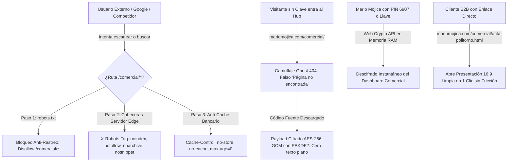

# 🛡️ Protocolo de Seguridad y Blindaje de la Carpeta Comercial (`/comercial/`)

**Autor:** Mario Mojica  
**Plataforma:** Mario Mojica • 3dBimFab  
**Ámbito de Aplicación:** Toda la carpeta física `c:\Desarrollo\mmapp\Comercial\` y la ruta web pública `mariomojica.com/comercial/*`  
**Última Actualización:** 25 de Septiembre, 2026  

---

## 🧭 1. El Principio Fundamental: Seguridad por Perímetro de Carpeta

Para garantizar tranquilidad conceptual y operativa, el sistema de seguridad comercial no depende de nombres individuales ni de configuraciones dispersas. Se rige por una única regla de oro:

> **REGLA DE ORO DEL PERÍMETRO COMERCIAL:**  
> **Cualquier archivo, documento, visor interactivo o PDF que se guarde dentro de la carpeta `/comercial/` hereda AUTOMÁTICAMENTE el blindaje de seguridad de la plataforma.**  
> No importa si se llama `acta-politorno.html`, `propuesta-henn.html`, `cotizacion_123.pdf` o si en el futuro existen 10.000 archivos con nombres totalmente distintos: **al residir dentro de `/comercial/`, están protegidos.**

---

## 🔒 2. Las 4 Capas de Blindaje que Protegen Todos los Links

Cada enlace que pertenezca a la ruta `mariomojica.com/comercial/...` cuenta con 4 niveles de protección simultáneos:



---

### Capa 1: Blindaje en el Servidor Edge (`netlify.toml`)
A nivel de infraestructura de servidor, el archivo `netlify.toml` tiene una regla global que intercepta cualquier petición a `/comercial/*`:

```toml
[[headers]]
  for = "/comercial/*"
  [headers.values]
    X-Robots-Tag = "noindex, nofollow, noarchive, nosnippet, noimageindex"
    Cache-Control = "no-store, no-cache, must-revalidate, max-age=0"
    Pragma = "no-cache"
```

* **`noindex`:** Le ordena a todos los motores de búsqueda del mundo que **NUNCA guarden este archivo en sus índices**.
* **`nofollow`:** Impide que los robots sigan enlaces dentro de ese documento.
* **`noarchive`:** Prohíbe que Google almacene copias en caché del documento (nadie puede ver una versión guardada).
* **`nosnippet`:** Impide que los buscadores muestren fragmentos de texto o resúmenes.
* **`no-store, no-cache`:** Impide que proxies intermedios o cibercafés guarden en memoria el contenido de las propuestas.

---

### Capa 2: Barrera de Acceso para Rastreadores e IA (`robots.txt`)
En la raíz de la web, el archivo `robots.txt` prohíbe explícitamente el acceso a toda la carpeta:

```txt
User-agent: *
Disallow: /comercial/
Disallow: /comercial/*
```

* Esto le cierra la puerta en la cara a los crawlers de **Google, Bing, Yahoo, DuckDuckGo, GPTBot (OpenAI), ClaudeBot (Anthropic), Perplexity y CommonCrawl**.
* Si un competidor busca en Google `"Politorno Móveis propuesta Mario Mojica"` o `"Móveis Henn manual 3D"`, **Google nunca mostrará ningún archivo de `/comercial/`**.

---

### Capa 3: El Hub Cifrado de Grado Bancario (`comercial.html` / `index.html`)
El archivo centralizador que lista todas las empresas y propuestas está protegido por **criptografía simétrica militar**:

1. **Camuflaje Ghost 404:**
   * Quien ingrese a `mariomojica.com/comercial/` o `mariomojica.com/comercial/comercial.html` sin autorización ve una página idéntica al error 404 del sitio web: *"Página no encontrada. El recurso no existe..."*.
2. **Cero Texto Plano en Disco o Tránsito:**
   * El código HTML público no contiene los nombres de tus clientes, ni cotizaciones, ni links. Todo está cifrado en una variable Base64 llamada `CIPHERTEXT_B64`.
3. **Cifrado AES-256-GCM + PBKDF2:**
   * 100.000 iteraciones con SHA-256 y un Vector de Inicialización (IV) criptográfico aleatorio.
   * Solo se descifra cuando ingresas tu **PIN de 4 dígitos (`6907`)** o tu **Llave Maestra (`MM-3BF-2026`)**.
   * El descifrado ocurre estrictamente en la memoria RAM de tu navegador con la **Web Crypto API nativa**. Al cerrar la ventana, la memoria se libera y nadie puede extraer nada.

---

### Capa 4: Acceso Privado Sin Fricción para Clientes (Enlaces No Listados / Unlisted)
¿Por qué las propuestas de los clientes abren sin pedir contraseña?

* **Estrategia Comercial B2B:** Un tomador de decisiones (Directores como Marcelo Piriz o Rafael Henn) abre los mensajes en su teléfono mientras camina por la fábrica o en una reunión. Exigirles un login o contraseña crearía desconfianza y un 80% de abandono de la propuesta.
* **Mecanismo de "Enlace No Listado" (Estilo YouTube Unlisted / Google Docs privado):**
  * La URL es privada: solo quien reciba el enlace exacto (por ejemplo `https://mariomojica.com/comercial/acta-politorno.html`) puede abrirla.
  * Como está dentro de `/comercial/*`, las Capas 1 y 2 le impiden a Google rastrearla o publicarla.
  * El cliente tiene una experiencia instantánea en 1 clic con carga ultra-rápida.

---

## 📂 3. Mapa de la Estructura Canónica de la Carpeta `/comercial/`

A partir de este hito, la arquitectura de archivos físicos y enlaces web queda 100% estandarizada y unificada bajo el paraguas `/comercial/`:

| Tipo de Recurso | Archivo en Disco (`Comercial/` y `public/comercial/`) | Enlace Web de Producción | Nivel de Blindaje |
| :--- | :--- | :--- | :--- |
| **Hub Maestro Privado** | `comercial.html` / `index.html` | `mariomojica.com/comercial/` | 🛡️ Cifrado AES-256 + Ghost 404 + PIN 6907 |
| **Politorno • Visor 16:9** | `acta-politorno.html` | `mariomojica.com/comercial/acta-politorno.html` | 🔒 Anti-Indexación Servidor + No-Cache |
| **Politorno • Alterna USD** | `acta-propuesta-politorno-usd.html` | `mariomojica.com/comercial/acta-propuesta-politorno-usd.html` | 🔒 Anti-Indexación Servidor + No-Cache |
| **Politorno • PDF Oficial** | `Acta_Propuesta_Piloto_Politorno_Mario_Mojica_USD.pdf` | `mariomojica.com/comercial/Acta_Propuesta_Piloto_Politorno_Mario_Mojica_USD.pdf` | 🔒 Anti-Indexación Servidor + No-Cache |
| **Henn • Visor 16:9** | `propuesta-henn.html` | `mariomojica.com/comercial/propuesta-henn.html` | 🔒 Anti-Indexación Servidor + No-Cache |
| **Henn • Alterna USD** | `propuesta-henn-usd.html` | `mariomojica.com/comercial/propuesta-henn-usd.html` | 🔒 Anti-Indexación Servidor + No-Cache |
| **Henn • PDF Oficial** | `Propuesta_Comercial_Moveis_Henn_Mario_Mojica_USD.pdf` | `mariomojica.com/comercial/Propuesta_Comercial_Moveis_Henn_Mario_Mojica_USD.pdf` | 🔒 Anti-Indexación Servidor + No-Cache |
| **Renders Politorno (Landing)** | `estudio-corporativo-politorno.html` | `mariomojica.com/comercial/estudio-corporativo-politorno.html` | 🔒 Anti-Indexación Servidor + No-Cache |
| **Renders Politorno (PT-BR)** | `Propuesta_Comercial_Renders_Politorno_Mario_Mojica_PT.html` | `mariomojica.com/comercial/Propuesta_Comercial_Renders_Politorno_Mario_Mojica_PT.html` | 🔒 Anti-Indexación Servidor + No-Cache |

*(Nota: En el servidor existen redirecciones automáticas para que cualquier cliente que tenga una URL vieja sin `/comercial/` sea conducido de inmediato y de forma transparente a la nueva ruta protegida).*

---

## 🧪 4. ¿Cómo Verificar que el Blindaje Está Funcionando?

Puedes auditar y comprobar la seguridad en cualquier momento con estas 3 pruebas sencillas:

1. **Prueba de Modo Incógnito en el Hub:**
   * Abre una ventana de incógnito en tu navegador y visita: `https://mariomojica.com/comercial/`
   * **Resultado esperado:** Aparecerá la pantalla de error `404 - Página no encontrada`.
   * Haz triple clic sobre el número `404` (o presiona `Alt + M`), ingresa tu PIN `6907` y verás cómo el Hub se descifra al instante.
2. **Prueba del Código Fuente (Ctrl + U):**
   * Presiona `Ctrl + U` en `mariomojica.com/comercial/comercial.html`.
   * Presiona `Ctrl + F` y busca la palabra "Politorno" o "Henn" o "USD".
   * **Resultado esperado:** 0 coincidencias. No existe ni una sola letra en texto plano; solo existe el bloque cifrado `CIPHERTEXT_B64`.
3. **Prueba de Búsqueda en Google:**
   * En el buscador de Google escribe: `site:mariomojica.com/comercial/`
   * **Resultado esperado:** `No se han encontrado resultados para site:mariomojica.com/comercial/`. Google tiene totalmente vetada la indexación de esa carpeta.

---

## 💡 Resumen Operativo para Mario

* **¿Dónde guardo nuevos documentos comerciales?**  
  Siempre en la carpeta `c:\Desarrollo\mmapp\Comercial\` (y se sincronizan a `public/comercial/`).
* **¿Qué pasa si le pongo un nombre raro o diferente a un archivo?**  
  No importa el nombre. Al estar dentro de `/comercial/`, queda automáticamente blindado por el servidor Edge y por `robots.txt`.
* **¿Cómo entro a mi panel central?**  
  Entras a `https://mariomojica.com/comercial/` e introduces tu PIN `6907` (o con tu enlace directo `?key=6907`).
