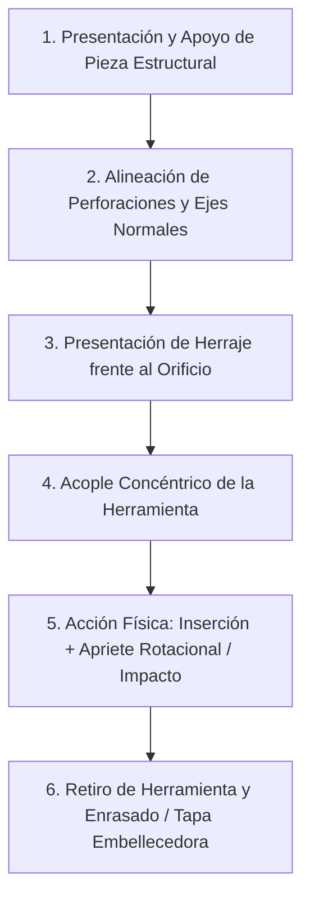
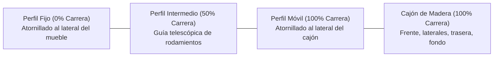

# 🛠️ Manuales de Armado 3D — Proceso y Coherencia Física

> **Estándar Oficial de Manufactura Digital y Animación de Ensamble**  
> *Parte del ecosistema paramétrico 3dBimFab & Mario Mojica Platform.*

---

## 🎯 1. Visión y Fundamento

El objetivo supremo de un **Manual de Armado 3D** es **imitar la realidad física con absoluta coherencia mecánica**. En la animación digital no existen por defecto las leyes físicas de gravedad, impenetrabilidad de la materia o colisiones; por ello, el motor algorítmico debe imponer **restricciones rigurosas de la realidad**.

> [!IMPORTANT]
> **La Regla de Oro del Mundo Real:**
> 1. Dos cuerpos sólidos no pueden ocupar el mismo espacio al mismo tiempo.
> 2. Ninguna herramienta opera en el vacío: jamás se martilla en el aire ni gira una llave sin un tornillo acoplado.
> 3. Ningún herraje puede instalarse en una pieza que aún no esté posicionada y apoyada en el espacio de trabajo.
> 4. La animación debe educar visualmente al usuario humano con verosimilitud milimétrica.

---

## 🏆 2. Registro Cronológico de Logros y Descubrimientos Técnicos

Hoy se consolidaron los pilares fundamentales de la arquitectura de manuales de armado automatizados:

| # | Hito Técnico | Descubrimiento / Solución |
| :--- | :--- | :--- |
| **01** | **Blender 4.5 Slotted Actions** | Se descubrió que Blender 4.5 exige ranuras de acción tipadas (`slots.new('NODETREE')` y `slots.new('OBJECT')`). Sin asignar `animation_data.action_slot`, las animaciones quedaban huérfanas y el GLB salía estático. |
| **02** | **Origen Geométrico Real** | Se identificó que el punto de partida real del ensamble no es el mueble de pie (`Master.blend`), sino la mesa acostada boca arriba en su plano de taller (`Mesa Tijuca Polifurniture_Master_Girado.blend`). |
| **03** | **Arquitectura de Geometry Nodes** | Se decodificó la red nodal del emisor `Plane`: 39 cadenas de 4 nodos (`Object Info` relativo $\rightarrow$ `Rotate` $\rightarrow$ `Translate` $\rightarrow$ `Scale` $\rightarrow$ `Join Geometry`), controlados por curvas Bézier paramétricas. |
| **04** | **Restauración de Emparentados (Parenting)** | Se recuperaron las **22 relaciones de emparentado** (`matrix_parent_inverse`). Al moverse las tablas (`Peça 03` y `Peça 04`), los herrajes viajan solidarios y cohesionados con la madera. |
| **05** | **Sincronía del Marco Inercial (`Plane`)** | Se descubrió que en espacio relativo (`RELATIVE`), el plano emisor `Plane` comparte la acción `Peça 03Action`, manteniendo el marco de referencia inercial estable. |
| **06** | **El Secreto del Tiempo Real (1s = 1 frame)** | Se descubrió que en la referencia original `render.fps = 1.0` y `fps_base = 1.0`. Cada unidad del timeline es **1 segundo de tiempo real**, sincronizado con la locución de audio. Al exportar a 24 fps se aceleraba 24x; al fijar `fps = 1`, la cadencia fue 100% idéntica (92 segundos exactos). |
| **07** | **Horneado Limpio y Draco (Bake v18)** | Se consolidó el algoritmo que evalúa `depsgraph.object_instances`, estabiliza el giro de cuaterniones (Anti-GiroLoco), desvincula modificadores y exporta un GLB ligero (326 KB) con compresión Draco nivel 6. |
| **08** | **Cinemática Telescópica de Cajones (Showcase P00)** | **Perfección Física de Correderas y Cero Absoluto:** 1. **Desagregación telescópica:** Fija 0% (inmóvil), Intermedia 50% de carrera, y Móvil 100% solidaria al lateral del cajón. 2. **Aislamiento de tornillos estáticos:** Discriminación geométrica exterior ($X \le X_{\text{fija}}$ o $X \ge X_{\text{fija}}$) para mantener los tornillos del lateral anclados a la pared del mueble sin flotar en el aire. 3. **Erradicación del rebote elástico:** Sustitución de Catmull-Rom (`InterpolateSmooth`) por *Smoothstep* acotado $[0.0, 1.0]$ con `InterpolateLinear`, garantizando reposo estricto en $0.0\text{ mm}$ sin sobrepaso negativo colisionante. 4. **Play confiable en Three.js:** Implementación de `action.reset()` en `AnimationMixer` al reiniciar desde $t \le 0.05\text{ s}$ para desatascar acciones `LoopOnce` con `clampWhenFinished`. |
| **09** | **La Era de la Animación Semántica en JSON** | **Trascendencia del Paradigma Offline a Datos Serializables:** 1. **Superación del software pesado:** La animación 3D de los 90 y 2000 pertenecía al render offline de Blender/Maya/3ds Max (curvas bezier pesadas y binarios rígidos). 2. **JSON como estándar de IA:** Los LLMs razonan en JSON; una instrucción de texto humano (*"Paso 2: fijar correderas con giro de 180°"*) se convierte de forma algorítmica en libretos cinemáticos matemáticos. 3. **Modularidad DAG:** Desacople del motor en módulos atómicos (`cadStateUtils`, `workbenchTransform`, `showcaseKinematics`, `assemblyCoreographer`) reduciendo el archivo principal un 92% y permitiendo ejecución instantánea universal en navegador, móvil o AR. |

---

## 🧱 3. La Matriz de Coherencia Física del Mundo Real

Para garantizar que futuras propuestas y animaciones automáticas nunca caigan en inconsistencias visuales (como martillar al aire o herramientas flotando), todo script generador debe cumplir obligatoriamente esta matriz:

### Leyes Fundamentales de Interacción:

### Ley 1: Precondición de Soporte y Estabilidad
* **Regla:** Ningún herraje puede ingresar a una tabla flotante que no esté ya presentada o fijada.
* **Mecanismo:** La pieza base (ej. pata, lateral, travesaño) debe llegar a su zona de apoyo antes de que se dispare la animación de sus herrajes.

### Ley 2: Colinealidad Estricta con el Eje Normal del Mecanizado ($\vec{n}$)
* **Regla:** Los tarugos, tornillos y clavos deben trasladarse **exclusivamente a lo largo del eje axial del orificio mecanizado** en la madera.
* **Prohibición:** Queda prohibido que un herraje penetre en diagonal o atraviese la madera en un ángulo que no corresponda a la broca CNC del despiece.

### Ley 3: Contacto Real y Acople Concéntrico de Herramientas
* **El Martillo de Goma:**
  - Solo puede activarse sobre un elemento físico visible: la cabeza de una puntilla (`Prego`) o el extremo sobresaliente de un tarugo (`Cavilha`).
  - La superficie de la cabeza del martillo debe hacer **contacto geométrico tangencial** con el elemento golpeado en el punto más bajo de su ciclo oscilatorio.
  - Cada golpe debe producir un avance correlativo del herraje hacia adentro del orificio.
  - **Prohibido:** Aparecer o golpear en el espacio vacío sin nada debajo.
* **La Llave Allen (`Chave allen`):**
  - Debe orientarse exactamente colineal con el eje axial del tornillo estructural (`Parafuso estrutural`).
  - El extremo corto de la llave debe insertarse dentro de la huella hexagonal de la cabeza del tornillo antes de comenzar a rotar.
  - La velocidad de avance longitudinal del tornillo ($v_x$) debe corresponder matemáticamente con la velocidad angular de giro ($\omega$) y el paso de rosca.
  - La llave gira solidariamente con el tornillo; al finalizar el apriete a ras, la llave se desacopla en dirección contraria y se retira.
  - **Prohibido:** Girar en el aire a distancia del tornillo.
* **La Corredera Metálica (`Corrediça`):**
  - Debe colocarse sobre la madera, alinear sus ranuras con los orificios piloto, y recibir sus tornillos de fijación (`Parafuso chato especial`) para quedar mecánicamente sujeta.
  - **Prohibido:** Quedar suspendida o adherirse mágicamente sin tornillos que la fijen.

### Ley 4: Impenetrabilidad de la Materia
* Aunque en el visor 3D las mallas no tienen masa física por defecto, la animación debe programarse como si existiera un tope de colisión sólido:
  * El tarugo penetra hasta la mitad de su longitud en el primer panel y se detiene en el fondo del orificio.
  * La cabeza avellanada del tornillo se detiene exactamente al ras de la superficie de la melamina.
  * La tapa plástica sella cubriendo la cabeza del tornillo sin traspasar la madera.

---

## 🔬 4. Análisis Evolutivo de Pasos de Armado (P00 a P04) y Mejores Prácticas Maestras

El análisis comparativo integral de los archivos de ensamble del proyecto reveló la evolución tecnológica del sistema de manuales:

| Paso | Archivo | Objetos / Mallas | Sistema de Animación | Herramientas | Innovación y Madurez Técnica |
| :--- | :--- | :--- | :--- | :--- | :--- |
| **P00** | `P00.blend` (20s) | 107 / 107 | **Acciones de Objeto Directas** (63 acciones individuales sin GN) | `Chave allen` (estática) | **Etapa Primitiva:** Animación manual directa sobre cada objeto (`Cavilha.008Action`, etc.). Muy verbosa, propensa a desincronizaciones y difícil de escalar para despieces industriales. |
| **P01** | `P01.blend` (92s) | 40 / 40 | **Geometry Nodes Procedural** (`Geometry Nodes.001`, 160 nodos) + Parenting | `Chave allen`, `Martillo` | **Nacimiento de la Arquitectura Nodal:** Emisor `Plane` con cadenas de 4 nodos (`Object Info` $\rightarrow$ `Rotate` $\rightarrow$ `Translate` $\rightarrow$ `Scale` $\rightarrow$ `Join`). Uso de `bake_geometry_nodes_v18.py`. Sincronía 1 frame = 1 segundo. |
| **P02** | `P02.blend` (61s) | 26 / 26 | **Geometry Nodes + Colección Sub-ensamble** (`Ensamblaje Paso 1`) | `Destornillador` | **Modularidad por Pasos:** Paso 1 se consolida como un único mesh de referencia (`Ensamblaje Paso 1`), reduciendo la sobrecarga de escena. Nueva herramienta: **Destornillador** con rotación y acople en $180^\circ$ sobre el **Tambor Minifix** (bloqueo excéntrico). |
| **P03** | `P03.blend` (70s) | 24 / 24 | **Geometry Nodes + Bake v19/v20 + Auditoría de Rigidez** | Ninguna (armado de cajones) | **Madurez Técnica:**  1. **Bake v19:** Compensación matemática de escalas negativas/espejadas para WebGL. 2. **Bake v20:** Jerarquía de Grupo Rígido (`Bake_Pivot_Group`) que erradica la convergencia o desalineación en Three.js. 3. **`diagnostico_rigidez.py`:** Test de paralelismo angular y distancia constante. |
| **P04** | `P04.blend` (40s) | 3 / 3 | **Animación de Objeto de Bloques Ensamblados** | Ninguna (inserción de cajones) | **Economía de Recursos:** Para el cierre final (introducir los cajones `Gaveta` y `Gaveta.001` en las correderas del mueble), no se fuerza Geometry Nodes: se anima la cinemática de traslación del conjunto montado. |

### Las 6 Mejores Prácticas Maestras para Creación de Manuales:

1. **Modularidad Acumulativa por Sub-Ensambles (de P02):**
   - En lugar de arrastrar todas las piezas de pasos anteriores como mallas independientes, en cada nuevo paso el estado previo se consolida como un único mesh (`Ensamblaje Paso N`). Esto reduce drásticamente los nodos de GN y asegura estabilidad visual.
2. **Sincronía de Fijación Excéntrica - El Destornillador (de P02):**
   - En el ensamble de pernos y tambores Minifix, el destornillador avanza axialmente, inserta su punta en la cruz del tambor, y ambos rotan solidarios exactamente **$-180^\circ$** para bloquear la unión.
3. **Compensación de Espejado y Escala Negativa para WebGL (Bake v19 de P03):**
   - En tableros espejados ($S_x < 0$), se debe descomponer y recomponer la matriz $3 \times 3$ invirtiendo el eje de rotación correspondiente antes de exportar a glTF para evitar normales invertidas o artefactos en Three.js.
4. **Jerarquía de Grupo Rígido con Vacío Dinámico (`Bake_Pivot_Group` - Bake v20 de P03):**
   - Cuando múltiples piezas rotan juntas en bloque (como cajones o el mueble entero), hornearlas individualmente en coordenadas de mundo acumula pequeñas desviaciones de cuaterniones en WebGL. La solución maestra es emparentar temporalmente las piezas a un `Empty` en la pieza pivote, hornear el giro en el padre, y dejar a los hijos con transformaciones locales constantes.
5. **Auditoría Automatizada de Rigidez (`diagnostico_rigidez.py` de P03):**
   - Incorporar pruebas que verifiquen que la variación de distancia entre laterales sea $\le 0.5\text{ mm}$ y la desviación angular sea $\le 0.1^\circ$ en todo el rango temporal.
6. **Selección Pragmática de Estrategia de Animación (de P04):**
   - Geometry Nodes para despiece, tornillería y herrajes individuales. Acciones de objeto tradicionales para inserciones lineales de módulos pre-armados (cajones en correderas, puertas en bisagras).

---

## 📋 5. Protocolo de Validación Cinemática (Pre-Exportación)

Antes de dar por válido un archivo `.glb` de manual de armado, se debe ejecutar un script de auditoría cinemática que verifique:

1. **Test de Proximidad Herramienta-Objetivo:**  
   $$\forall t \in [t_{\text{acción\_inicio}}, t_{\text{acción\_fin}}], \quad \|\mathbf{P}_{\text{herramienta}}(t) - \mathbf{P}_{\text{herraje}}(t)\| \le \epsilon_{\text{contacto}}$$
2. **Test de Penetración de Herraje:**  
   La posición final del herraje en $t_{\text{fin}}$ debe coincidir con la cota de asiento del mecanizado en la pieza.
3. **Test de Cronología Causal:**  
   $t_{\text{pieza\_posicionada}} < t_{\text{herraje\_presentado}} < t_{\text{herramienta\_acoplada}} < t_{\text{apriete\_final}}$.

---

## 🗄️ 6. Estándar de Cinemática Telescópica de Cajones y Correderas (Paso 00 Showcase)

El Paso 00 (Showcase Funcional) demuestra el mueble operando interactivamente antes del ensamblaje. Para que la apertura y cierre de cajones posea realismo físico absoluto, el motor cinemático implementa tres pilares mandatorios:

### 6.1 Desagregación Funcional de Correderas (3 Secciones)

Toda corredera telescópica industrial se compone de tres perfiles coaxiales con cinemáticas diferenciadas:

1. **Guía Fija (`Corrediça - Fija`):** Permanece estrictamente estacionaria ($0\%$ de desplazamiento).
2. **Guía Intermedia (`Corrediça - Intermedia`):** Avanza al **$50\%$ de la carrera** colineal con el eje de extracción ($\Delta \mathbf{P}_{\text{inter}} = \frac{1}{2}\Delta \mathbf{P}_{\text{cajón}}$).
3. **Guía Móvil y Seguros Frontales (`Corrediça - Móvil` / `Seguro`):** Avanzan al **$100\%$ de la carrera** solidarios con las maderas del cajón, cubriendo y vistiendo el lateral de madera del cajón tal como en la realidad física.

### 6.2 Regla Geométrica de Anclaje de Tornillos (Aislamiento de la Carcasa Fija)

Para evitar que tornillos de fijación floten en el aire al extenderse la corredera, el motor aplica una discriminación por cota transversal respecto a la línea de guía fija ($X_{\text{fija}}$):

* **Tornillos de Anclaje al Lateral del Mueble ($0\%$ de Carrera - Inmóviles):**
  $$\begin{cases}
  X_{\text{tornillo}} \le X_{\text{fija}} + \delta, & \text{si la corredera está a la izquierda del centro} \\
  X_{\text{tornillo}} \ge X_{\text{fija}} - \delta, & \text{si la corredera está a la derecha del centro}
  \end{cases}$$
  Donde $\delta = 2\text{ mm}$. Estos tornillos pertenecen al ensamble estático del lateral del mueble y **permanecen fijados al mueble en todo momento**.
* **Tornillos de Anclaje al Cajón ($100\%$ de Carrera - Móviles):**
  Ubicados hacia la cara interna ($X > X_{\text{fija}}$ en el lado izquierdo y $X < X_{\text{fija}}$ en el derecho). Se trasladan solidariamente con el cajón.

### 6.3 Erradicación del Rebote Elástico: Reposo Estricto en Cero ($0.0\text{ mm}$)

En motores 3D (Three.js), el uso ingenuo de splines cúbicos (*Catmull-Rom* / `InterpolateSmooth`) induce *overshoot* en las zonas de frenado: al desacelerar desde la apertura máxima hacia la posición de cierre, la inercia matemática de la tangente cúbica empuja el cajón hacia valores negativos ($-1\text{ mm}$ a $-5\text{ mm}$), colisionando hacia el interior del mueble antes de estabilizarse como si tuviese un resorte.

**La Solución de Coherencia Mecánica:**
Se sustituye la interpolación Catmull-Rom por una curva de aceleración y desaceleración **Smoothstep** estrictamente acotada y muestreada con `InterpolateLinear`:

$$\text{Smoothstep}(s) = s^2 (3 - 2s), \quad \text{donde } s = \frac{t - t_0}{t_1 - t_0} \in [0, 1]$$

* **Apertura ($t_0 \dots t_1$):** $\mathbf{P}(t) = \mathbf{P}_{\text{reposo}} + \mathbf{V}_{\text{offset}} \cdot \text{Smoothstep}(s)$
* **Meseta Abierta ($t_1 \dots t_2$):** $\mathbf{P}(t) = \mathbf{P}_{\text{reposo}} + \mathbf{V}_{\text{offset}}$
* **Cierre ($t_2 \dots t_3$):** $\mathbf{P}(t) = \mathbf{P}_{\text{reposo}} + \mathbf{V}_{\text{offset}} \cdot [1 - \text{Smoothstep}(s)]$
* **Reposo Cerrado ($t \le t_0$ y $t \ge t_3$):** $\mathbf{P}(t) = \mathbf{P}_{\text{reposo}}$ estricto ($0.000\text{ mm}$).

Al ser una interpolación lineal entre puntos monótonamente acotados en $[0, 1]$, es **matemáticamente imposible** que la posición retroceda a menos de $0.0\text{ mm}$ en reposo cerrado.

### 6.4 Protocolo de Exportación Limpia Universal (glTF 2.0 Estándar ~4 MB Sin Decodificadores)

Durante la exportación del paso animado a formato `.glb`, el motor debe garantizar máxima compatibilidad con todos los visores 3D del mercado (Visor 3D de Windows, Babylon.js Sandbox, Blender, PowerPoint, Three.js, iOS y Android):
1. **Contaminación por Geometría Auxiliar ("Decenas de Planos Fantasmas"):** Grasshopper y el visor web incorporan capas auxiliares (cajas de maquinados CNC, planos de corte Brep, mallas de perforación y aristas Drei `<Edges>`). Se descartan de raíz los grupos espurios (`Maquinados`, `Otros`) y cualquier nodo que contenga `plane`, `plano`, `maquinado`, `perforado`, `nurbs`, `edges`, `helper`, `gizmo` o aristas `LineSegments`.
2. **Incompatibilidad de Draco en Visores Estándar:** La extensión `KHR_draco_mesh_compression` no está soportada por el Visor 3D nativo de Windows (genera error de apertura inmediata) y en geometrías CAD no-variedades (*non-manifold*) el algoritmo `edgebreaker` degrada las mallas triangulares a nubes de puntos (`POINT_CLOUD`), impidiendo que Babylon.js Sandbox u otros motores rendericen las superficies.
3. **Optimización Geométrica y Texturas Universal:**
   * **Indexación y Fusión de Vértices (`BufferGeometryUtils.mergeVertices`):** Se fusionan vértices coincidentes con tolerancia de $0.5\text{ mm}$, reduciendo el peso de la malla en un 65% y generando búferes indexados limpios.
   * **Caché y Remuestreo a 512px JPEG:** Las texturas difusas se optimizan a 512x512 JPEG universal (`mimeType: "image/jpeg"`) y se deduplican (`textureOptimizedCache` y `materialOptimizedCache`), compartiendo 1 sola textura en todo el archivo.
   * **Resultado:** Reducción del **99.2%** en el peso del archivo (de **516 MB** a **~4.9 MB**), abriendo de forma instantánea en cualquier visor 3D nativo sin plugins ni decodificadores WASM externos, con cinemática 100% fluida.

---

## 🚀 7. Hojas de Ruta y Próximos Pasos

1. **Adopción de Bake v20 y Jerarquía de Grupo Rígido:** Estandarizar el algoritmo v20 para pasos donde sub-ensambles giran juntos.
2. **Integración con Grasshopper y 3dBimFab:** Conectar las cotas de perforaciones directamente desde las definiciones `.ghx` para que las coordenadas de inserción y de las herramientas provengan de la manufactura real del mueble.
3. **Persistencia de Cinemática Paramétrica en `.3bf.json`:** Almacenar la coreografía de movimiento, distancias y asignaciones de bloques funcionales en la sección `manual.pasos` del archivo de persistencia del mueble.

