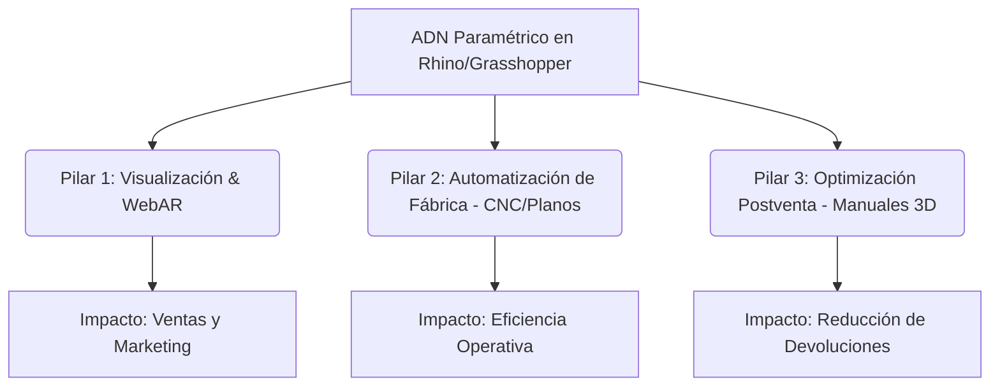

# 🧠 Manifiesto de Negocio: Algorithmic Furniture Manufacturing (AFM)

Este documento es la **columna vertebral conceptual** y la hoja de ruta estratégica de la startup de **Mario Mojica**. Define la filosofía, el modelo de negocio, el stack tecnológico y los pasos a seguir para transformar la industria del mueble a través del diseño algorítmico y la Manufactura 4.0.

---

## 👁️ 1. Visión y Propósito Central

### El Puente Digital Algorítmico
La industria del mueble tradicional, en especial el sector de mobiliario **RTA (Ready-To-Assemble / Listo para armar)** y mobiliario tapizado, sufre de una desconexión crítica en su cadena de valor. El proceso creativo de diseño, la ingeniería de detalle, el costeo de producción, el marketing y la experiencia de armado del cliente final operan en silos aislados con herramientas desconectadas.

Nuestra startup nace para ser el **puente digital interactivo** que fusiona estos mundos. No vendemos archivos de diseño estáticos (planos planos, renders aislados). Entregamos el **ADN del Producto (Gemelo Digital Paramétrico)**: un modelo matemático inteligente que automatiza la generación de toda la cadena de valor en segundos.

### El Dolor del Mercado
* **Ineficiencia en I+D:** Las áreas de diseño en fábricas tradicionales son lentas y costosas. Modificar la dimensión de un mueble requiere redibujar planos manualmente, recalcular despieces y re-costear procesos, lo que toma días y genera errores humanos en cascada.
* **Falta de Agilidad Comercial:** Las empresas no pueden probar el mercado a la velocidad que exige la era digital. La generación de renders realistas y entornos WebAR suele ser tercerizada a costos elevados y tiempos lentos.
* **Fricción en Postventa:** Los manuales en papel mal diseñados provocan frustración en el usuario final, armados defectuosos y un alto volumen de devoluciones y reclamos costosos.

### 🎯 Foco Táctico Inmediato (GTM): El Manual de Armado 3D como "Caballo de Troya" B2B
Aunque nuestra visión a largo plazo es la automatización completa (AFM / MakeLab), **el producto de entrada comercial inmediato es el Manual de Armado Interactivo 3D**.
* **¿Por qué?** Resuelve el dolor más visible, inmediato y cuantificable de los fabricantes RTA (devoluciones por armado incorrecto, soporte técnico telefónico saturado y mala reputación online).
* **Fácil Adopción:** A diferencia del outsourcing de ingeniería que requiere cambiar procesos internos de la fábrica, el Manual 3D se vende como un entregable de marketing/postventa que se integra fácilmente mediante un código QR o iframe en el sitio del cliente (PDP).
* **Estrategia Comercial:** Salir al mercado ofreciendo este producto estrella. Una vez que ganemos la confianza del fabricante RTA con el manual 3D y demostremos su valor en analíticas de escaneo y retención de clientes, introduciremos los servicios de automatización de fábrica, planos CNC y diseño paramétrico como un *upsell* natural.

---

## 🚀 2. Los Tres Pilares de Valor (Ecosistema MakeLab)

Nuestra ventaja competitiva radica en el **Ecosistema MakeLab**, un laboratorio de definición algorítmica basado en **Rhinoceros 3D (v8), Grasshopper y VisualArq** que habilita tres pilares:



### Pilar 1: Digitalización y Marketing Visual de Alto Impacto
* **Renders Fotorrealistas 4K:** Generados localmente mediante pipelines optimizados, eliminando la dependencia de render farms costosas. Permiten prototipar infinitas variantes de color, maderas, textiles y herrajes en caliente.
* **Realidad Aumentada Web (WebAR):** Visualización interactiva a escala real directamente desde el navegador móvil del cliente, incrementando la conversión de compra online al eliminar la incertidumbre espacial.

### Pilar 2: Automatización de Fábrica e Industria 4.0 (Outsourcing de Ingeniería)
* **Planos de Fabricación Automatizados:** Generación instantánea de vistas, acotados y despieces técnicos a partir de los parámetros del modelo.
* **Integración CNC & Listas de Corte:** Exportación de archivos listos para maquinaria (DXF para seccionadoras y taladros CNC tipo Biesse), optimización de láminas (Optiplaning) y etiquetado inteligente.
* **Costeo en Tiempo Real:** Enlace paramétrico con bases de datos de materiales y herrajes para dar visibilidad financiera inmediata a cambios de diseño.
* **3D Nesting (Empaque Eficiente):** Módulo de cubicación automática que define las dimensiones óptimas de las cajas y empaques para logística.

### Pilar 3: Optimización Postventa (Manuales de Armado 3D)
* **Visor 3D Interactivo:** El aplicativo web (`Three.js / React Three Fiber`) permite al cliente final rotar el mueble, visualizar la secuencia exacta paso a paso y recibir indicaciones por voz (TTS).
* **Escaneo de Piezas Inteligente:** Algoritmo integrado que extrae de manera exacta la cantidad de madera y herrajes requeridos directamente desde el modelo 3D para pintarlo en el tutorial interactivo.

---

## 💰 3. Modelo de Negocio y Estructura de Planes

Ofrecemos un modelo de **Outsourcing Técnico y Transformación Digital** estructurado en tres niveles de servicio (SaaS / Suscripción mensual B2B):

| Característica | Plan 1: Starter | Plan 2: Estándar (Recomendado) | Plan 3: Visionario |
| :--- | :--- | :--- | :--- |
| **Precio** | **$790 USD / mes** | **$2,900 USD / mes** | **$79,000 USD / año** (Contrato Anual) |
| **Volumen** | Hasta 5 productos / mes | Hasta 10 productos / mes | Transformación Digital Llave en Mano |
| **Entregables Visuales** | Renders 4K + WebAR | Renders 4K + WebAR + Modelado 3D | Todo lo del Plan Estándar |
| **Entregables Técnicos** | - | Planos, Costeo Paramétrico, Cubicaje | Adaptación a la medida del ERP/Fábrica |
| **Postventa** | - | Manual de Armado 3D Interactivo | Aplicativos y herramientas customizadas |
| **Consultoría & Procesos** | - | Estrategia de diseño RTA | Diagnóstico, Gestión del cambio, Mockups, Pruebas piloto |

---

## 🌿 4. Estrategia Dual: Servicios vs. Producto (Muebles en Guadua)

Para maximizar la resiliencia financiera y mitigar los riesgos de depender de un único canal de ingresos, implementamos una **Estrategia Dual**:

1. **B2B: Outsourcing de Ingeniería y Automatización (SaaS/Servicio):** Genera flujo de caja recurrente de alto valor. Alivia el dolor de ineficiencia en departamentos de diseño lentos de grandes fabricantes (como Maderkit o Jamar).
2. **B2C: Venta Online de Muebles de Diseño Premium en Guadua (Producto):**
   - **Validación Interna:** Sirve como el "sandbox" real para probar nuestro propio pipeline: desde el diseño paramétrico en Guadua (uniones, estructura sustentable) hasta los manuales de armado 3D y WebAR del e-commerce.
   - **Producto Físico Verde:** Venta de mobiliario ecológico de alto valor estético y estructural enfocado a nichos de diseño sostenible e-commerce.

---

## 💻 5. Arquitectura del Stack Tecnológico

Nuestra plataforma se compone de dos vertientes interconectadas (la fábrica algorítmica y la visualización web):

```
       [ Rhino 8 / Grasshopper (Local/Compute) ] -- ADN Paramétrico
                        │
                        ├─ (Archivos de fabricación: DXF, CSV, PDF)
                        ▼
                [ Supabase DB & Storage ] -- Almacenamiento de configuraciones y modelos
                        │
         ┌──────────────┴──────────────┐
         ▼                             ▼
 [ Next.js Platform (Port 3003) ]   [ R3F Assembly App (Port 3004 / Embed) ]
   - CMS de administración             - Visor 3D del usuario final
   - Configuración de manuales         - Guía por voz interactiva (TTS)
   - Carga de PBR e Iluminación        - Visualización en caliente (postMessage)
```

1. **Algoritmos y Computación Paramétrica (Rhino Compute + Grasshopper):** Corre los scripts en segundo plano para realizar el procesamiento geométrico y generar las exportaciones de archivos técnicos (DXF, CSV).
2. **Base de Datos y Almacenamiento (Supabase):** Repositorio central de perfiles de usuario, solicitudes de diseño, configuraciones de branding del cliente, modelos GLB de pasos, audios y texturas PBR.
3. **Plataforma de Administración (Next.js - Puerto 3003):** Dashboard del administrador (Mario Mojica) para gestionar insumos, editar audios, calibrar luces, definir texturas y generar el código QR de inserción.
4. **Visor de Usuario Final (React Three Fiber - Puerto 3004):** Aplicación interactiva ligera incrustable en los e-commerce (PDP) de los clientes que consume los datos de Supabase en tiempo real.

---

## 🗺️ 6. Hoja de Ruta Táctica (Roadmap de Acción)

### Fase 1: Consolidación Tecnológica (Foco Actual)
- [x] Levantar servidores locales de desarrollo en puertos 3003 y 3004.
- [x] Estabilizar el visor interactivo de armado con soporte de audio TTS y sombras reales.
- [x] Implementar la calibración de iluminación y cámaras en tiempo real con persistencia en Supabase.
- [ ] Desarrollar y validar los scripts de empaquetado y nesting en Grasshopper.

### Fase 2: Creación de Contenido y Posicionamiento de Marca
* **Demo Pública Imbatible:** Utilizar el diseño del mueble de Guadua para publicar un caso de estudio real en la web: mostrar el render, el WebAR, el despiece automatizado y el manual 3D en funcionamiento.
* **LinkedIn Technical Posting:** Generar posts demostrando "Antes y Después" en procesos de diseño. Ejemplos: "Cómo pasamos de 3 días a 10 minutos para exportar planos CNC usando Grasshopper".
* **Blog de Transformación Digital:** Crear artículos en el portafolio explicando los dolores ocultos de las áreas de I+D y cómo la automatización paramétrica incrementa la rentabilidad.

### Fase 3: Captura de Clientes e Iteración
* **Prospección B2B:** Ofrecer diagnósticos gratuitos de flujo de trabajo de diseño a fabricantes medianos.
* **Lanzamiento B2C:** Publicar y vender las primeras piezas físicas de Guadua online para validar la logística del manual de armado y WebAR en tiempo real con compradores reales.

---

## 📈 7. Puesta en Marcha del Negocio: Foco Estratégico en el Manual de Armado 3D

Para la fase de lanzamiento comercial de la startup, **nos enfocamos de forma prioritaria y exclusiva en la venta y distribución del Manual de Armado Interactivo 3D**. Este producto actúa como nuestro caballo de troya comercial, permitiéndonos adquirir clientes B2B de forma ágil sin exigirles cambios en sus procesos de diseño o ingeniería internos.

Nuestra propuesta comercial no se limita a vender "visualizaciones 3D bonitas"; vendemos una **plataforma integrada de optimización operativa, postventa inteligente y captura de datos de clientes**.

### 7.1 El Argumento Comercial de Venta (Go-To-Market)
El manual de armado 3D se presenta ante los fabricantes de muebles RTA bajo una propuesta de valor de alto retorno de inversión (ROI):
1. **Reducción de Devoluciones y Garantías:** Minimiza los errores del usuario final al armar el mueble. Si un cliente rompe una pieza de madera por seguir mal un manual de papel, la empresa debe asumir el costo de reposición. El manual interactivo 3D con guías visuales y por voz reduce esta fricción drásticamente.
2. **Descongestionamiento del Soporte Postventa:** Menos llamadas telefónicas redundantes a la línea de ayuda consultando *"¿dónde va este tornillo?"* o *"¿cuál es la pieza A?"*.
3. **Instalación Instantánea:** Los fabricantes solo deben imprimir un código QR autogenerado en la caja de cartón del mueble o incluir un enlace de inserción (iframe) en sus tiendas en línea (PDP). El usuario final escanea el QR y accede a la guía de inmediato en su celular, sin descargar aplicaciones ni registrarse.

### 7.2 El Sistema de Métricas Ejecutivas (Optimización de Muebles basada en Datos)
El verdadero diferencial tecnológico para convencer a la junta directiva de una fábrica de muebles es el **módulo de analíticas automatizadas**. A través de la interacción del cliente con el visor 3D, la plataforma captura datos y genera un **Informe Ejecutivo en PDF (Modelo Estanteria.pdf)**:
* **El Embudo de Armado (Funnel paso a paso):** Gráfico de retención que detalla cuántos usuarios iniciaron el armado y cuántos llegaron a cada paso. Esto permite identificar cuellos de botella del producto físico.
  * *Ejemplo de Alerta Automatizada del Sistema:* *"Alerta de Fricción Crítica: El Paso 8 registró la mayor pérdida de usuarios en el camino, con 32 abandonos en esta transición. Se recomienda auditar la claridad visual o de audio de este paso."* Con esto, el fabricante sabe si debe cambiar un herraje complejo o rediseñar el paso en fábrica.
* **Tasa de Finalización (Completion Rate):** Muestra el porcentaje de éxito total del proceso de armado.
* **Uso de Dispositivos:** Identifica qué porcentaje de usuarios utiliza dispositivos móviles (ej: 65%) versus escritorio o tablet, optimizando futuras campañas de marketing.
* **Sentimiento y Reseñas de Clientes:** Un muro de opiniones directas de los usuarios recolectadas al terminar el manual (ej: *"El audio va muy rápido en la explicación de las bisagras traseras"*, *"Excelente manual, muy fácil"*), lo que otorga a la fábrica una visibilidad directa del cliente final que antes no tenía.

### 7.3 Portal B2B de Acceso y Colaboración Fluidos
Para que la relación entre nuestra startup y los fabricantes sea escalable y profesional, los clientes acceden a un panel seguro en nuestra plataforma mediante un **usuario y contraseña exclusivos**:
* **Branding e Identidad Autogestionables:** Cada cliente (ej: Jamar, Maderkit) ingresa a su cuenta y define su **Color Primario** corporativo (que tiñe la interfaz del manual), carga sus logotipos, faviconos y configura los textos y traducciones de las 8 burbujas de ayuda del tutorial interactivo.
* **Calibrador y Visor en Caliente:** El cliente puede visualizar de forma segura la previsualización en vivo de sus manuales, calibrar las luces del escenario virtual PBR, definir la posición predeterminada de la cámara por paso y guardar la configuración instantáneamente en nuestra base de datos mediante la integración de la plataforma.
* **Descarga de QR e Informes:** El cliente ingresa a su zona de control privada para visualizar sus paneles de métricas interactivas y descargar los reportes mensuales en PDF para sus comités de calidad.

### 7.4 Traducción al Diseño de la Landing Page
Este enfoque estratégico dicta que la landing page (`localhost:3004`) ya no debe hablar de "plataformas 3D generalistas" o "diseño generativo abstracto". Debe centrarse en **vender el Manual de Armado 3D como solución integral**.
* **El Hero** ataca el dolor directo del fabricante RTA.
* **El centro de la página** muestra el visualizador 3D interactivo en vivo.
* **La sección principal de beneficios** explica el sistema de analíticas automáticas (el reporte de fricción, abandonos paso a paso y reviews de clientes).
* **El cierre de venta** destaca la plataforma CMS colaborativa donde el cliente inicia sesión para controlar sus marcas y descargar sus códigos QR.


