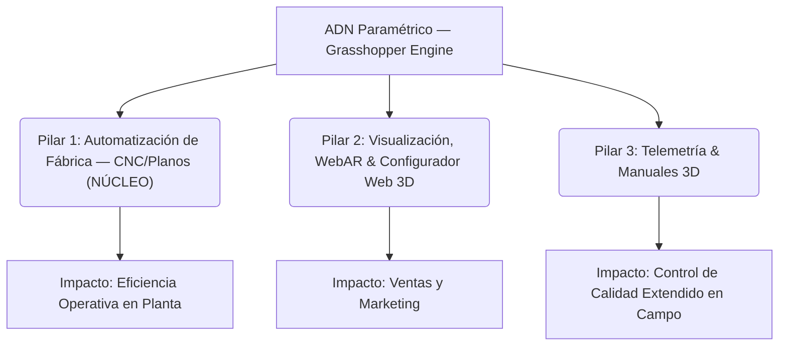

# 🧠 Manifiesto de Negocio: Software para la Industria de Manufactura (Smart Manufacturing & Digital Twins)

Este documento es la **columna vertebral conceptual** y la hoja de ruta estratégica de **Mario Mojica (MM)**. Define la filosofía, el modelo de negocio, la arquitectura tecnológica y los pasos tácticos para posicionar a **[mariomojica.com](https://mariomojica.com)** como la **firma de desarrollo de software para la industria de la Manufactura (Manufactura 4.0)**, con una vertical de foco prioritario y especialización profunda en el **sector del mueble y mobiliario RTA**.

---

## 👁️ 1. Visión, Posicionamiento y Propósito Central

### Definición de Categoría: Firma de Software para Manufactura
**Mario Mojica (MM)** se define principalmente como una **empresa y firma de desarrollo de software especializado para el sector de la Manufactura**. Desarrollamos soluciones tecnológicas de **Manufactura 4.0**, integrando gemelos digitales paramétricos, asistencia interactiva 3D de ensamblaje, telemetría de comportamiento en campo y automatización de ingeniería (CAD/CAM/CNC).

Al enmarcar nuestra identidad dentro de la categoría macro de **Software para Manufactura**, logramos:
1. **Claridad Ejecutiva:** Comunicar de forma instantánea a CEOs, directores de planta e inversionistas el alcance tecnológico de la firma.
2. **Alta Encontrabilidad (SEO & B2B Matchmaking):** Capturar intenciones de búsqueda corporativas, licitaciones y categorizaciones en directorios industriales B2B bajo términos consolidados como *software de manufactura*, *manufactura 4.0*, *gemelo digital industrial* y *smart manufacturing*.
3. **Escalabilidad de Plataforma:** Construir un motor de software cuyos núcleos (motor 3D, telemetría, generador de planos, costeo y empaque) aplican a la manufactura en general, mientras concentramos nuestra energía comercial en una vertical de dominio absoluto.

---

### Vertical de Foco Prioritario: La Industria del Mueble
Dentro del amplio espectro de la manufactura, **nuestro campo de acción inmediato y especialización profunda está en la Industria del Mueble**. La fabricación de mobiliario es una de las industrias de manufactura discreta de mayor volumen global, pero padece una desconexión crítica en su cadena digital de valor.

#### Segmentación y Estructura del Mercado de Mobiliario B2B
Para posicionar nuestras soluciones de software con la máxima precisión, abarcamos las 5 categorías industriales del mercado mueblero:

*   **RTA / Seriados (Ej: Politorno, Kappesberg, Madesa, Multimóveis):** 
    *   **Nomenclatura Técnica e Industrial (B2B):** **RTA (Ready-To-Assemble / Pronto para Montar)** es el término estándar global y corporativo utilizado por la industria (respaldado por la ABIMÓVEL, Movergs, eMóbile e IEMI en Brasil). Define la categoría industrial de muebles en caja plana (*flat-pack*) optimizados para logística, e-commerce y exportación.
    *   **El Pacto Económico del RTA:** El consumidor acepta voluntariamente el riesgo del auto-ensamblaje (*Do-It-Yourself / DIY*) a cambio de un precio competitivo, ahorrándole a la fábrica los costos de flete volumétrico y la mano de obra final de producción.
    *   **La Oportunidad del Acompañamiento Digital:** El Manual 3D por voz asegura que la terminación final sea un éxito, evitando bloqueos, reclamos y pérdida de reputación de marca.
*   **Modulados (Ej: Favorita / New / Casa Brasileira):** Módulos estandarizados de medidas fijas (ej: gabinetes de cocina de 30, 40, 60 y 80 cm) adaptados según el espacio.
*   **Planejados / A Medida (Ej: Dell Anno, Florense):** Producción a la medida exacta bajo pedido mediante herramientas de diseño en fábrica para showrooms y arquitectos.
*   **Tapizados y Espumados (Ej: K1 Upholstery, Natuzzi, Salas y Colchones):** Mobiliario acolchado con estructura, espumas y textiles (sofás, poltronas, pufs, salas de estar y colchones).
*   **Personalizados y Especiales:** Mobiliario corporativo, comercial o técnico diseñado bajo requerimientos únicos de proyecto.

---

### El Dolor de la Manufactura Mueblera
* **Ineficiencia en I+D / Ingeniería:** Las áreas de diseño e ingeniería en plantas tradicionales son lentas y costosas. Modificar la dimensión de un producto requiere redibujar planos manualmente, recalcular despieces y re-costear procesos, lo que toma días y genera errores humanos en cascada.
* **Falta de Agilidad Comercial:** Las empresas no pueden probar el mercado a la velocidad que exige la era digital. La generación de renders realistas y entornos WebAR suele ser tercerizada a costos elevados y tiempos lentos.
* **Fricción en Postventa:** Los manuales en papel mal diseñados provocan frustración en el usuario final, armados defectuosos y un alto volumen de devoluciones y reclamos costosos que erosionan el margen del fabricante.

---

### 🎯 Foco Táctico Inmediato (GTM): El Manual 3D como Primer Módulo de una Plataforma Tecnológica Multi-Aplicaciones
Aunque nuestra visión como firma de software de manufactura abarca la suite completa de automatización de planta y marketing industrial (Ecosistema 3DBimFab), **el Manual de Armado Interactivo 3D es el primer producto comercial insignia** desplegado sobre nuestra **Plataforma Tecnológica Multi-Aplicaciones SaaS B2B**.

* **Plataforma Multi-Aplicaciones:** El fabricante no adquiere un visor aislado; accede a una plataforma de software integral de manufactura que conecta múltiples aplicaciones especializadas (Visor 3D Interactivo, CMS de Identidad de Marca, Generador de Códigos QR, Motor de Analíticas de Campo, y las futuras aplicaciones de Definidor de Empaque/Cubicaje, Renders 4K/WebAR y Automatización CAD/CAM/CNC).
* **El "Caballo de Troya" B2B:** El Manual 3D resuelve el dolor más visible, inmediato y cuantificable de los fabricantes de muebles (devoluciones por armado incorrecto, soporte técnico telefónico saturado y mala reputación online).
* **Fácil Adopción:** A diferencia del outsourcing de ingeniería que requiere cambiar procesos internos de la fábrica, el Manual 3D se vende como el primer módulo de software de postventa y marketing que se integra fácilmente mediante un código QR o iframe en el sitio del cliente (PDP).
* **Estrategia Comercial:** Salir al mercado ofreciendo la plataforma con este producto estrella. Una vez que ganemos la confianza del fabricante RTA con el manual 3D y demostremos el valor de nuestras analíticas y datos de campo, introduciremos las siguientes aplicaciones de la plataforma (automatización de fábrica, planos CNC y diseño paramétrico) como un *upsell* natural.

---

## 🚀 2. Los Tres Pilares de Valor (Ecosistema 3DBimFab)

> 📄 **Documento Fundacional Completo:** [3BF.md](file:///c:/Desarrollo/mmapp/3BF/3BF.md)

### Definición de 3DBimFab (3BF)
**3DBimFab** es nuestra metodología de trabajo convertida en identidad — el motor que convierte el diseño paramétrico en un bien tangible de forma automatizada:
- **3D (Geometría):** Entorno tridimensional avanzado con Rhinoceros 8, precisión milimétrica en cada pieza.
- **BIM (Información Inteligente):** Algoritmos en Grasshopper y metadatos paramétricos propios que convierten cada mueble en un objeto inteligente con su "ADN" de costos, materiales y procesos.
- **Fab (Manufactura Digital):** Generación automatizada de archivos DXF para CNC, listas de corte, manuales de armado interactivos 3D, activos WebAR e instrucciones de empaque — todo desde un único modelo paramétrico.

### Visión Web-BIM: Eliminación de VisualARQ
La evolución estratégica de 3BF es reemplazar VisualARQ (capa de UI dentro de Rhino, +$695 USD/licencia) por un **Parser Web nativo** que lee los parámetros del `.gh` (Grasshopper), genera un JSON Schema y renderiza una interfaz de configuración web en React, democratizando el acceso al diseño paramétrico a cualquier usuario con navegador — sin licencias ni conocimiento técnico. Esto trasciende el BIM tradicional hacia un paradigma **Web-BIM para manufactura** que integra DfMA, personalización masiva e integración e-commerce.

Nuestra ventaja competitiva radica en el **Ecosistema 3DBimFab**, una suite de software industrial basada en **Rhinoceros 3D (v8), Grasshopper (motor headless), Rhino Compute API, WebGL (Three.js/R3F) y Supabase** que habilita tres pilares:


```mermaid
graph TD
    A["ADN Paramétrico — Grasshopper Engine"] --> C("Pilar 1: Automatización de Fábrica — CNC/Planos (NÚCLEO)")
    A --> B("Pilar 2: Visualización, WebAR & Configurador Web 3D")
    A --> D("Pilar 3: Telemetría & Manuales 3D")
    C --> F["Impacto: Eficiencia Operativa en Planta"]
    B --> E["Impacto: Ventas y Marketing"]
    D --> G["Impacto: Control de Calidad Extendido en Campo"]
```

### Pilar 1: Automatización de Fábrica e Industria 4.0 — NÚCLEO (Outsourcing de Ingeniería)
* **Grasshopper como Motor Headless:** El corazón de 3BF. Los algoritmos paramétricos corren de forma independiente, exponiendo sus parámetros vía JSON Schema para ser consumidos por la web.
* **Planos de Fabricación Automatizados:** Generación instantánea de vistas, acotados y despieces técnicos a partir de los parámetros del modelo.
* **Integración CNC & Listas de Corte:** Exportación de archivos listos para maquinaria (DXF para seccionadoras y taladros CNC tipo Biesse), optimización de láminas (Optiplaning) y etiquetado inteligente.
* **Costeo en Tiempo Real:** Enlace paramétrico con bases de datos de materiales y herrajes para dar visibilidad financiera inmediata a cambios de diseño.
* **3D Nesting (Empaque Eficiente):** Módulo de cubicación automática que define las dimensiones óptimas de las cajas y empaques para logística.

### Pilar 2: Digitalización, Marketing Visual y Configurador Web 3D (Periferia)
* **Renders Fotorrealistas 4K:** Generados localmente mediante pipelines de software optimizados, eliminando la dependencia de render farms costosas. Permiten prototipar infinitas variantes de color, maderas, textiles y herrajes en caliente.
* **Realidad Aumentada Web (WebAR):** Visualización interactiva a escala real directamente desde el navegador móvil del cliente, incrementando la conversión de compra online al eliminar la incertidumbre espacial.
* **Configurador Web 3D Paramétrico:** Interfaz web nativa (React + Three.js) que permite al cliente final personalizar dimensiones, materiales, herrajes y colores del mueble directamente desde el navegador, con actualización en tiempo real de la geometría 3D vía Rhino Compute API.

### Pilar 3: Optimización Postventa & Telemetría (Periferia — Manuales de Armado 3D)
* **Visor 3D Interactivo:** El aplicativo web (`Three.js / React Three Fiber`) permite al cliente final rotar el mueble, visualizar la secuencia exacta paso a paso y recibir indicaciones por voz (TTS).
* **Escaneo de Piezas Inteligente:** Algoritmo integrado que extrae de manera exacta la cantidad de madera y herrajes requeridos directamente desde el modelo 3D para pintarlo en el tutorial interactivo.
* **Telemetría de Campo:** Captura asíncrona de datos de interacción (embudo de armado, tiempos, bloqueos por paso) que entrega a la fábrica datos gerenciales inéditos sobre su producto en manos del consumidor.

---

## 💰 3. Modelo de Negocio y Estructura de Planes

Ofrecemos un modelo de **Software de Manufactura como Servicio (SaaS B2B)** y **Outsourcing de Transformación Digital** estructurado en tres niveles:

| Característica | Plan 1: Starter | Plan 2: Estándar (Recomendado) | Plan 3: Visionario |
| :--- | :--- | :--- | :--- |
| **Precio** | **$790 USD / mes** | **$2,900 USD / mes** | **$79,000 USD / año** (Contrato Anual) |
| **Volumen** | Hasta 5 productos / mes | Hasta 10 productos / mes | Transformación Digital Llave en Mano |
| **Entregables Visuales** | Renders 4K + WebAR | Renders 4K + WebAR + Modelado 3D | Todo lo del Plan Estándar |
| **Entregables Técnicos** | - | Planos, Costeo Paramétrico, Cubicaje | Adaptación a la medida del ERP/Fábrica |
| **Postventa & Software** | - | Manual de Armado 3D Interactivo + Telemetría | Aplicativos y herramientas de software customizadas |
| **Consultoría & Procesos** | - | Estrategia de diseño RTA | Diagnóstico, Gestión del cambio, Mockups, Pruebas piloto |

---

## 🌿 4. Estrategia Dual: Software B2B vs. Producto Físico Sandbox (Muebles en Guadua)

Para maximizar la resiliencia financiera y validar el software en condiciones reales de producción, implementamos una **Estrategia Dual**:

1. **B2B: Software para Manufactura y Automatización de Ingeniería (SaaS/Servicio):** Genera flujo de caja recurrente de alto valor. Alivia el dolor de ineficiencia en departamentos de diseño e ingeniería de grandes fabricantes (como Maderkit, Jamar, Politorno).
2. **B2C: Venta Online de Muebles Premium en Guadua (Sandbox de Producto Físico):**
   - **Validación Interna:** Sirve como el laboratorio real (*sandbox*) para probar y perfeccionar nuestro propio software: desde el diseño paramétrico en Guadua (uniones, estructura sustentable) hasta los manuales de armado 3D, la telemetría y el WebAR del e-commerce.
   - **Producto Físico Verde:** Venta de mobiliario ecológico de alto valor estético y estructural enfocado a nichos de diseño sostenible e-commerce.

---

## 💻 5. Arquitectura del Stack Tecnológico

Nuestra plataforma se compone de dos vertientes interconectadas (el motor de manufactura en planta y la visualización web de campo):

```
       [ Rhino 8 / Grasshopper (Local/Compute) ] -- ADN Paramétrico de Manufactura
                        │
                        ├─ (Archivos de fabricación: DXF, CSV, PDF)
                        ▼
                [ Supabase DB & Storage ] -- Almacenamiento de configuraciones y modelos
                        │
         ┌──────────────┴──────────────┐
         ▼                             ▼
  [ Next.js Platform (Port 3003) ]   [ R3F Assembly App (Port 3004 / Embed) ]
    - CMS de administración             - Visor 3D del usuario final
    - Configuración de manuales         - Guía por voz interactiva (TTS)
    - Carga de PBR e Iluminación        - Visualización en caliente (postMessage)
    - Telemetría & Reporte PDF          - Captura de métricas de fricción
```

1. **Algoritmos y Computación Paramétrica (Rhino Compute + Grasshopper):** Corre los scripts en segundo plano para realizar el procesamiento geométrico y generar las exportaciones de archivos técnicos (DXF, CSV, Nesting).
2. **Base de Datos y Almacenamiento (Supabase Cloud):** Repositorio central de perfiles de usuario, solicitudes de diseño, configuraciones de branding del cliente, modelos GLB de pasos, audios, texturas PBR y registros de telemetría.
3. **Plataforma de Administración (Next.js - Puerto 3003):** Dashboard del administrador (Mario Mojica) para gestionar proyectos, editar audios, calibrar luces, definir texturas, generar el código QR de inserción y emitir reportes de analítica en PDF.
4. **Visor de Usuario Final (React Three Fiber - Puerto 3004):** Aplicación interactiva ligera incrustable en los e-commerce (PDP) de los clientes que consume los datos de Supabase en tiempo real y registra eventos de telemetría sin cookies.

---

## 🗺️ 6. Hoja de Ruta Táctica (Roadmap de Acción)

### Fase 1: Consolidación Tecnológica y Plataforma (Completada / Foco Continuo)
- [x] Estabilizar los servidores de desarrollo y producción de la plataforma de software.
- [x] Consolidar el visor interactivo de armado con soporte de audio TTS, sombras reales y branding dinámico.
- [x] Implementar la calibración de iluminación y cámaras en tiempo real con persistencia en Supabase.
- [x] Blindaje de propiedad intelectual (IP Shield) con cifrado GLB y URLs firmadas.
- [x] Despliegue del motor de analíticas (Umami + API de telemetría en Next.js) y reporte PDF de fricción A4.

### Fase 2: Creación de Contenido y Posicionamiento de Marca (Manufactura 4.0)
* **Demo Pública Imbatible:** Utilizar el caso de estudio de Guadua y Politorno para mostrar en la web el render, el WebAR, el despiece automatizado y el manual 3D con telemetría en funcionamiento.
* **LinkedIn Technical Posting:** Generar publicaciones demostrando la eficiencia del software de manufactura: "Cómo pasamos de 3 días a 10 minutos para exportar planos CNC usando Grasshopper".
* **Posicionamiento en la Industria Mueblera:** Presencia técnica y outreach directo en los principales polos industriales de Brasil y Latinoamérica (Arapongas, Bento Gonçalves, Ubá, Movergs, Fimma).

### Fase 3: Captura de Clientes e Iteración Comercial
* **Prospección B2B:** Ofrecer diagnósticos gratuitos de flujo de trabajo de ingeniería a fabricantes medianos de mobiliario RTA.
* **Lanzamiento B2C Sandbox:** Publicar y vender las primeras piezas físicas de Guadua online para validar la logística del manual de armado y WebAR con compradores reales.

---

## 📈 7. Puesta en Marcha del Negocio: Foco Estratégico en el Manual 3D + Telemetría

Para la fase de lanzamiento comercial de la firma de software, **nos enfocamos de forma prioritaria en la venta y distribución del Manual de Armado Interactivo 3D con Telemetría de Campo**. Este módulo actúa como nuestro caballo de troya comercial, permitiéndonos adquirir clientes B2B de forma ágil sin exigirles cambios inmediatos en sus procesos de diseño o ingeniería internos.

Nuestra propuesta comercial no se limita a vender "visualizaciones 3D bonitas"; vendemos una **plataforma integrada de software para optimización operativa, postventa inteligente y captura de datos de clientes**.

### 7.1 El Argumento Comercial de Venta (Go-To-Market)
El manual de armado 3D se presenta ante los fabricantes de muebles RTA bajo una propuesta de valor de alto retorno de inversión (ROI):
1. **Reducción de Devoluciones y Garantías:** Minimiza los errores del usuario final al armar el mueble. Si un cliente rompe una pieza de madera por seguir mal un manual de papel, la empresa debe asumir el costo de reposición. El manual interactivo 3D con guías visuales y por voz reduce esta fricción drásticamente.
2. **Descongestionamiento del Servicio al Cliente:** Menos llamadas telefónicas redundantes a la línea de soporte preguntando *"¿dónde va este tornillo?"* o *"¿cuál es la pieza A?"*.
3. **Instalación Instantánea:** Los fabricantes solo deben imprimir un código QR autogenerado en la caja de cartón del mueble o incluir un enlace de inserción (iframe) en sus tiendas en línea (PDP). El usuario final escanea el QR y accede a la guía de inmediato en su celular, sin descargar aplicaciones ni registrarse.

### 7.2 El Sistema de Métricas Ejecutivas (Optimización de Muebles basada en Datos)
El verdadero diferencial tecnológico para convencer a la junta directiva de una fábrica de muebles es el **módulo de analíticas automatizadas de nuestro software**. A través de la interacción del cliente con el visor 3D, la plataforma captura datos y genera un **Informe Ejecutivo en PDF (Modelo de Fricción A4)**:
* **El Embudo de Armado (Funnel paso a paso):** Gráfico de retención que detalla cuántos usuarios iniciaron el armado y cuántos llegaron a cada paso. Esto permite identificar cuellos de botella del producto físico.
  * *Ejemplo de Alerta Automatizada del Sistema:* *"Alerta de Fricción Crítica: El Paso 8 registró la mayor pérdida de usuarios en el camino, con 32 abandonos en esta transición. Se recomienda auditar la claridad visual o de audio de este paso."* Con esto, el fabricante sabe si debe cambiar un herraje complejo o rediseñar el paso en fábrica.
* **Tasa de Finalización (Completion Rate):** Muestra el porcentaje de éxito total del proceso de armado.
* **Uso de Dispositivos:** Identifica qué porcentaje de usuarios utiliza dispositivos móviles (ej: 65%) versus escritorio o tablet, optimizando futuras campañas de marketing.
* **Sentimiento y Reseñas de Clientes:** Un muro de opiniones directas de los usuarios recolectadas al terminar el manual (ej: *"El audio va muy rápido en la explicación de las bisagras traseras"*, *"Excelente manual, muy fácil"*), lo que otorga a la fábrica una visibilidad directa del cliente final que antes no tenía.

### 7.3 Portal B2B de Acceso y Colaboración Fluidos
Para que la relación entre nuestra firma de software y los fabricantes sea escalable y profesional, los clientes acceden a un panel seguro en nuestra plataforma mediante un **usuario y contraseña exclusivos**:
* **Branding e Identidad Autogestionables:** Cada cliente (ej: Jamar, Maderkit, Politorno) ingresa a su cuenta y define su **Color Primario** corporativo (que tiñe la interfaz del manual), carga sus logotipos, faviconos y configura los textos y traducciones de las 8 burbujas de ayuda del tutorial interactivo.
* **Calibrador y Visor en Caliente:** El cliente puede visualizar de forma segura la previsualización en vivo de sus manuales, calibrar las luces del escenario virtual PBR, definir la posición predeterminada de la cámara por paso y guardar la configuración instantáneamente en nuestra base de datos.
* **Descarga de QR e Informes:** El cliente ingresa a su zona de control privada para visualizar sus paneles de métricas interactivas y descargar los reportes mensuales en PDF para sus comités de calidad.

### 7.4 Traducción al Diseño de la Landing Page
Este enfoque estratégico dicta que la landing page (`mariomojica.com`) se posicione como la entrada principal a una **Plataforma Tecnológica de Software para la Industria de la Manufactura (Manufactura 4.0)**, presentando el **Manual de Armado 3D por Voz** como su primer producto comercial en vivo, conectado a una suite multi-aplicaciones.
* **El Hero**: Presenta a **Mario Mojica** como la Plataforma Tecnológica de Manufactura, destacando la conexión entre el diseño de fábrica y el consumidor mediante nuestro primer módulo insignia (el asistente 3D por voz).
* **El Centro de la Página**: Despliega la demo interactiva 3D en vivo como prueba de la potencia del software.
* **Sección de Inteligencia y Métricas**: Explica el valor de las métricas en tiempo real (reporte de fricción A4, abandonos paso a paso y reseñas de clientes).
* **Sección de Plataforma Multi-Aplicaciones**: Muestra el panel CMS de la plataforma donde el cliente administra sus marcas, descarga códigos QR y tiene visibilidad del ecosistema de aplicaciones (manuales 3D, definidor de empaque, renders/WebAR y automatización de planos CNC).
