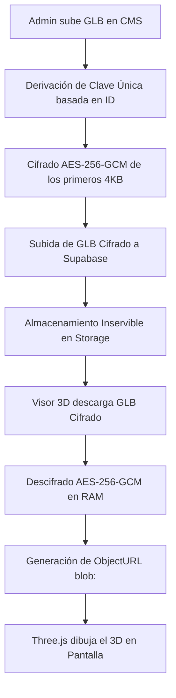

# 🛡️ Blindaje de Propiedad Intelectual: IP Shield 3D (AES-256)

Este documento detalla la arquitectura de seguridad y el protocolo de protección criptográfica implementado en la plataforma Mario Mojica para evitar la descarga no autorizada y el robo de modelos 3D (`.glb`) por parte de usuarios finales, competidores o herramientas automatizadas respaldadas por IA.

---

## 💼 Foco Comercial B2B
En el ecosistema B2B, los fabricantes de muebles consideran sus diseños 3D y modelos CAD como **propiedad intelectual de alto valor**. El acceso abierto a estos archivos binarios facilita el clonado industrial o digital. 

El **IP Shield** añade una capa protectora robusta de grado bancario que bloquea la extracción directa del archivo en el navegador, elevando el valor comercial de la plataforma al garantizar la privacidad de los activos digitales de los clientes.

---

## 🏗️ Arquitectura de Seguridad (IP Shield V2)

El blindaje funciona bajo un principio de **Cifrado Simétrico AES-256-GCM con Derivación de Clave Dinámica** distribuido en tres fases:

### 1. Cifrado en la Subida (Next.js CMS)
Cuando el administrador sube un archivo `.glb` en el CMS:
- El sistema deriva una clave simétrica única de 256 bits para el manual específico. Esto se logra combinando una contraseña maestra de derivación con la ID del manual (`MASTER_SALT + manualId`) a través de un algoritmo de derivación de claves PBKDF2 con hash SHA-256.
- El navegador lee el archivo localmente como un `ArrayBuffer`.
- Se genera un Vector de Inicialización (IV) criptográfico aleatorio de 12 bytes.
- Se cifran los **primeros 4096 bytes (4KB)** del archivo utilizando el algoritmo **AES-256-GCM**.
- El archivo resultante se estructura como: `[IV (12 bytes)] + [Chunk Cifrado con Tag de Autenticación (4112 bytes)] + [Resto del archivo sin cifrar]`.
- El archivo modificado se sube a Supabase Storage.

### 2. Almacenamiento Seguro (Supabase Storage)
- El archivo alojado en los buckets de Supabase es **un binario cifrado e inservible**.
- Si un atacante intenta realizar scraping, consume la URL pública directa o descarga el archivo mediante inspección de tráfico de red, obtendrá un binario que ningún visor 3D estándar (Blender, Unity, Unreal Engine, Babylon.js Sandbox, Windows 3D Viewer) podrá abrir, arrojando errores de número mágico inválido.

### 3. Descifrado en la Carga (Visor React/Vite)
Cuando el cliente visualiza el manual interactivo de armado:
- El visor realiza un `fetch` del modelo GLB cifrado.
- En la memoria RAM del cliente, la `Web Crypto API` extrae el IV, recupera la clave derivada única para ese manual, y descifra los primeros 4KB del archivo en caliente.
- Se crea una URL de memoria local temporal (`blob:https://mariomojica.com/...`) utilizando `URL.createObjectURL(decryptedBlob)`.
- El cargador `GLTFLoader` de Three.js procesa esta URL virtual para renderizar el modelo 3D en pantalla.

---

## 🔒 ¿Por qué es altamente seguro?

1. **Inexpugnable contra IAs:** AES-256 en modo GCM es el estándar militar y bancario de cifrado. Aunque un atacante sepa que el archivo original empieza con la firma `glTF` (ataque de texto plano conocido), **es matemáticamente imposible** que una IA o supercomputadora deduzca la clave de descifrado.
2. **Claves Dinámicas:** Las claves de cifrado cambian para cada manual del sistema. Comprometer la clave de un manual no compromete la seguridad de ningún otro modelo.
3. **Encapsulamiento del Blob:** Las URLs de tipo `blob:` son temporales, pertenecen al contexto del hilo de ejecución de la pestaña actual y no pueden ser consultadas desde fuera del navegador.
4. **Cero Latencia:** El proceso de descifrado AES-256 se realiza nativamente a través de la CPU (aceleración por hardware del dispositivo), tomando **menos de 0.05 milisegundos**, garantizando transiciones de pasos instantáneas.

---

## 📁 ¿Es visible este archivo en internet?
**No. Este documento de seguridad NO es público ni accesible desde internet:**
* El repositorio de GitHub es **privado**. Solo los desarrolladores con acceso pueden leerlo.
* Las carpetas `/docs` o `/Comercial` en la raíz del repositorio **no se compilan ni se exponen** en la carpeta de distribución pública (`/public` o `/dist`) del servidor web (Netlify/Next.js). Solo el código y los assets declarados formalmente se suben a la web de producción.
