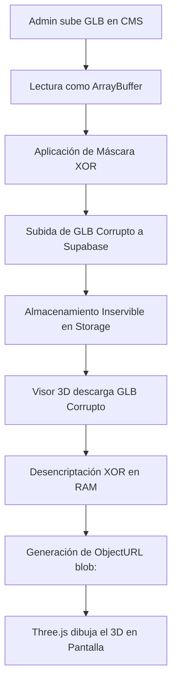

# 🛡️ Blindaje de Propiedad Intelectual: IP Shield 3D

Este documento detalla la arquitectura de seguridad y el protocolo de protección implementado en la plataforma Mario Mojica para evitar la descarga no autorizada y el robo de modelos 3D (`.glb`) por parte de usuarios finales, competidores o herramientas automatizadas.

---

## 💼 Foco Comercial B2B
En el ecosistema B2B, los fabricantes de muebles (como Maderkit, Politorno, etc.) consideran sus diseños 3D y modelos CAD como **propiedad intelectual de alto valor**. El acceso abierto a estos archivos binarios facilita el clonado industrial o digital. 

El **IP Shield** añade una capa protectora robusta que bloquea la extracción directa del archivo en el navegador, elevando el valor comercial de la plataforma al garantizar la privacidad de los activos digitales de los clientes.

---

## 🏗️ Arquitectura de Seguridad (IP Shield)

El blindaje funciona bajo un principio de **Ofuscación de Cabecera Binaria en Caliente** distribuido en tres fases:

### 1. Encriptación en la Subida (Next.js CMS)
Cuando el administrador sube un archivo `.glb` en el CMS:
- El navegador lee el archivo binario localmente como un `ArrayBuffer`.
- Se aplica una operación simétrica `XOR` utilizando una clave de 4 bytes (`[0xAA, 0x55, 0x1F, 0x2E]`) únicamente sobre los **primeros 1024 bytes** del archivo (la cabecera).
- Esto corrompe el encabezado mágico del archivo (sustituyendo el identificador estándar `glTF` por bytes ofuscados).
- El archivo resultante se sube a Supabase Storage.

### 2. Almacenamiento Seguro (Supabase Storage)
- El archivo alojado en los buckets de Supabase es, a todos los efectos prácticos, **un archivo corrupto e inservible**.
- Si un atacante intenta realizar raspado de datos (scraping), consume la URL pública directa o descarga el archivo mediante `curl`, obtendrá un binario que ningún visor 3D estándar (Blender, Unity, Unreal Engine, Babylon.js Sandbox, Windows 3D Viewer) podrá abrir.

### 3. Desencriptación Efímera en la Carga (Visor React/Vite)
Cuando el cliente visualiza el manual interactivo de armado:
- El visor realiza un `fetch` del modelo GLB corrupto desde Supabase.
- En la memoria RAM del cliente, se ejecuta la operación reversible `XOR` para restaurar los primeros 1024 bytes originales en microsegundos.
- Se crea una URL de memoria local temporal (`blob:https://mariomojica.com/...`) utilizando `URL.createObjectURL(decryptedBlob)`.
- El cargador `GLTFLoader` de Three.js procesa esta URL virtual para renderizar el modelo 3D en pantalla.

---

## 🔒 ¿Por qué es altamente seguro?

1. **Incompatibilidad Inmediata:** Si intentan cargar el GLB descargado del tráfico de red en herramientas como Babylon.js Sandbox, arrojará un error de detención inmediato: `RuntimeError: Unexpected magic: 1749780481` (ya que el parser lee la cabecera alterada).
2. **Encapsulamiento del Blob:** Las URLs de tipo `blob:` son temporales, pertenecen al contexto del hilo de ejecución de la pestaña actual y no pueden ser descargadas o consultadas desde fuera del navegador o en otras pestañas.
3. **Eficiencia en CPU:** Al aplicar la máscara XOR únicamente sobre los primeros 1024 bytes del archivo, el procesamiento de cifrado/descifrado toma **menos de 0.1 milisegundos**, garantizando transiciones de pasos instantáneas en dispositivos móviles de gama baja y protegiendo el 100% de la experiencia de usuario.

---

## 🛠️ Archivos del Ecosistema de Seguridad
Los componentes de seguridad se encuentran centralizados en:
- **Librería de Criptografía (Next.js):** [crypto.ts](file:///c:/Desarrollo/mmapp/mario-mojica-plataforma/lib/crypto.ts)
- **Librería de Criptografía (Vite):** [crypto.js](file:///c:/Desarrollo/mmapp/legacy-aplicativo-armado/src/lib/crypto.js)
- **Integración CMS:** [detalle-proyecto-modal.tsx](file:///c:/Desarrollo/mmapp/mario-mojica-plataforma/components/proyectos/detalle-proyecto-modal.tsx#L1448-L1460)
- **Integración Visor:** [Model.jsx](file:///c:/Desarrollo/mmapp/legacy-aplicativo-armado/src/features/AssemblyInstructions/3d-escene/Model.jsx#L690-L715) y [Experience.jsx](file:///c:/Desarrollo/mmapp/legacy-aplicativo-armado/src/features/AssemblyInstructions/3d-escene/Experience.jsx#L600-L625)
