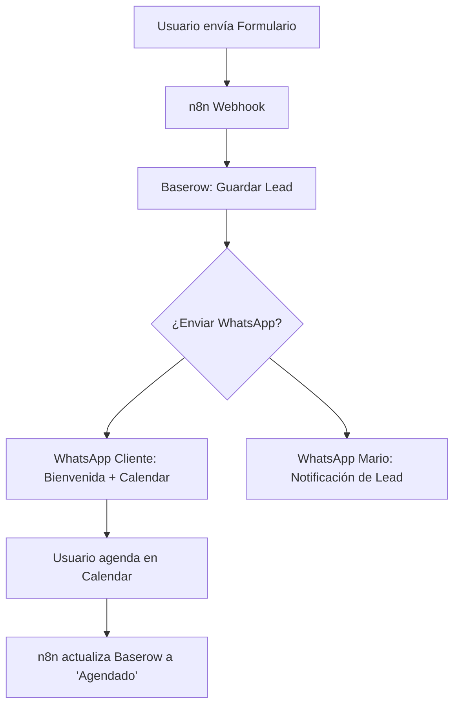

# Diseño de Automatización: CRM & Agendamiento Mario Mojica

**Fecha:** 2026-03-12  
**Autor:** Antigravity  
**Estado:** Probado / En Proceso  

## 1. Objetivo
Implementar un sistema de captura de leads premium para el portafolio de Mario Mojica, asegurando que cada contacto sea registrado, notificado y atendido de forma instantánea mediante WhatsApp oficial (Meta API) y gestionado en una base de datos centralizada (Baserow).

## 2. Componentes del Sistema

### A. Frontend (Portafolio Next.js)
- **Componente:** `ContactForm.tsx`
- **Campos:** Nombre, Apellido, Email, Empresa, País, Teléfono, Rol, Intereses específicos.
- **Acción:** Envío de datos vía `fetch` POST al Webhook de n8n.
- **UX:** Feedback visual de "Enviando" y "Éxito/Error".

### B. Base de Datos (Baserow)
- **Tabla:** `Leads Portafolio`
- **Columnas:** ID, Fecha, Nombre Completo, Email, Empresa, Teléfono, Rol, Intereses, Estado del Lead (Nuevo, Contactado, Agendado).

### C. Automatización (n8n v2.10.2 en VPS)
- **Nodo 1 (Webhook):** Escucha peticiones desde el portafolio.
- **Nodo 2 (Baserow):** Crea el registro del lead.
- **Nodo 3 (Meta WhatsApp API - Cliente):** Envía mensaje de bienvenida personalizado con link de agendamiento.
- **Nodo 4 (Meta WhatsApp API - Mario):** Envía notificación detallada con link directo al chat del cliente.
- **Nodo 5 (Google Calendar):** Creación de evento tentativo (opcional según lógica de negocio).

## 3. Configuración de Meta API (WhatsApp Cloud)
- Creación de App en `developers.facebook.com`.
- Configuración de un **System User** para obtener un Token de Acceso Permanente.
- Verificación de número y plantillas (Templates) de mensajes.

## 4. Flujo de Trabajo (Diagrama)

## 5. Medidas de Seguridad
- Uso de variables de entorno para tokens de Meta y API Keys de Baserow.
- Implementación de reCAPTCHA o validación de origen en el Webhook.
- Almacenamiento seguro de llaves en el VPS con permisos restringidos.
