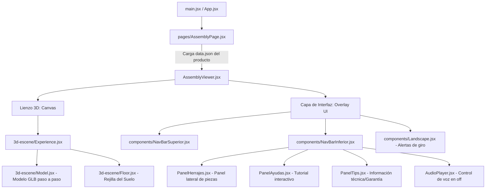

# 🗺️ El Mapa del Tesoro: Estructura del Aplicativo de Armado (3D)

Este documento es una guía de referencia rápida tanto para ti como para **Antigravity** (la IA). Describe de forma compacta la arquitectura, el flujo de datos, el manejo de estados globales y la responsabilidad de cada archivo clave dentro del proyecto **`legacy-aplicativo-armado`**.

Mantener este mapa activo evita tener que leer miles de líneas de código repetidamente, **reduciendo el consumo de tokens en más del 80%** y guiando de manera exacta a los archivos correctos.

---

## 🏗️ 1. Arquitectura General y Jerarquía

El aplicativo es una experiencia 3D interactiva construida en **React + Three.js** utilizando `@react-three/fiber` (R3F) y `@react-three/drei`. Los menús e interfaces se superponen sobre el lienzo 3D como capas HTML tradicionales (Overlay UI).

---

## 🧠 2. El Cerebro Global: `useEnviroment.js`
Ubicación: `src/features/AssemblyInstructions/hooks/useEnviroment.js`

El proyecto utiliza **Zustand** como manejador de estado global. En lugar de pasar propiedades de padre a hijo, los componentes se suscriben a este store.

### Variables Críticas de Estado:
* **`pasoActual`** (String): El paso de armado actual (ej. `"00"`, `"01"`, `"02"`). Controla qué modelo `.glb` cargar.
* **`pasos`** (Array): Lista de todos los identificadores de paso cargados desde el `data.json`.
* **`id`** (String): El ID del producto (ej. `"M01536"`). Define las rutas de assets.
* **`phaseAudio`** (String): Estado de reproducción (`"start"`, `"playing"`, `"paused"`, `"reset"`).
* **`PiezaHerraje`** (String): Nombre del elemento que el usuario está señalando o tocando en 3D. Se muestra en el banner inferior.
* **`show`** (Boolean): Variable de transición rápida para desmontar y remontar el Canvas 3D al cambiar de paso, limpiando memoria.
* **`Parpadeo`** (Boolean): Si es `true`, hace destellar la flecha de avanzar paso.
* **Paneles Activos**: `panelTips`, `PanelAyudas`, `PanelCantidades` y `PanelShow` controlan qué ventana modal o panel lateral está abierto.

---

## 📂 3. Inventario de Archivos Clave

### 🎛️ Cimientos y Enrutamiento
1. **`index.html`**
   * *Propósito*: Punto de entrada web. Aloja fuentes locales (`Play-Regular`) para evitar retrasos de carga.
2. **`src/main.jsx` & `src/App.jsx`**
   * *Propósito*: Configura el enrutador (`react-router-dom`). Redirige la raíz `/` automáticamente al ID de producto por defecto (`/M01536`).
3. **`src/pages/AssemblyPage.jsx`**
   * *Propósito*: Captura el ID de la URL y hace un `fetch` dinámico del archivo `/${id}/data.json` que reside en la carpeta pública. Si tiene éxito, renderiza el `AssemblyViewer`.

### 🕶️ El Núcleo 3D (Carpeta `src/features/AssemblyInstructions/3d-escene/`)
4. **`AssemblyViewer.jsx`**
   * *Propósito*: El contenedor raíz de la vista 3D. Inicializa el store Zustand con los datos del JSON, define la configuración del renderizador web de Three (`gl`, `toneMapping`, `camera`) y distribuye el Overlay UI.
5. **`Experience.jsx (AssemblySceneViewer)`**
   * *Propósito*: Configura las luces de la escena, las sombras, el control de órbita (`OrbitControls`) y el entorno panorámico local (`hdri2/salon_01.webp`).
6. **`Model.jsx`**
   * *Propósito*: Carga dinámicamente el modelo GLB del paso correspondiente (`/${id}/models/P${pasoActual}.glb`). Contiene la lógica de animación, detección de clics en piezas, resaltado con Matcaps y emisión de la señal de parpadeo visual.

### 🎨 La Interfaz HTML (Carpeta `src/features/AssemblyInstructions/components/`)
7. **`NavBarSuperior/NavBarSuperior.jsx` & `.css`**
   * *Propósito*: Controles del borde superior: Botón de ayuda (`?`), información técnica (`i`) y el botón de Realidad Aumentada (`AR.html`). Contiene selectores de color del mueble (desactivados).
8. **`NavBarInferior/NavBarInferior.jsx` & `.css`**
   * *Propósito*: Controles del borde inferior: Flecha izquierda (`left`), Flecha derecha (`right`), Play/Pausa/Reset de audio, e indicador circular de porcentaje completado.
   * *⚠️ Nota Crítica*: Este archivo contiene **grandes imágenes SVG embebidas en formato Base64**, lo que lo hace muy pesado de leer.
9. **`AudioPlayer/AudioPlayer.jsx`**
   * *Propósito*: Gestiona el elemento de audio HTML5 `<audio>` que reproduce las instrucciones habladas (`/${id}/sounds/...`). Coordina con Zustand la detención y reinicio de la narración en sincronía con el visualizador.
10. **`PanelTips/PanelTips.jsx`**
    * *Propósito*: Panel de información técnica (herramientas necesarias, sistemas de ensamble, garantía). Libre de links externos.
11. **`NavBarInferior/PanelHerrajes/PanelHerrajes.jsx`**
    * *Propósito*: Barra flotante que muestra qué herrajes se necesitan en el paso actual. Contiene el tutorial gráfico para localizarlos.
12. **`NavBarInferior/PanelAyudas/PanelAyudas.jsx`**
    * *Propósito*: Despliega el tutorial inicial del aplicativo en 5 pasos interactivos de ayuda.

---

## 🩺 4. Diagnóstico de Consumo de Tokens de Antigravity

Al analizar la estructura, identificamos las **3 causas principales** por las que la IA consume tus tokens tan rápidamente al modificar este proyecto:

1. **SVGs Embebidos Gigantes en JSX (Densidad de Texto):**
   * Archivos como `NavBarInferior.jsx` y `NavBarSuperior.jsx` tienen en su JSX iconos y flechas representados como strings SVG larguísimos o cadenas de Base64 de miles de caracteres.
   * **Problema**: Cada vez que la IA lee el archivo con `view_file` para modificar una línea simple, procesa miles de caracteres inútiles de imágenes, quemando tu cuota de tokens.
2. **Manipulación Imperativa del DOM:**
   * La aplicación hace manipulación directa del DOM mediante Vanilla JS mezclado con React (ej. `document.querySelector(":root").style.setProperty(...)`, `btnPause.current.removeChild(...)`, inyección manual de SVG con `.innerHTML`).
   * **Problema**: La IA debe razonar con mucho cuidado para no romper este frágil puente entre React y la manipulación imperativa directa, lo que alarga sus "pensamientos" e incrementa los tokens de salida.
3. **Exploración Ciegas:**
   * Sin un mapa, la IA tiene que adivinar en qué archivo está la lógica del audio, en cuál está el canvas 3D y en cuál la barra de carga, leyendo secuencialmente múltiples componentes.

---

## 🛠️ 5. Plan de Simplificación y Ahorro

Para blindar el aplicativo contra el consumo desmedido de tokens de la IA, podemos aplicar estas **3 reglas de oro de limpieza rápida**:

* **Regla 1: Externalizar SVGs**: Mover todos los SVGs del JSX a archivos `.svg` separados en la carpeta `/public/assets/icons/` o agruparlos en un componente utilitario ligero (ej. `Icons.jsx`). Esto reducirá el tamaño de los NavBars en un 80%.
* **Regla 2: Seguir el Mapa del Tesoro**: Usar este archivo `MAPA_DEL_TESORO.md` para indicarle a la IA exactamente qué línea de qué archivo cambiar, eliminando las lecturas exploratorias innecesarias.
* **Regla 3: Ediciones Quirúrgicas**: Usar la herramienta `replace_file_content` para sustituir únicamente fragmentos exactos de 10 o 20 líneas en lugar de reescribir o leer componentes completos.
